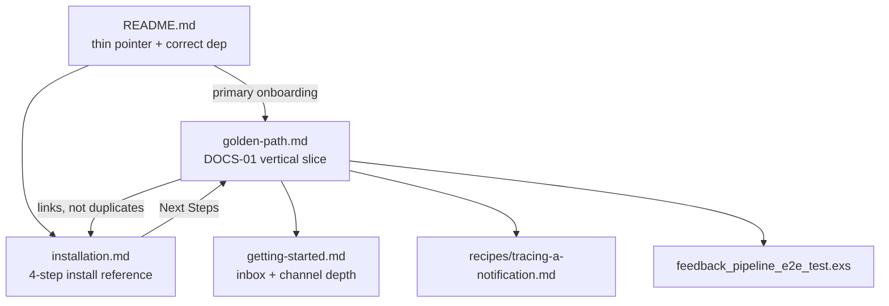

# Phase 36: Golden Path & Version Alignment — Pattern Mapping

**Mapped:** 2026-05-28  
**Phase:** 36-golden-path-version-alignment  
**Requirements:** DOCS-01, DOCS-02  

This document maps every file Phase 36 creates or modifies to the closest existing codebase analog, with copy-ready excerpts planners and executors should follow.

---

## File Inventory

| File | Action | Role | Data flow position |
|------|--------|------|-------------------|
| `guides/introduction/golden-path.md` | **Create** | Primary onboarding spine (DOCS-01) | README → install → **golden-path** → getting-started / trace recipe |
| `README.md` | **Edit** | First-touch adopter surface | Entry → golden-path (primary) + HexDocs |
| `guides/introduction/installation.md` | **Edit** | Detailed install reference | Deps → migrations → config → supervisor → Next Steps → golden-path |
| `guides/introduction/getting-started.md` | **Edit** | Notifier/inbox depth guide | golden-path cross-link; fix `tenant_id`; optional Next Steps |
| `mix.exs` | **Edit** | Package metadata + HexDocs registration | `@version` SSOT; `docs/[:extras]` publishes golden-path |
| `guides/recipes/tracing-a-notification.md` | Link only | Trace API depth | golden-path → explain_delivery depth |
| `examples/chimeway_demo_host/test/.../feedback_pipeline_e2e_test.exs` | Link only | Webhook appendix proof | golden-path optional appendix → demo host E2E |

**Out of scope:** engine/API changes, CHANGELOG (optional), Phase 41 CI gates.

---

## Documentation Architecture (target state)



---

## Pattern 1: Introduction Guide Structure

**Closest analog:** `guides/introduction/installation.md` + `guides/introduction/getting-started.md`  
**Role:** Numbered vertical-slice tutorial with checkpoint sections and a closing “Next” block.

### installation.md — reference install skeleton

Four numbered H2 sections + Next Steps. Each step: one-sentence intro, code block, optional bash commands.

```1:73:guides/introduction/installation.md
# Installation

This guide will walk you through installing Chimeway and configuring it for your Elixir application.

## 1. Add Dependency
...
## 2. Generate and Run Migrations
...
## 3. Configuration
...
## 4. Add to Supervision Tree
...
## Next Steps

Now that Chimeway is installed and running, you're ready to start building notifications. Head over to the [Getting Started](getting-started.md) guide to create your first notification!
```

**Phase 36 delta:** Fix version at line 12; Next Steps should recommend golden-path first (D-12).

### getting-started.md — notifier + trigger + validation skeleton

Three numbered sections; notifier block is the **canonical API pattern** golden-path must reuse (D-03).

```1:54:guides/introduction/getting-started.md
# Getting Started
...
## 1. Define a Notifier
...
  def recipients(params) do
    {:ok, [%{recipient_identity: params.user_id, recipient_type: "user"}]}
  end
...
## 2. Trigger a Notification
...
opts = [idempotency_key: "signup_user_12345"]

{:ok, trigger_result} = Chimeway.trigger(MyApp.Notifiers.WelcomeUser, params, opts)
```

**Phase 36 delta:** Add `tenant_id` to trigger opts; replace inbox-only validation with `explain_delivery/1` in golden-path; getting-started may keep inbox section but golden-path must not use inbox as proof (D-04).

### golden-path.md — recommended section outline (new file)

Follow installation’s numbered H2 rhythm; link into installation for steps 1–4 rather than duplicating (D-02):

| Section | Content | Link/delegate |
|---------|---------|---------------|
| `# Golden Path` | One-paragraph value prop + prerequisites | — |
| `## 1. Add the dependency` | `{:chimeway, "~> 0.1"}` + `mix deps.get` | Mirror installation §1 (fixed version) |
| `## 2. Install database schema` | `mix chimeway.gen.migrations` → `mix ecto.migrate` | Link [Installation §2](installation.md#2-generate-and-run-migrations) |
| `## 3. Configure Chimeway` | `config :chimeway, repo:` **and** `config :chimeway, Chimeway.Repo, ...` shared DB | Link [Installation §3–4](installation.md); **new** Chimeway.Repo block (OQ-1) |
| `## 4. Define a minimal :in_app notifier` | Full module, no `channels/2` | Pattern from getting-started §1 |
| `## 5. Trigger your first notification` | `idempotency_key` + `tenant_id` required | Pattern from tests below |
| `## 6. Prove explainability` | `explain_delivery/1` on `result.trace.delivery_ids` | Pattern from `traces.ex` moduledoc |
| `## 7. What's next?` | getting-started, tracing recipe | D-12 |
| `## Next: webhook feedback loop` (optional) | Outcome + links to demo host test | D-09/D-10 |

**Tone:** Tutorial with checkpoints (OQ-5) — short prose before each code block, not a bare checklist.

---

## Pattern 2: Recipe Guide Structure (trace depth — link target)

**Closest analog:** `guides/recipes/tracing-a-notification.md`  
**Role:** Concept → telemetry principles → IEx diagnosis. Golden-path links here for depth; does not duplicate telemetry attach example.

```57:70:guides/recipes/tracing-a-notification.md
## Diagnosing "Why wasn't this sent?"

If you're using IEx and need to know why a specific notification was suppressed, you can use the built-in `Chimeway.Traces` module.
...
Traces.explain_delivery(delivery_id)
...
Traces.find_traces_by_correlation_id(correlation_id)
```

**Drift to avoid in golden-path:** Always bind `{:ok, explanation} =`; show `explanation.status`, `suppression_reason`, `timeline` (D-05). Recipe omits tuple binding — golden-path should be stricter.

---

## Pattern 3: README Thin Pointer

**Closest analog:** Current `README.md` structure (Installation → Quick Start → Documentation → License)  
**Role:** Value prop, correct dep line, link to golden-path as primary onboarding (D-08).

### Current structure (keep sections, fix content)

```1:64:README.md
# Chimeway
...
## Installation
...
## Quick Start
...
## Documentation
...
## License
```

### Version dep — already correct (SSOT alignment)

```12:16:README.md
def deps do
  [
    {:chimeway, "~> 0.1"}
  ]
end
```

Matches `mix.exs`:

```4:4:mix.exs
  @version "0.1.0"
```

### Broken Quick Start — do not copy

Current README uses non-existent API (`resolve_recipients/2`, `identity`/`type` keys, macro opts). Replace with thin pointer:

**Target shape (from RESEARCH):**

```markdown
## Quick Start

Follow the [Golden Path guide](guides/introduction/golden-path.md) for install, notifier setup, and your first explainable trace.

```elixir
Chimeway.trigger(MyApp.Notifiers.WelcomeUser, %{user_id: "u1", name: "Ada"},
  idempotency_key: "welcome-u1",
  tenant_id: "default"
)
```
```

### Documentation links — add golden-path first

```markdown
## Documentation

- [Golden Path Guide](guides/introduction/golden-path.md)
- [Hex Docs](https://hexdocs.pm/chimeway)
- [Installation Guide](guides/introduction/installation.md)
- [Getting Started Guide](guides/introduction/getting-started.md)
```

### Install steps — add missing migration generation

Current README jumps `mix deps.get` → `mix ecto.migrate`. Golden-path and README should reference `mix chimeway.gen.migrations` (installer moduledoc):

```7:14:lib/mix/tasks/chimeway.gen.migrations.ex
  ## Usage

      mix chimeway.gen.migrations

  Copies 31 migration templates from `priv/chimeway_migrations/` (Oban excluded).
```

---

## Pattern 4: mix.exs docs/[:extras] Registration

**Closest analog:** Existing `docs/0` function in `mix.exs`  
**Role:** HexDocs extras list + Introduction group regex auto-groups `guides/introduction/*.md`.

```94:116:mix.exs
  defp docs do
    [
      main: "Chimeway",
      source_ref: "v#{@version}",
      source_url: "https://github.com/jonlunsford/chimeway",
      extras: [
        "guides/introduction/getting-started.md",
        "guides/introduction/installation.md",
        ...
      ],
      groups_extras: [
        Introduction: ~r/guides\/introduction\//,
        Flows: ~r/guides\/flows\//,
        Recipes: ~r/guides\/recipes\//
      ]
    ]
  end
```

**Phase 36 change:** Insert after `installation.md` (adoption order):

```elixir
"guides/introduction/installation.md",
"guides/introduction/golden-path.md",
"guides/introduction/getting-started.md",
```

**Verification:** `mix ci.docs` (`docs --warnings-as-errors`).

**Package files:** `guides/` already in `package/0` files list — no package change needed.

```86:88:mix.exs
  defp package do
    [
      files: ~w(lib priv guides CHANGELOG.md LICENSE.md README.md mix.exs .formatter.exs),
```

---

## Pattern 5: Version String Alignment (DOCS-02)

**SSOT:** `mix.exs` `@version "0.1.0"` → consumer constraint `{:chimeway, "~> 0.1"}`.

| Location | Current | Target |
|----------|---------|--------|
| `mix.exs:4` | `"0.1.0"` | unchanged |
| `README.md:15` | `~> 0.1` | unchanged |
| `installation.md:12` | `~> 1.0.0` | **`~> 0.1`** |
| `golden-path.md` (new) | — | `~> 0.1` |

**Grep gate (manual):**

```bash
rg '~> 1\.0|1\.0\.0' README.md guides/introduction/
# Expected after Phase 36: zero matches
```

---

## Pattern 6: Notifier Callback API (D-03)

**Source of truth:** `lib/chimeway/notifier.ex`  
**Closest doc analog:** `getting-started.md` §1 (correct) vs `README.md` Quick Start (broken).

### Required callbacks

```47:50:lib/chimeway/notifier.ex
  @callback notification_key() :: String.t()
  @callback version() :: pos_integer()
  @callback recipients(map()) :: {:ok, [map()]} | {:error, term()}
  @callback build(map(), map()) :: {:ok, map()} | {:error, term()}
```

### Macro does not accept notification_key/version opts

```41:44:lib/chimeway/notifier.ex
  defmacro __using__(_opts) do
    quote do
      @behaviour Chimeway.Notifier
    end
  end
```

### Recipient map keys — normalization in trigger.ex

```370:378:lib/chimeway/trigger.ex
  defp recipient_identity(%{recipient_identity: identity}), do: identity
  defp recipient_identity(%{"recipient_identity" => identity}), do: identity
  ...
  defp recipient_type(%{recipient_type: recipient_type}),
    do: normalize_recipient_type(recipient_type)
```

**Minimal golden-path notifier (copy-ready):**

```elixir
defmodule MyApp.Notifiers.WelcomeUser do
  use Chimeway.Notifier

  @impl true
  def notification_key, do: "welcome_user"

  @impl true
  def version, do: 1

  @impl true
  def recipients(params) do
    {:ok, [%{recipient_identity: params.user_id, recipient_type: "user"}]}
  end

  @impl true
  def build(params, _recipient) do
    name = Map.get(params, :name, "User")
    {:ok, %{subject: "Welcome, #{name}!", body: "Thanks for joining."}}
  end
end
```

Omit `channels/2` — defaults to `:in_app` (`trigger_pipeline_test.exs` line 262).

**API grep gate:**

```bash
rg 'resolve_recipients|identity:' README.md guides/introduction/golden-path.md
# Expected: zero matches
```

---

## Pattern 7: Trigger + Result Shape (D-04)

**Public entry:** `lib/chimeway.ex`

```14:16:lib/chimeway.ex
  def trigger(notifier, params, opts \\ []) do
    Trigger.trigger(notifier, params, opts)
  end
```

**Required opts:**

```133:137:lib/chimeway/trigger.ex
  defp fetch_tenant_id(opts) do
    case Keyword.fetch(opts, :tenant_id) do
      {:ok, tenant_id} -> {:ok, tenant_id}
      :error -> {:error, :missing_tenant_id}
    end
  end
```

**Test proof — missing tenant_id:**

```135:138:test/chimeway/integration/trigger_explain_test.exs
  test "trigger/3 returns missing_tenant_id when tenant_id is omitted" do
    assert {:error, :missing_tenant_id} =
             Trigger.trigger(ExplainWorkflowNotifier, %{}, idempotency_key: "trigger-explain-2")
  end
```

**Result shape after sync dispatch:**

```202:222:lib/chimeway/trigger.ex
  defp normalize_trigger_result(
         {:ok, %{event: event, notifications: notifications_inserted}},
         ...
       ) do
    {:ok,
     %{
       event: event,
       ...
       trace: %{
         event_id: event.id,
         correlation_id: event.correlation_id,
         delivery_ids: []
       }
     }}
  end
```

**delivery_ids populated post-dispatch:**

```461:481:lib/chimeway/trigger.ex
  defp trace_with_delivery_ids(trace, deliveries) when is_list(deliveries) do
    delivery_ids =
      deliveries
      |> Enum.map(&delivery_id_from_dispatch_result/1)
      |> Enum.reject(&is_nil/1)

    Map.put(trace, :delivery_ids, delivery_ids)
  end

  defp merge_dispatch_outcome(trigger_result, dispatch_outcome, dispatch_mode, deliveries) do
    trace =
      trigger_result
      |> Map.get(:trace, %{})
      |> trace_with_delivery_ids(deliveries)
    ...
  end
```

**Test assertions (trigger_pipeline_test.exs):**

```253:259:test/chimeway/trigger_pipeline_test.exs
    assert result.dispatch_outcome == :ok
    assert result.dispatch_mode == :sync
    assert is_map(result.trace)
    assert result.trace.event_id == result.event.id
    assert Map.has_key?(result.trace, :correlation_id)
    assert is_list(result.trace.delivery_ids)
```

**Integration test — trace pointers resolve to durable rows:**

```791:830:test/chimeway/integration/delivery_lifecycle_test.exs
    test "trigger response trace fields map to durable trace and delivery rows" do
      assert {:ok, result} =
               Chimeway.trigger(
                 ChimewayTest.Notifiers.LifecycleA,
                 %{user_id: 8},
                 idempotency_key: "lifecycle_trace_contract_001",
                 correlation_id: "phase8-trace-001",
                 tenant_id: "acme"
               )
      ...
      assert result.trace.event_id == result.event.id
      assert is_list(result.trace.delivery_ids)
      assert {:ok, trace_event} = Traces.get_trace(result.trace.event_id)
      ...
      assert MapSet.new(result.trace.delivery_ids) == MapSet.new(durable_delivery_ids)
    end
```

---

## Pattern 8: Trace Query IEx Snippets (D-04 / D-05)

**Primary source:** `lib/chimeway/traces.ex` moduledoc — copy-ready for golden-path §6.

```16:28:lib/chimeway/traces.ex
  ## Usage in IEx

      # Full trace for one event
      {:ok, event} = Chimeway.Traces.get_trace("event-uuid-here")
      event.notifications |> Enum.flat_map(& &1.deliveries)

      # Why was this delivery suppressed?
      {:ok, explanation} = Chimeway.Traces.explain_delivery("delivery-uuid-here")
      explanation.suppression_reason  #=> "channel_disabled"
      explanation.timeline            #=> [%{at: ~U[...], event: :event_created, detail: %{}}, ...]
```

**Golden-path end-to-end snippet (bind from trigger result):**

```elixir
params = %{user_id: "user_12345", name: "Alice"}

{:ok, result} =
  Chimeway.trigger(
    MyApp.Notifiers.WelcomeUser,
    params,
    idempotency_key: "signup_user_12345",
    tenant_id: "default"
  )

[delivery_id | _] = result.trace.delivery_ids

{:ok, explanation} = Chimeway.Traces.explain_delivery(delivery_id)

explanation.status
#=> :succeeded

explanation.suppression_reason
#=> nil

Enum.map(explanation.timeline, & &1.event)
#=> [:event_created, :notification_created, :delivery_planned, :attempt_recorded, ...]
```

**Alternate path (get_trace):**

```elixir
{:ok, event} = Chimeway.Traces.get_trace(result.trace.event_id)
event.notifications |> Enum.flat_map(& &1.deliveries)
```

**Optional correlation_id one-liner (Claude discretion):**

```elixir
Chimeway.trigger(MyApp.Notifiers.WelcomeUser, params,
  idempotency_key: "signup_user_12345",
  tenant_id: "default",
  correlation_id: "signup-flow-abc123"
)

Chimeway.Traces.find_traces_by_correlation_id("signup-flow-abc123")
```

### Explanation struct fields (D-05 vocabulary)

From `lib/chimeway/traces/explanation.ex`:

```19:34:lib/chimeway/traces/explanation.ex
  - `status` — final delivery status: :succeeded | :failed | :suppressed | :pending | :cancelled
  ...
  - `suppression_reason` — reason atom string when status is `:suppressed` OR `:cancelled`,
    else nil. The four documented reason strings are:
      * `"channel_disabled"` ...
      * `"retries_exhausted"` ...
      * `"permanent_failure"` ...
      * `"bounced"` ...
  - `timeline` — chronological list of lifecycle events, each a map with :at, :event, :detail
```

**Test pattern — succeeded delivery explanation:**

```301:311:test/chimeway/traces_test.exs
  describe "explain_delivery/1 — succeeded delivery" do
    test "returns correct explanation struct" do
      ...
      assert {:ok, %Explanation{} = exp} = Traces.explain_delivery(delivery.id)
      assert exp.delivery_id == delivery.id
      assert exp.event_id == event.id
      ...
```

**Anti-pattern:** Using `Chimeway.list_for_recipient/1` as the golden-path proof step (getting-started §3) — inbox proves delivery existed, not *why* (D-04).

---

## Pattern 9: Shared-Database / Chimeway.Repo Config

**Critical gap:** `config :chimeway, repo: MyApp.Repo` is **installer-only**; runtime queries use `Chimeway.Repo` directly.

**Closest analog:** Root `config/dev.exs` + demo host `config/test.exs`.

```27:27:config/dev.exs
config :chimeway, Chimeway.Repo, repo_config
```

```16:21:examples/chimeway_demo_host/config/test.exs
config :chimeway, Chimeway.Repo,
  username: System.get_env("PGUSER") || System.get_env("USER") || "postgres",
  password: System.get_env("PGPASSWORD"),
  hostname: System.get_env("PGHOST") || "localhost",
  database: "chimeway_test#{System.get_env("MIX_TEST_PARTITION")}",
  pool: Ecto.Adapters.SQL.Sandbox
```

**Golden-path host example (same DB as MyApp.Repo):**

```elixir
# config/dev.exs — point Chimeway.Repo at the same database as MyApp.Repo
config :chimeway, Chimeway.Repo,
  username: "postgres",
  password: "postgres",
  hostname: "localhost",
  database: "my_app_dev",
  stacktrace: true,
  show_sensitive_data_on_connection_error: true,
  pool_size: 10
```

**Integration model:**

```
Host MyApp.Repo  ──mix ecto.migrate──►  chimeway_* tables in host DB
                                              ▲
Chimeway.Repo    ──runtime queries────────────┘  (must share same DB config)
```

Golden-path §3 is the **first doc** that makes this explicit (RESEARCH OQ-1).

---

## Pattern 10: Next Steps Cross-Links (D-12)

### installation.md — current vs target

**Current:**

```71:73:guides/introduction/installation.md
## Next Steps

Now that Chimeway is installed and running, you're ready to start building notifications. Head over to the [Getting Started](getting-started.md) guide to create your first notification!
```

**Target pattern:**

```markdown
## Next Steps

Follow the [Golden Path](golden-path.md) guide to define a notifier, trigger your first notification, and verify explainability with `Chimeway.Traces.explain_delivery/1`.

For inbox and channel depth, continue to [Getting Started](getting-started.md).
```

### getting-started.md — current vs target

**Current:**

```81:87:guides/introduction/getting-started.md
## What's Next?
...
- Configuring more complex [Channel Adapters](../recipes/custom-adapter.md)
...
```

**Target pattern:** Add at top of What's Next:

```markdown
If you haven't yet, start with the [Golden Path](golden-path.md) for the canonical install-to-trace vertical slice.

For explainability depth, see [Tracing a Notification](../recipes/tracing-a-notification.md).
```

---

## Pattern 11: Webhook Appendix (D-09 / D-10)

**Closest analog:** Outcome-level description + link — not a tutorial.  
**Proof file:** `examples/chimeway_demo_host/test/demo_host_web/controllers/feedback_pipeline_e2e_test.exs`

**What to describe (outcome only):**

| Path | Proves |
|------|--------|
| Progress (lines 24–115) | Inbound webhook → ingress → Oban worker → signal → workflow resume → `:webhook_received` on timeline |
| Stop (lines 118+) | Bounced webhook → workflow stopped → timeline includes `:webhook_received` + `:workflow_stopped` |

**Trace assertion pattern from demo host:**

```108:114:examples/chimeway_demo_host/test/demo_host_web/controllers/feedback_pipeline_e2e_test.exs
      {:ok, %{timeline: timeline}} = Traces.explain_delivery(delivery.id)
      event_atoms = Enum.map(timeline, & &1.event)

      assert :webhook_received in event_atoms

      webhook_entry = Enum.find(timeline, &(&1.event == :webhook_received))
      assert webhook_entry.detail.signal_event_name == "chimeway.delivery.succeeded"
```

**Appendix copy template:**

```markdown
## Next: webhook feedback loop

When inbound delivery feedback should drive workflow progression, Chimeway surfaces webhook handling on the delivery timeline. The demo host includes a runnable E2E proof:

- [Demo host example](../../examples/chimeway_demo_host/)
- [Feedback pipeline E2E test](../../examples/chimeway_demo_host/test/demo_host_web/controllers/feedback_pipeline_e2e_test.exs)

That test shows feedback arriving via webhook, progressing (or stopping) a workflow, and appearing as `:webhook_received` entries on `Chimeway.Traces.explain_delivery/1` timelines — without requiring you to rebuild the full Phoenix webhook stack in this guide.
```

**Do not:** Inline demo host controller setup, Phase 34 progression internals, or Oban wiring (D-10).

---

## Per-File Implementation Checklist

### `guides/introduction/golden-path.md` (CREATE)

- [ ] Numbered sections per Pattern 1 outline
- [ ] `{:chimeway, "~> 0.1"}` dep block
- [ ] Link to installation for detailed config; include Chimeway.Repo shared-DB block (Pattern 9)
- [ ] Notifier uses `recipients/1` + correct map keys (Pattern 6)
- [ ] Every `Chimeway.trigger/3` includes `idempotency_key` AND `tenant_id`
- [ ] Validation via `explain_delivery/1` showing `status`, `suppression_reason`, `timeline` (Pattern 8)
- [ ] Optional webhook appendix (Pattern 11)
- [ ] Cross-links to getting-started + tracing recipe

### `README.md` (EDIT)

- [ ] Thin Quick Start + golden-path link (Pattern 3)
- [ ] Fix/remove broken notifier example
- [ ] Add `mix chimeway.gen.migrations` hint or defer entirely to golden-path
- [ ] Documentation section lists golden-path first

### `guides/introduction/installation.md` (EDIT)

- [ ] Line 12: `~> 1.0.0` → `~> 0.1`
- [ ] Next Steps → golden-path primary (Pattern 10)
- [ ] Optional one-line link to Chimeway.Repo shared-DB note in golden-path

### `guides/introduction/getting-started.md` (EDIT)

- [ ] Add `tenant_id: "default"` (or similar) to trigger example (OQ-2)
- [ ] What's Next → golden-path + trace recipe links (Pattern 10)
- [ ] Keep inbox section (depth guide); do not remove unless trimming overlap

### `mix.exs` (EDIT)

- [ ] Add `"guides/introduction/golden-path.md"` to `docs/[:extras]` after installation (Pattern 4)
- [ ] Run `mix ci.docs`

---

## Verification Patterns (pre–Phase 41)

| Gate | Command / action |
|------|------------------|
| Version alignment | `rg '~> 1\.0|1\.0\.0' README.md guides/introduction/` → zero matches |
| API alignment | `rg 'resolve_recipients\|identity:' README.md guides/introduction/golden-path.md` → zero matches |
| Required trigger opts | Every `Chimeway.trigger` in golden-path has `idempotency_key` and `tenant_id` |
| HexDocs | `mix ci.docs` |
| Fresh-host UAT (recommended once) | New Phoenix app → follow golden-path → IEx → `explain_delivery/1` → `:succeeded` |

---

## Analog Summary Table

| Phase 36 artifact | Closest analog | Copy from |
|-------------------|----------------|-----------|
| golden-path overall structure | `installation.md` | Numbered H2 + Next Steps |
| golden-path notifier block | `getting-started.md` §1 | `recipients/1`, map keys |
| golden-path trace section | `traces.ex` moduledoc | IEx `explain_delivery/1` |
| golden-path trigger contract | `trigger_explain_test.exs`, `trigger_pipeline_test.exs` | `tenant_id`, `trace.delivery_ids` |
| golden-path Chimeway.Repo config | `config/dev.exs`, demo host `config/test.exs` | Shared DB pattern |
| README thin pointer | Current README layout | Fix Quick Start only |
| mix.exs extras entry | Existing introduction guides | Insert after installation |
| webhook appendix | `feedback_pipeline_e2e_test.exs` | Outcome + link, not tutorial |
| version strings | `mix.exs @version` + README | `~> 0.1` everywhere |

---

*Phase: 36-golden-path-version-alignment*  
*Pattern mapping: 2026-05-28*
