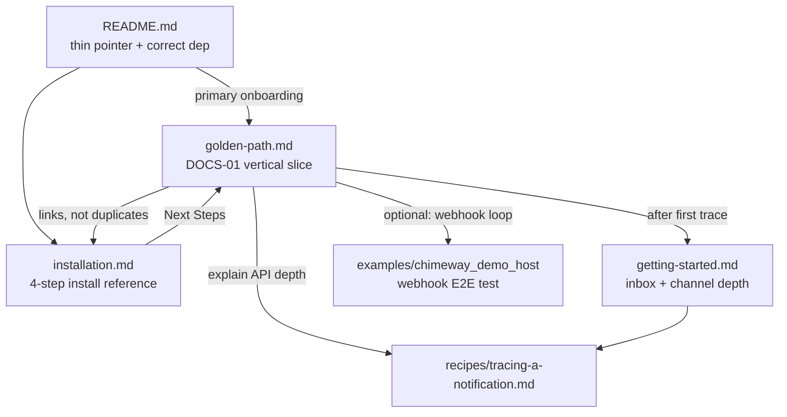

# Phase 36: Golden Path & Version Alignment — Research

**Researched:** 2026-05-28  
**Phase:** 36-golden-path-version-alignment  
**Requirements:** DOCS-01, DOCS-02  
**Status:** Ready for plan-phase

---

## user_constraints

Locked decisions from `36-CONTEXT.md` (D-01 through D-12) — **non-negotiable**:

| ID | Constraint |
|----|------------|
| D-01 | Single deliverable: `guides/introduction/golden-path.md` — dependency → `mix chimeway.gen.migrations` → `mix ecto.migrate` → config → supervisor → minimal `:in_app` notifier → `Chimeway.trigger/3` with `idempotency_key` → trace query |
| D-02 | `installation.md` stays detailed install reference; golden-path links in, does not duplicate every config paragraph |
| D-03 | Notifier examples use `recipients/1` with `recipient_identity` + `recipient_type` — never `resolve_recipients/2` or `identity` keys |
| D-04 | Validation step uses `Chimeway.Traces.explain_delivery/1` (primary) or `get_trace/1` (alternate); inbox listing alone is insufficient |
| D-05 | IEx snippets show `explanation.suppression_reason`, `explanation.status`, `explanation.timeline` |
| D-06 | Align consumer version strings to `mix.exs` `@version` (`0.1.0` / `~> 0.1`); fix installation guide `~> 1.0.0` |
| D-07 | Do not bump Hex package to `1.0.0` in this phase |
| D-08 | README becomes thin pointer: value prop, correct dep line, link to golden-path; fix broken Quick Start API |
| D-09 | Optional webhook appendix cross-links demo host + `feedback_pipeline_e2e_test.exs` — no full inline tutorial |
| D-10 | Webhook appendix describes outcome only (feedback → progression → timeline), not Phase 34 engine internals |
| D-11 | Register `guides/introduction/golden-path.md` in `mix.exs` `docs/[:extras]` |
| D-12 | Update installation and/or getting-started “Next Steps” to recommend golden-path |

**Explicit out of scope:** engine/API changes, journey guide truth (Phase 37), recipes (Phase 38), doc-contract CI (Phase 41), Hex 1.0.0 release.

---

## research_summary

Phase 36 is a **documentation-only** closure of the v1.5 adoption wedge identified in the 2026-05-28 assessment: adopters hit **three-way semver drift** and a **broken README Quick Start** before they ever reach a working trace. Phase 35 shipped the installer; Phase 36 must ship the **vertical onboarding spine** and align version strings.

### What the codebase confirms

1. **Version SSOT:** `mix.exs:4` — `@version "0.1.0"`. README already matches (`~> 0.1`). Installation guide does not (`~> 1.0.0` at line 12).
2. **Installer exists:** `lib/mix/tasks/chimeway.gen.migrations.ex` — task name matches `installation.md:30`.
3. **Notifier API:** `@callback recipients(map())` at `notifier.ex:49`; normalization expects `recipient_identity` / `recipient_type` at `trigger.ex:370-385`.
4. **Trigger contract:** `Chimeway.trigger/3` delegates to `Trigger.trigger/3` (`chimeway.ex:14-15`). Requires `:idempotency_key` and `:tenant_id` (`trigger.ex:47-48`, `135-137`). Test proof: `trigger_explain_test.exs:135-137` returns `{:error, :missing_tenant_id}` when omitted.
5. **Trigger result shape:** `normalize_trigger_result/3` at `trigger.ex:202-222` plus `merge_dispatch_outcome/4` at `470-481` populates `trace.delivery_ids` after sync dispatch.
6. **Explainability surface:** `Chimeway.Traces.explain_delivery/1` returns `%Chimeway.Traces.Explanation{}` with documented fields (`explanation.ex:9-35`).
7. **Webhook proof:** `feedback_pipeline_e2e_test.exs` — two describe blocks prove progress and stop paths via `Traces.explain_delivery/1` timeline assertions.

### Critical gaps planning must address

| Gap | Impact |
|-----|--------|
| **`tenant_id` omitted from all onboarding guides** | Copy-paste from `getting-started.md` or fixed README will fail at runtime |
| **`config :chimeway, repo:` vs `Chimeway.Repo` runtime** | Installation guide step 3 sets installer namespace target; runtime hardcodes `Chimeway.Repo` (`application.ex:14`). Host must also configure `config :chimeway, Chimeway.Repo, ...` pointing at the **same database** where host migrations ran |
| **README skips `mix chimeway.gen.migrations`** | Line 24 jumps to `mix ecto.migrate` with no schema bootstrap |
| **getting-started proves inbox, not explainability** | Contradicts D-04 product intent; golden-path must differ explicitly |

**Planning recommendation:** Golden-path is the first doc that makes the **shared-database + Chimeway.Repo config** pattern explicit. Installation.md can gain a short cross-link; full duplication violates D-02.

---

## 1. Version String Inventory (DOCS-02)

| Location | Line | Current value | Target | Action |
|----------|------|---------------|--------|--------|
| `mix.exs` | 4 | `@version "0.1.0"` | SSOT | None |
| `mix.exs` | 97 | `source_ref: "v#{@version}"` | Auto-aligned | None |
| `README.md` | 15 | `{:chimeway, "~> 0.1"}` | `~> 0.1` | None (correct) |
| `guides/introduction/installation.md` | 12 | `{:chimeway, "~> 1.0.0"}` | `~> 0.1` | **Fix** |
| `guides/introduction/golden-path.md` | — | (does not exist) | `~> 0.1` | **Create** |
| Hex badge `README.md` | 5 | `hexpm/v/chimeway` | Live Hex version | Informational only; no doc edit required |

**Secondary drift (not semver, but adoption friction):**

| Location | Line | Issue |
|----------|------|-------|
| `README.md` | 20-24 | Install steps omit `mix chimeway.gen.migrations`; only `mix deps.get` + `mix ecto.migrate` |
| Assessment thread | 30 | Documents three-way drift — still accurate except installer gap (closed in Phase 35) |

No other consumer-facing `~> 1.0` references under `guides/` or `README.md` (verified via repo grep).

---

## 2. API Example Drift Inventory

### README Quick Start (`README.md:27-53`) — **broken**

| Issue | README shows | Source truth |
|-------|--------------|--------------|
| Recipient callback | `resolve_recipients/2` | `recipients/1` — `notifier.ex:49` |
| Recipient map keys | `identity`, `type` | `recipient_identity`, `recipient_type` — `trigger.ex:370-378` |
| Notifier macro | `use Chimeway.Notifier, notification_key:, version:` | Macro ignores opts — `notifier.ex:41-44`; callbacks required |
| Trigger opts | `idempotency_key` only | Also requires `tenant_id: "..."` — `trigger.ex:133-137` |
| Return shape comment | `%{event: ..., notifications: [...]}` | Actual map — see §3 |

### Getting Started (`guides/introduction/getting-started.md`) — **mostly correct, incomplete**

| Section | Lines | Status |
|---------|-------|--------|
| Notifier definition | 11-40 | Correct: `recipients/1`, map keys, `build/2`, optional `channels/2` |
| Trigger | 47-54 | **Missing `tenant_id`** — will return `{:error, :missing_tenant_id}` |
| Validation | 56-72 | Inbox-only — does not satisfy D-04 explainability proof |
| Next Steps | 81-87 | No golden-path link yet (D-12) |

### Tracing recipe (`guides/recipes/tracing-a-notification.md:61-70`)

- Shows `Traces.explain_delivery(delivery_id)` without `{:ok, explanation} =` binding — minor style drift; function returns tuple (`traces.ex:114-115`).

---

## 3. Trigger Result Shape (verified)

After successful sync dispatch (default `dispatcher: Chimeway.Dispatch.Sync` per `config/config.exs:6`):

```elixir
{:ok, result} = Chimeway.trigger(MyNotifier, params,
  idempotency_key: "stable-key",
  tenant_id: "default"          # required — omit => {:error, :missing_tenant_id}
)

result.event.id                    # UUID — same as result.trace.event_id
result.trace.event_id              # UUID
result.trace.correlation_id        # string | nil (from opts or Logger metadata)
result.trace.delivery_ids          # [uuid, ...] — populated after dispatch
result.dispatch_outcome            # :ok | {:error, reason}
result.dispatch_mode               # :sync (default) | :oban | :unknown
result.notifications_inserted      # integer count from insert_all
```

**Test evidence:** `trigger_pipeline_test.exs:253-259` asserts `trace.event_id == result.event.id`, `delivery_ids` is a list, `dispatch_mode == :sync`.

**Golden-path trace access pattern (D-04):**

```elixir
[delivery_id | _] = result.trace.delivery_ids
{:ok, explanation} = Chimeway.Traces.explain_delivery(delivery_id)

explanation.status              # e.g. :succeeded for default :in_app sync path
explanation.suppression_reason  # nil when not suppressed/cancelled
explanation.timeline            # [%{at: ~U[...], event: :event_created, detail: %{}}, ...]
```

**Alternate path:**

```elixir
{:ok, event} = Chimeway.Traces.get_trace(result.trace.event_id)
event.notifications |> Enum.flat_map(& &1.deliveries)
```

---

## 4. Explanation Struct Fields (verified)

From `lib/chimeway/traces/explanation.ex` moduledoc (lines 9-35) and `defstruct` (lines 69-89):

**Golden-path IEx fields (D-05 minimum):**

- `explanation.status` — `:succeeded | :failed | :suppressed | :pending | :cancelled | :dispatched`
- `explanation.suppression_reason` — string when suppressed/cancelled; documented values: `"channel_disabled"`, `"retries_exhausted"`, `"permanent_failure"`, `"bounced"`
- `explanation.timeline` — list of `%{at: DateTime.t(), event: atom(), detail: map()}`

**Useful additional fields for golden-path (optional, not D-05 required):**

- `explanation.delivery_id`, `explanation.event_id`, `explanation.correlation_id`
- `explanation.notification_key`, `explanation.recipient_id`, `explanation.channel`

**Moduledoc IEx example** at `traces.ex:16-25` — copy-ready and accurate.

---

## 5. mix.exs docs/[:extras] Structure (D-11)

Current registration (`mix.exs:94-116`):

```elixir
defp docs do
  [
    main: "Chimeway",
    source_ref: "v#{@version}",
    source_url: "https://github.com/jonlunsford/chimeway",
    extras: [
      "guides/introduction/getting-started.md",
      "guides/introduction/installation.md",
      # ... flows, recipes, cheatsheet
    ],
    groups_extras: [
      Introduction: ~r/guides\/introduction\//,
      Flows: ~r/guides\/flows\//,
      Recipes: ~r/guides\/recipes\//
    ]
  ]
end
```

**To add golden-path:**

1. Insert `"guides/introduction/golden-path.md"` in `extras` — recommend after `installation.md` (adoption order: install → golden-path → getting-started depth).
2. No `groups_extras` change needed — Introduction regex auto-groups any `guides/introduction/*.md`.
3. Package `files` already includes `guides/` (`mix.exs:88`) — Hex publish needs no package change.
4. Verify with `mix docs --warnings-as-errors` (alias `ci.docs` at line 62).

---

## 6. Current “Next Steps” Content

### `guides/introduction/installation.md:71-73`

```markdown
## Next Steps

Now that Chimeway is installed and running, you're ready to start building notifications. Head over to the [Getting Started](getting-started.md) guide to create your first notification!
```

**D-12 action:** Add golden-path as **recommended** post-install path; getting-started remains linked for inbox/channel depth.

### `guides/introduction/getting-started.md:81-87`

```markdown
## What's Next?

You have successfully defined, triggered, and retrieved a Chimeway notification.

To explore further, you might want to look into:
- Configuring more complex [Channel Adapters](../recipes/custom-adapter.md)
- Setting up [Policies and Preferences](../flows/policy-and-preferences.md) to respect user communication limits
- Understanding the full [Trigger to Delivery Lifecycle](../flows/trigger-to-delivery.md)
```

**D-12 action:** Point readers who landed here first toward golden-path for the canonical vertical slice; optionally add trace recipe link.

---

## 7. Demo Host Webhook Test (D-09 / D-10 appendix)

**File:** `examples/chimeway_demo_host/test/demo_host_web/controllers/feedback_pipeline_e2e_test.exs`

**What it proves (outcome-level, suitable for appendix copy):**

| Test | Lines | Proves |
|------|-------|--------|
| Progress path | 24-115 | Inbound POST `/webhooks/chimeway/echo` → `Ingress` row → Oban worker → `DeliveryAttempt` → `Signal` (`chimeway.delivery.succeeded`) → workflow resume → `Traces.explain_delivery/1` timeline includes `:webhook_received` with `signal_event_name` |
| Stop path | 119-190 | Bounced webhook → `:bounced` signal → `workflow_stopped` transition → timeline includes `:webhook_received` + `:workflow_stopped` |

**What it is NOT:**

- Not a fresh-Phoenix-host walkthrough (fixtures insert DB rows directly)
- Not runnable without demo host deps (Oban, Phoenix, path dep to chimeway)
- Not a substitute for golden-path `:in_app` sync trace (webhook path requires Oban + adapter + ingress route)

**Appendix framing (D-10):** “When you need inbound delivery feedback to drive workflow progression, see the demo host E2E test for a runnable proof that feedback surfaces on the delivery timeline.”

---

## architecture_patterns

### Documentation flow (target state after Phase 36)



### Notifier minimal surface for golden-path

Required callbacks (`Notifier.validate_module!/1` — `notifier.ex:66-86`):

- `notification_key/0`
- `version/0`
- `recipients/1`
- `build/2`

Optional for `:in_app` only path:

- `channels/2` — when omitted, planning defaults to `["in_app"]` (`delivery_planning.ex:141-153`)

### Host integration model (current engine — docs must reflect)

```
Host MyApp.Repo  ──mix ecto.migrate──►  chimeway_* tables in host DB
                                              ▲
Chimeway.Repo    ──runtime queries────────────┘  (must share same DB config)
```

`config :chimeway, repo: MyApp.Repo` — **installer only** (`install/migrations.ex:103`). Runtime modules alias `Chimeway.Repo` directly (`trigger.ex:30`, `traces.ex:33`, etc.).

---

## common_pitfalls

1. **Copying README Quick Start verbatim** — uses non-existent `resolve_recipients/2` and wrong map keys.
2. **Omitting `tenant_id` on trigger** — silent doc bug in getting-started; golden-path must show it on every trigger example.
3. **Treating inbox listing as “explainability proof”** — product value is `explain_delivery/1` timeline, not `Chimeway.list_for_recipient/1`.
4. **Assuming `config :chimeway, repo:` configures runtime DB** — it does not; host must configure `Chimeway.Repo` separately (see demo host `config/test.exs:16-21` pattern).
5. **Running `mix ecto.migrate` without `mix chimeway.gen.migrations`** — README currently implies this; tables won't exist.
6. **Using `use Chimeway.Notifier, notification_key: ...` as shorthand** — macro does not generate callbacks; use explicit `@impl` functions like getting-started.
7. **Webhook appendix scope creep** — D-10 forbids duplicating Phase 34 progression docs or demo controller implementation.
8. **Premature `~> 1.0.0` bump** — D-07; internal milestone v1.5 ≠ Hex 1.0.0.
9. **Duplicating installation.md config blocks in golden-path** — D-02; link instead.
10. **Expecting `trace.delivery_ids` before dispatch completes** — populated in `merge_dispatch_outcome/4` after sync dispatch returns (`trigger.ex:461-467`).

---

## code_examples

Copy-ready snippets verified against source. Planner should use these as golden-path seeds.

### Dependency (DOCS-02 aligned)

```elixir
# mix.exs
defp deps do
  [
    {:chimeway, "~> 0.1"}
  ]
end
```

### Minimal `:in_app` notifier

```elixir
defmodule MyApp.Notifiers.WelcomeUser do
  use Chimeway.Notifier

  @impl true
  def notification_key, do: "welcome_user"

  @impl true
  def version, do: 1

  @impl true
  def recipients(params) do
    {:ok, [%{recipient_identity: params.user_id, recipient_type: "user"}]}
  end

  @impl true
  def build(params, _recipient) do
    name = Map.get(params, :name, "User")

    {:ok, %{
      subject: "Welcome, #{name}!",
      body: "Thanks for joining."
    }}
  end
end
```

Matches `getting-started.md:11-40` pattern; `channels/2` omitted intentionally (defaults to `:in_app`).

### Trigger + explain (D-04 / D-05)

```elixir
params = %{user_id: "user_12345", name: "Alice"}

{:ok, result} =
  Chimeway.trigger(
    MyApp.Notifiers.WelcomeUser,
    params,
    idempotency_key: "signup_user_12345",
    tenant_id: "default"
  )

[delivery_id | _] = result.trace.delivery_ids

{:ok, explanation} = Chimeway.Traces.explain_delivery(delivery_id)

explanation.status
#=> :succeeded

explanation.suppression_reason
#=> nil

Enum.map(explanation.timeline, & &1.event)
#=> [:event_created, :notification_created, :delivery_planned, :attempt_recorded, ...]
```

### Optional correlation_id (Claude discretion — D-01 context)

```elixir
Chimeway.trigger(MyApp.Notifiers.WelcomeUser, params,
  idempotency_key: "signup_user_12345",
  tenant_id: "default",
  correlation_id: "signup-flow-abc123"
)

Chimeway.Traces.find_traces_by_correlation_id("signup-flow-abc123")
```

### Chimeway.Repo config (shared DB — **planning should add to golden-path**)

```elixir
# config/dev.exs — point Chimeway.Repo at the same database as MyApp.Repo
config :chimeway, Chimeway.Repo,
  username: "postgres",
  password: "postgres",
  hostname: "localhost",
  database: "my_app_dev",
  stacktrace: true,
  show_sensitive_data_on_connection_error: true,
  pool_size: 10
```

Pattern derived from `config/dev.exs:3-27` and demo host `config/test.exs:16-21`.

### Thin README Quick Start (D-08 target shape)

```elixir
# After following guides/introduction/golden-path.md:
Chimeway.trigger(MyApp.Notifiers.WelcomeUser, %{user_id: "u1", name: "Ada"},
  idempotency_key: "welcome-u1",
  tenant_id: "default"
)
```

Link body: “See the [Golden Path guide](guides/introduction/golden-path.md) for install, notifier setup, and your first explainable trace.”

---

## open_questions

| # | Question | Recommendation | Owner |
|---|----------|----------------|-------|
| OQ-1 | Should golden-path document `config :chimeway, Chimeway.Repo` shared-DB setup explicitly? | **Yes** — without it, install guide path fails on fresh Phoenix host. Add as new step between install config and first trigger; link from installation.md. Not an engine change. | Plan-phase |
| OQ-2 | Should `getting-started.md` gain `tenant_id` fix in Phase 36 or only golden-path? | **Fix getting-started** — same bug, low scope; avoids two conflicting trigger examples. D-12 implies touch anyway. | Plan-phase (Claude discretion) |
| OQ-3 | Include optional `correlation_id` one-liner in golden-path? | Low cost; aligns with `traces.ex:98-104` and telemetry story. | Claude discretion |
| OQ-4 | CHANGELOG entry for doc-only Phase 36? | Optional; no Hex bump required (D-07). | Execute-phase |
| OQ-5 | Golden-path section tone: tutorial vs checklist? | Favor **tutorial with checkpoints** — assessment cites “credibility” not just coverage. | Claude discretion |
| OQ-6 | Does Phase 41 GATE-01 need a stub checklist item in Phase 36? | Mention in Validation Architecture only; implementation deferred. | Plan-phase |

---

## sources

### Primary (read for this research)

| Path | Use |
|------|-----|
| `.planning/phases/36-golden-path-version-alignment/36-CONTEXT.md` | Locked decisions D-01–D-12 |
| `.planning/REQUIREMENTS.md` | DOCS-01, DOCS-02 acceptance |
| `.planning/ROADMAP.md` | Phase 36 success criteria |
| `.planning/threads/2026-05-28-v1.5-milestone-assessment.md` | Drift evidence |
| `mix.exs` | `@version`, `docs/[:extras]` |
| `README.md` | Version + API drift |
| `guides/introduction/installation.md` | Version drift, Next Steps |
| `guides/introduction/getting-started.md` | Correct notifier pattern, missing tenant_id |
| `lib/chimeway/notifier.ex` | Callback contract |
| `lib/chimeway/trigger.ex` | Trigger opts, result shape, recipient normalization |
| `lib/chimeway/traces.ex` | Trace query API, moduledoc IEx examples |
| `lib/chimeway/traces/explanation.ex` | Explanation struct fields |
| `lib/chimeway.ex` | Public `trigger/3` entry |
| `lib/chimeway/application.ex` | `Chimeway.Repo` supervision |
| `lib/mix/tasks/chimeway.gen.migrations.ex` | Installer task moduledoc |
| `examples/chimeway_demo_host/test/demo_host_web/controllers/feedback_pipeline_e2e_test.exs` | Webhook appendix proof |
| `test/chimeway/trigger_pipeline_test.exs` | Result shape assertions |
| `test/chimeway/integration/trigger_explain_test.exs` | `missing_tenant_id` contract |
| `.planning/phases/35-installer-task/35-RESEARCH.md` | Repo/runtime split note (§2) |

### Secondary (link targets, do not duplicate)

| Path | Use |
|------|-----|
| `guides/recipes/tracing-a-notification.md` | Telemetry + trace depth |
| `guides/recipes/oban-integration.md` | Async path boundary |
| `guides/flows/trigger-to-delivery.md` | Lifecycle depth |

---

## metadata

| Field | Value |
|-------|-------|
| Phase | 36-golden-path-version-alignment |
| Milestone | v1.5 Adoption Surface |
| Requirements | DOCS-01, DOCS-02 |
| Depends on | Phase 35 (installer) — complete |
| Phase type | Documentation only — no engine changes |
| Files to create | `guides/introduction/golden-path.md` |
| Files to edit | `README.md`, `guides/introduction/installation.md`, `guides/introduction/getting-started.md`, `mix.exs` |
| Estimated surface | 4 edits + 1 new guide (~150-250 lines) |
| Risk level | Medium — shared-DB config gap must be documented correctly |
| GATE-01 automation | Deferred to Phase 41 |

---

## Validation Architecture

*Nyquist sampling strategy for plan-phase verification loop (docs-only phase).*

### What manual verification proves

| Contract | Verification | Proves |
|----------|--------------|--------|
| DOCS-02 semver | Grep `~> 1.0`, `1.0.0` in README + guides | No consumer-facing version drift vs `@version "0.1.0"` |
| DOCS-02 dep constraint | Visual diff README + installation + golden-path dep blocks | All show `{:chimeway, "~> 0.1"}` |
| DOCS-01 golden-path completeness | Section checklist against D-01 steps | Vertical slice coverage |
| D-03 notifier API | No `resolve_recipients`, `identity:` keys in new/edited examples | Matches `notifier.ex` callbacks |
| D-04 explain proof | Golden-path ends with `explain_delivery/1` not inbox-only | Explainability product value |
| D-05 IEx fields | Snippets reference `status`, `suppression_reason`, `timeline` | Matches `Explanation` struct |
| D-08 README thin | README links golden-path; Quick Start API fixed | First-touch credibility |
| D-11 HexDocs | `mix docs --warnings-as-errors` | golden-path published under Introduction group |
| D-09 webhook appendix | Link to demo host test file exists | Optional loop pointer present |

### Doc verification strategy (Phase 36 — pre GATE-01)

**No automated doc-contract CI in this phase.** Verification is checklist + spot-compile:

1. **Version grep gate (manual, required)**

   ```bash
   rg '~> 1\.0|1\.0\.0' README.md guides/introduction/
   # Expected after Phase 36: zero matches (except historical planning docs)
   ```

2. **API grep gate (manual, required)**

   ```bash
   rg 'resolve_recipients|identity:' README.md guides/introduction/golden-path.md
   # Expected: zero matches
   ```

3. **Required trigger opts gate**

   ```bash
   rg 'Chimeway\.trigger' guides/introduction/golden-path.md
   # Every example must include idempotency_key AND tenant_id
   ```

4. **HexDocs build (automated, existing alias)**

   ```bash
   mix ci.docs
   ```

5. **Spot-check against tests (maintainer IEx or copy into test)** — optional but high confidence:
   - Pattern from `trigger_pipeline_test.exs:253-259` for `trace.delivery_ids`
   - Pattern from `traces.ex:16-25` for `explain_delivery/1`

### Sampling strategy

| Surface | Strategy |
|---------|----------|
| Version strings | **Full enumeration** — finite set (README, installation, golden-path, mix.exs) |
| Notifier examples | **Full enumeration** in edited files |
| Golden-path steps | **Full walkthrough** — 8 steps, no statistical sampling |
| Webhook appendix | **Existence check** — link + 2-sentence outcome description |
| Cross-links | **Full enumeration** — installation Next Steps, README docs list, getting-started What's Next |

### Nyquist UAT deferral

Full fresh-Phoenix-host UAT (create app, migrate, trigger, explain in IEx) is **recommended once** during execute-phase but not CI-automated until Phase 41 `mix verify.example` + doc-contract gates. Phase 35 deferred E2E migrate proof to Phase 36 explicitly (`35-RESEARCH.md:608`).

**Minimum UAT script for execute-phase:**

1. `mix new my_app --sup` (or use existing Phoenix 1.7+ app)
2. Add `{:chimeway, path: ...}` or git dep
3. Follow golden-path verbatim
4. `iex -S mix` → trigger → `explain_delivery/1` returns `status: :succeeded`

### Phase 41 handoff (GATE-01 prep)

Document expected future automation without implementing:

- Grep-based version alignment check in CI
- Golden-path step names vs repo reality (`mix chimeway.gen.migrations`, `explain_delivery/1`)
- Optional: extract IEx snippets into `mix verify.example` smoke

---

## Suggested Plan Decomposition

| Plan | Scope | Requirements |
|------|-------|--------------|
| 36-01 | Create `golden-path.md` + register in `mix.exs` extras | DOCS-01 |
| 36-02 | Fix README (thin pointer, API, install hint) + installation version + Next Steps | DOCS-02, D-08, D-12 |
| 36-03 | Update getting-started Next Steps + optional `tenant_id` fix; cross-link trace recipe | D-12, OQ-2 |

Suggested commit granularity:

1. `docs: add golden-path integration guide (DOCS-01)`
2. `docs: align version strings and README onboarding (DOCS-02)`
3. `docs: wire next-steps links to golden-path`

---

*Phase: 36-golden-path-version-alignment*  
*Research completed: 2026-05-28*
