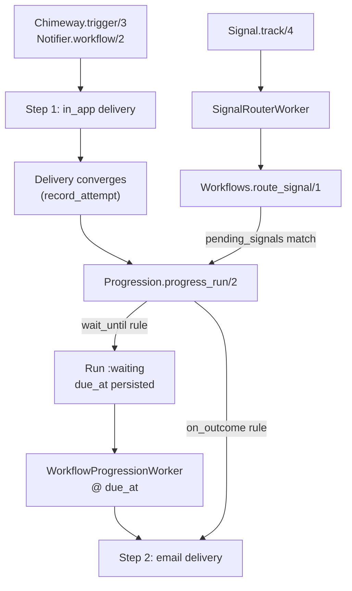

# Phase 37: Doc Truth & Journey Guides — Research

**Researched:** 2026-05-28  
**Phase:** 37-doc-truth-journey-guides  
**Requirements:** DOCS-03  
**Status:** Ready for plan-phase

---

## user_constraints

Locked decisions from `37-CONTEXT.md` (D-01 through D-16) — **non-negotiable**:

| ID | Constraint |
|----|------------|
| D-01 | Resolve INV-002 by correcting journey documentation to match the engine. Do NOT implement `pending_signals` population in `enter_waiting/6` or read→signal auto-wiring in this phase — that belongs to the deferred READ milestone (READ-01/READ-02). |
| D-02 | Any aspirational read/unread early-exit behavior (`stop_conditions`, `notification_read` cancel-on-read) is removed from the primary guide flow and moved to an explicit **Deferred / Future** callout citing the engine gap (`enter_waiting` does not set `pending_signals`; `route_signal/1` only matches runs with `pending_signals` populated). |
| D-03 | Full rewrite using the real authoring surface: Notifier `@callback workflow/2` returning `{:ok, %{workflow_key:, workflow_version:, steps: [...]}}` — not a fictional `Chimeway.Workflow` behaviour module. |
| D-04 | Step progression rules live in each step's `config["progress"]` array with normalized rule kinds: `wait_until`, `on_outcome`, and `stop`. Remove all references to `stop_conditions`, `type: :wait`, ISO 8601 duration strings, and separate wait-step actions — these do not exist in the engine. |
| D-05 | Primary worked example: time-based channel escalation matching test fixtures — `in_app` step with `wait_until` rule (`anchor: "prior_delivery_terminal_at"`, `delay_seconds`, `to_step: "email"`) → `email` step. This is the canonical “missed engagement → escalate” story for v1.5 docs. |
| D-06 | Trigger examples use `Chimeway.trigger/3` with required `idempotency_key` and tenant opts — not `Chimeway.Trigger.trigger/3` with wrong arity. |
| D-07 | Signal examples use correct `Chimeway.Signal.track/4` signature: `track(tenant_id, actor_id, event_name, payload \\ %{})` — not reversed tenant/actor argument order. |
| D-08 | Document `wait_until` behavior as implemented: run enters `:waiting` with `status_reason: "waiting_for_step_progression"`, `status_context` carries `due_at`, `to_step`, anchor delivery metadata; past-due advancement via `Chimeway.Workflows.Progression.progress_run/2` (Oban-scheduled `WorkflowProgressionWorker` in production). |
| D-09 | Document `on_outcome` and `stop` rules with the curated outcome vocabulary from `ProgressionOutcome`: `delivered`, `suppressed`, `temporary_failure`, `retries_exhausted`, `permanent_failure`, `bounced`. Include the `temporary_failure` early-fire warning from `Chimeway.Notifier` moduledoc (fires on first `:failed`, not after retries exhausted — use `retries_exhausted` when that is the intent). |
| D-10 | Document operator inspection via `Chimeway.Workflows.explain/2` and `Chimeway.Workflows.list_traces/2` for run state and transition history — aligned with explainability product value. |
| D-11 | Document delivery-feedback signal routing as the proven production path: webhook ingress → `ProcessFeedbackWorker` → `Chimeway.Signal.track/4` with canonical `chimeway.delivery.{succeeded,bounced,failed}` event names → `SignalRouterWorker` → `Workflows.route_signal/1` → `on_outcome`/`stop` progression. Cross-link `examples/chimeway_demo_host/test/demo_host_web/controllers/feedback_pipeline_e2e_test.exs` and golden-path webhook appendix (`guides/introduction/golden-path.md`). |
| D-12 | Document generic signal routing honestly: `route_signal/1` matches `:waiting` runs whose `pending_signals` list contains the signal's `event_name`. Today, `enter_waiting/6` does not populate `pending_signals` — host applications must wire signal expectations explicitly until READ milestone ships. Do not document read-to-cancel as working out of the box. |
| D-13 | Fix Oban worker module paths in journey guide and `guides/recipes/oban-integration.md`: `Chimeway.Dispatch.WorkflowProgressionWorker` and `Chimeway.Dispatch.SignalRouterWorker` — not `Chimeway.Workflows.Workers.*`. |
| D-14 | Align oban-integration recipe cron/queue guidance with actual dispatch worker modules and queue names (verify against `lib/chimeway/dispatch/` at plan time). |
| D-15 | Add lightweight journey-guide doc-contract test (new file or extend `test/chimeway/doc_contract_test.exs`) with static assertions that `guides/flows/multi-step-journeys.md` references only existing public modules/APIs — e.g., forbids `Chimeway.Workflow`, `stop_conditions`, wrong worker namespaces; requires `Chimeway.trigger/3`, `Chimeway.Signal.track/4`, `wait_until`/`on_outcome`/`stop` rule kinds. |
| D-16 | Ship phase `37-VALIDATION.md` manual checklist mirroring Phase 36 pattern (grep gates on edited guides + `mix test` for doc-contract test + `mix ci.docs`). Full automated GATE-01 doc-contract matrix remains Phase 41 scope. |

**Claude's discretion:** section headings and narrative tone; minimal inline Elixir snippet vs link-only for demo host E2E; specific grep patterns and assertion count in doc-contract test; whether oban-integration fixes land in same commit wave as journey guide; CHANGELOG entry for doc-only changes.

**Explicit out of scope:** `pending_signals` auto-population on `wait_until` entry (READ-01); inbox read/seen → `notification_read` signal → cancel escalation (READ-02); reference recipes (Phase 38); full GATE-01 automated doc-contract CI matrix (Phase 41); `Chimeway.Workflow` behaviour module; engine/API changes of any kind.

---

## research_summary

Phase 37 closes **DOCS-03** and resolves **INV-002** by making `guides/flows/multi-step-journeys.md` describe the engine as implemented — not as aspirational read-to-cancel fiction. The current guide is the largest remaining adoption-surface violator after Phase 36: it documents a non-existent `Chimeway.Workflow` behaviour, separate `:wait` steps with ISO 8601 durations and `stop_conditions`, wrong trigger/signal APIs, and wrong Oban worker namespaces.

**Confidence: High.** Every drift item was verified against source via grep and file reads. The canonical rewrite seeds already exist in `workflow_progression_test.exs`, `workflows_test.exs`, and `feedback_pipeline_e2e_test.exs`.

### What the codebase confirms [VERIFIED: codebase grep]

1. **Workflow authoring surface:** `@callback workflow(map(), map())` on `Chimeway.Notifier` at `notifier.ex:58`; normalization expects `workflow_key`, `workflow_version`, `steps` with `step_key`, `step_order`, `channel`, `config` at `notifier.ex:365-516`.
2. **Progress rule kinds:** Only `wait_until`, `on_outcome`, `stop` — `notifier.ex:644-648`. Outcomes: `delivered`, `suppressed`, `temporary_failure`, `retries_exhausted`, `permanent_failure`, `bounced` at `notifier.ex:617`. Wait anchor: only `prior_delivery_terminal_at` at `notifier.ex:622`.
3. **`wait_until` entry:** `enter_waiting/6` sets `state: :waiting`, `status_reason: "waiting_for_step_progression"`, `status_context` with `due_at`, `to_step`, anchor fields — **does not set `pending_signals`** [CITED: `progression.ex:251-286`].
4. **Past-due advancement:** `maybe_reactivate_due/3` → `advance_after_wait/5` via `progress_run/2`; Oban hosts get `WorkflowProgressionWorker` scheduled at `due_at` when `dispatcher: Chimeway.Dispatch.Oban` [CITED: `progression.ex:431-537`, `progression.ex:603-651`].
5. **Signal routing contract:** `route_signal/1` matches `:waiting` runs where `event_name in pending_signals`, scoped by `tenant_id` + `recipient_identity == actor_id` [CITED: `workflows.ex:393-451`].
6. **Public trigger:** `Chimeway.trigger/3` delegates to `Trigger.trigger/3` [CITED: `chimeway.ex:14-15`]. Requires `idempotency_key` and `tenant_id` [CITED: `trigger.ex:47-48`, integration test at `trigger_explain_test.exs:135-137`].
7. **Public signal:** `Chimeway.Signal.track(tenant_id, actor_id, event_name, payload \\ %{})` [CITED: `signal.ex:20-22`].
8. **Oban workers:** `Chimeway.Dispatch.WorkflowProgressionWorker` (queue `:chimeway_delivery`) and `Chimeway.Dispatch.SignalRouterWorker` (queue `:chimeway_signals`) — no `Chimeway.Workflows.Workers.*` modules exist [VERIFIED: codebase grep].
9. **Delivery-feedback path:** `ProcessFeedbackWorker` emits `chimeway.delivery.{succeeded,bounced,failed}` signals [CITED: `process_feedback_worker.ex:159`]; demo E2E proves webhook → signal → `route_signal` → trace [CITED: `feedback_pipeline_e2e_test.exs:24-115`].
10. **Operator inspection:** `Workflows.explain/2` and `Workflows.list_traces/2` with tenant scoping [CITED: `workflows.ex:287-371`]; tests at `workflows_inspection_test.exs`.

### Critical gaps planning must address

| Gap | Impact |
|-----|--------|
| **Journey guide is entirely fictional** | Adopters copy broken APIs before reaching working engine |
| **`chimeway_workflows` queue in oban recipe is unused** | Host Oban config includes dead queue; worker actually on `chimeway_delivery` |
| **Cron ProgressionWorker guidance is misleading** | Engine auto-schedules per-run jobs at `due_at`; cron + `progress_due_runs/1` is fallback only |
| **Read-to-cancel presented as primary story** | Contradicts engine; must move to Deferred callout per D-02 |
| **No journey doc-contract test** | DOCS-03 criterion #3 unmet until D-15 lands |

**Planning recommendation:** One full rewrite of `multi-step-journeys.md` anchored on the `WorkflowProgression` test fixture; secondary section for delivery-feedback signals (not inbox read); explicit Deferred callout for READ milestone; extend `doc_contract_test.exs`; fix `oban-integration.md` worker paths and queue/cron guidance in same phase.

---

## 1. Drift Inventory — `guides/flows/multi-step-journeys.md`

| # | Guide claims (current) | Engine truth | Action |
|---|------------------------|--------------|--------|
| 1 | `@behaviour Chimeway.Workflow` standalone module | Workflows authored via optional `Notifier.workflow/2` callback | **Remove**; show notifier-embedded workflow |
| 2 | Step map uses `id`, nested `action: %{type: :notify, ...}` | Steps use `step_key`, `step_order`, `channel`, `config` | **Rewrite** step shape |
| 3 | Separate `type: :wait` step with `duration: "PT2H"` | Time gates are `wait_until` rules on a channel step's `config["progress"]` | **Remove** wait steps |
| 4 | `stop_conditions: [%{type: :signal_received, ...}]` | No such DSL; early exit via `stop` rules on delivery outcomes, or signal routing via `pending_signals` (host-wired) | **Remove** from primary flow; Deferred callout |
| 5 | `Chimeway.Trigger.trigger(Module, params, tenant_id: ...)` | `Chimeway.trigger(NotifierModule, params, idempotency_key:, tenant_id:)` | **Fix** trigger API |
| 6 | `Chimeway.Signal.track("user_123", "org_456", ...)` (actor, tenant) | `track(tenant_id, actor_id, event_name, payload)` | **Fix** argument order |
| 7 | Read signal halts escalation automatically | `enter_waiting/6` does not populate `pending_signals`; read path requires host glue | **Move to Deferred** |
| 8 | `Chimeway.Workflows.Workers.ProgressionWorker` cron | `Chimeway.Dispatch.WorkflowProgressionWorker` on `:chimeway_delivery`; scheduled at `due_at` per run | **Fix** worker + scheduling model |
| 9 | `Chimeway.Workflows.Workers.SignalRouterWorker` | `Chimeway.Dispatch.SignalRouterWorker` on `:chimeway_signals` | **Fix** namespace |
| 10 | "Wait Gates and Stop Conditions" framing | Progress rules: `wait_until`, `on_outcome`, `stop` | **Retitle/reframe** |

No other files under `guides/` reference `Chimeway.Workflow`, `stop_conditions`, or `Workflows.Workers` except `oban-integration.md` [VERIFIED: codebase grep on `guides/`].

---

## 2. Drift Inventory — `guides/recipes/oban-integration.md`

| # | Recipe claims | Engine truth | Action |
|---|---------------|--------------|--------|
| 1 | Cron: `Chimeway.Workflows.Workers.ProgressionWorker` | `Chimeway.Dispatch.WorkflowProgressionWorker`; auto-scheduled at `due_at` when Oban dispatcher configured | **Fix** module; document scheduled jobs + optional `progress_due_runs/1` cron fallback |
| 2 | `Chimeway.Workflows.Workers.SignalRouterWorker` | `Chimeway.Dispatch.SignalRouterWorker` | **Fix** module |
| 3 | `chimeway_workflows` queue for progression | No worker uses `:chimeway_workflows`; `WorkflowProgressionWorker` uses `:chimeway_delivery` | **Remove or mark optional/unused** |
| 4 | SignalRouter "satisfies stop conditions" | Signals resume runs with matching `pending_signals`; progression rules are separate (`on_outcome`/`stop` on delivery convergence) | **Clarify** semantics |
| 5 | Example uses `WelcomeNotifier.trigger(...)` | Public API is `Chimeway.trigger(NotifierModule, ...)` | **Fix** if touched (minor, outside journey scope but same file) |

---

## 3. Engine Semantics (authoritative reference for guide prose)

### 3.1 Workflow declaration shape [CITED: `notifier.ex:496-516`, `notifier.ex:399-414`]

Steps are normalized to:

```elixir
%{
  step_key: "in_app",      # or "step_key" => "in_app"
  step_order: 1,           # must be sequential 1..N
  channel: "in_app",       # atom or string
  config: %{"progress" => [...]}  # optional
}
```

Workflow envelope:

```elixir
{:ok, %{
  workflow_key: "mention_escalation",
  workflow_version: 1,
  steps: [...]
}}
```

### 3.2 Progress rule shapes [CITED: `notifier.ex:655-718`]

| Kind | Required keys | Behavior |
|------|---------------|----------|
| `wait_until` | `anchor`, `delay_seconds`, `to_step` | After prior step delivery converges (`:branchable`), run → `:waiting` until `due_at` |
| `on_outcome` | `outcome`, `to_step` | On matching terminal delivery outcome, advance cursor + plan next-step delivery |
| `stop` | `outcome` | On matching outcome, run → `:stopped` |

Rule evaluation order on active step [CITED: `progression.ex:190-214`]: `on_outcome`/`stop` first (by outcome match), then `wait_until` if branchable, else implicit completion or noop.

### 3.3 `wait_until` waiting state [CITED: `progression.ex:251-286`]

When entered:

- `run.state == :waiting`
- `run.status_reason == "waiting_for_step_progression"`
- `run.status_context` includes: `rule_kind`, `anchor`, `anchor_delivery_id`, `anchor_delivery_status`, `anchor_timestamp`, `due_at`, `to_step`
- **`pending_signals` unchanged** (defaults to `[]` from schema — not written in `enter_waiting/6`)

Past-due: `progress_run/2` with `now >= due_at` → `reactivated_from_wait` transition → advance to `to_step` → plan next delivery [CITED: `progression.ex:478-537`].

### 3.4 Outcome vocabulary + early-fire warning [CITED: `progression_outcome.ex:14-25`, `notifier.ex:11-38`]

Authoring strings must match mapper atoms: `delivered`, `suppressed`, `temporary_failure`, `retries_exhausted`, `permanent_failure`, `bounced`.

**WR-02:** `temporary_failure` fires on first `:failed` delivery row (retries may still succeed). Use `retries_exhausted` for post-retry terminal semantics.

### 3.5 Signal routing [CITED: `workflows.ex:373-451`, `signal.ex:20-39`]

```
Chimeway.Signal.track(tenant_id, actor_id, event_name, payload)
  → Signal row + SignalRouterWorker job (chimeway_signals queue)
  → Workflows.route_signal/1
  → matches :waiting runs where event_name ∈ pending_signals
     AND tenant_id matches AND notification.recipient_identity == actor_id
  → run.state := :active, pending_signals := [], transition reason "signal_received"
```

**Gap (INV-002 / READ-01):** `enter_waiting/6` never populates `pending_signals`. Tests and demo E2E set it manually or via fixture [CITED: `workflows_test.exs:190-195`, `feedback_pipeline_e2e_test.exs:268`]. Guide must not imply auto-population.

### 3.6 Delivery-feedback signal path (proven E2E) [CITED: `feedback_pipeline_e2e_test.exs:24-115`, `process_feedback_worker.ex`]

Production path for delivery outcomes driving progression:

1. Webhook → `Chimeway.Webhooks` ingress + `ProcessFeedbackWorker` (`chimeway_delivery` queue)
2. Worker records attempt + calls `Chimeway.Signal.track/4` with `chimeway.delivery.succeeded|bounced|failed`
3. `SignalRouterWorker` routes to waiting runs (when `pending_signals` pre-set)
4. For **active** runs, `on_outcome`/`stop` rules fire from delivery convergence inside `record_attempt/2` → `progress_run/2` (stop path in E2E does not need signal routing)

Cross-link golden-path appendix at `guides/introduction/golden-path.md:151-163`.

### 3.7 Operator inspection [CITED: `workflows.ex:287-371`]

```elixir
{:ok, run} = Chimeway.Workflows.explain(tenant_id, workflow_run_id)
# run.state, run.status_reason, run.current_step_name, run.pending_signals, ...

{:ok, traces} = Chimeway.Workflows.list_traces(tenant_id, workflow_run_id)
# [%WorkflowTransition{reason: "waiting_for_step_progression", context: %{...}}, ...]
```

Tenant mismatch returns `{:error, :not_found}` [CITED: `workflows_inspection_test.exs:157-163`].

### 3.8 Oban worker + queue truth [VERIFIED: codebase grep]

| Worker | Module | Queue | Scheduling |
|--------|--------|-------|------------|
| Wait elapse | `Chimeway.Dispatch.WorkflowProgressionWorker` | `:chimeway_delivery` | Auto-insert at `due_at` when `config :chimeway, dispatcher: Chimeway.Dispatch.Oban` |
| Signal route | `Chimeway.Dispatch.SignalRouterWorker` | `:chimeway_signals` | Enqueued by `Signal.track/4` Multi |
| Webhook feedback | `Chimeway.Webhooks.ProcessFeedbackWorker` | `:chimeway_delivery` | Enqueued by webhook ingress |

Fallback for non-Oban or failed scheduler: `Chimeway.Workflows.Progression.progress_due_runs/1` [CITED: `progression.ex:139-154`].

---

## 4. Canonical Code Examples (from test fixtures)

Planner should copy-adapt these verified snippets into the rewritten guide.

### 4.1 Notifier with `wait_until` + `on_outcome` (primary escalation story — D-05)

Source: `test/chimeway/orchestration/workflow_progression_test.exs:40-74`

```elixir
defmodule MyApp.Notifiers.MentionEscalation do
  use Chimeway.Notifier

  @impl true
  def notification_key, do: "mention_escalation"

  @impl true
  def version, do: 1

  @impl true
  def recipients(params) do
    {:ok, [%{recipient_identity: params.user_id, recipient_type: "user"}]}
  end

  @impl true
  def build(_params, _recipient) do
    {:ok, %{title: "You were mentioned", body: "See the document."}}
  end

  @impl true
  def channels(_params, _recipient), do: {:ok, [:in_app, :email]}

  @impl true
  def workflow(_params, _recipient) do
    {:ok,
     %{
       workflow_key: "mention_escalation",
       workflow_version: 1,
       steps: [
         %{
           step_key: "in_app",
           step_order: 1,
           channel: :in_app,
           config: %{
             "progress" => [
               %{
                 "kind" => "wait_until",
                 "anchor" => "prior_delivery_terminal_at",
                 "delay_seconds" => 7200,
                 "to_step" => "email"
               },
               %{
                 "kind" => "on_outcome",
                 "outcome" => "bounced",
                 "to_step" => "email"
               }
             ]
           }
         },
         %{
           step_key: "email",
           step_order: 2,
           channel: :email,
           config: %{}
         }
       ]
     }}
  end
end
```

### 4.2 Trigger with required opts (D-06)

Source: `workflow_progression_test.exs:621-627`

```elixir
{:ok, _result} =
  Chimeway.trigger(
    MyApp.Notifiers.MentionEscalation,
    %{user_id: "user:123"},
    idempotency_key: "mention-doc-789-user-123",
    tenant_id: "org_456"
  )
```

### 4.3 Signal track with correct argument order (D-07)

Source: `signal.ex:20-22`, `feedback_pipeline_e2e_test.exs:70-72`

```elixir
Chimeway.Signal.track(
  "org_456",
  "user:123",
  "invoice_paid",
  %{"delivery_id" => delivery_id}
)
```

Canonical delivery-feedback event names: `chimeway.delivery.succeeded`, `chimeway.delivery.bounced`, `chimeway.delivery.failed`.

### 4.4 `stop` rule example

Source: `workflow_progression_test.exs:108-109`

```elixir
%{"kind" => "stop", "outcome" => "bounced"}
```

### 4.5 Operator inspection (D-10)

Source: `workflows_inspection_test.exs:101-112`, `trigger_explain_test.exs:80-83`

```elixir
{:ok, run} = Chimeway.Workflows.explain("org_456", workflow_run_id)
run.state          # :waiting | :active | :stopped | :completed
run.status_reason  # e.g. "waiting_for_step_progression"
run.pending_signals

{:ok, traces} = Chimeway.Workflows.list_traces("org_456", workflow_run_id)
Enum.map(traces, & &1.reason)
#=> ["workflow_started", "step_activated", "waiting_for_step_progression", ...]
```

### 4.6 Deferred callout content (D-02 / D-12 — not primary flow)

Guide must include explicit **Deferred / Future** section:

- READ-01: auto-populate `pending_signals` when entering `wait_until`
- READ-02: inbox read/seen → `notification_read` signal → cancel escalation without host glue
- Until then: hosts that need signal-driven early exit must set `pending_signals` on the run (see `workflows_test.exs`, `trigger_explain_test.exs:107-112`) — not copy-paste ready for production

---

## 5. Doc-Contract Test Approach (D-15)

### Recommendation: extend `test/chimeway/doc_contract_test.exs`

**Rationale:** Phase 36 established a single doc-contract file for moduledoc checks. Journey guide assertions belong in the same module under a new `describe "journey guide doc contract"` block — keeps `mix test test/chimeway/doc_contract_test.exs` as one entrypoint until Phase 41 GATE-01 expands coverage.

### Implementation sketch

```elixir
describe "journey guide doc contract (DOCS-03)" do
  @guide_path "guides/flows/multi-step-journeys.md"
  @guide File.read!(@guide_path)

  test "forbids aspirational workflow APIs" do
    refute @guide =~ "Chimeway.Workflow"
    refute @guide =~ "stop_conditions"
    refute @guide =~ "Chimeway.Workflows.Workers"
    refute @guide =~ ~s(type: :wait)
    refute @guide =~ "Chimeway.Trigger.trigger"
  end

  test "requires implemented progression vocabulary" do
    assert @guide =~ "wait_until"
    assert @guide =~ "on_outcome"
    assert @guide =~ "config[\"progress\"]" or @guide =~ ~s(config: %{)
    assert @guide =~ "Chimeway.trigger"
    assert @guide =~ "Chimeway.Signal.track"
    assert @guide =~ "prior_delivery_terminal_at"
  end

  test "documents correct dispatch workers" do
    assert @guide =~ "Chimeway.Dispatch.WorkflowProgressionWorker"
    assert @guide =~ "Chimeway.Dispatch.SignalRouterWorker"
  end
end
```

**Optional second describe** for `guides/recipes/oban-integration.md` if edited in same phase (D-13/D-14) — same forbid/require patterns for worker namespaces.

### What doc-contract test does NOT cover (Phase 41 / manual)

- Semantic correctness of prose (grep cannot verify `temporary_failure` warning accuracy)
- Fresh-host walkthrough of escalation timing
- Cross-link URL validity

---

## 6. Target Guide Structure (suggested — Claude discretion on tone)

1. **Introduction** — multi-step journeys via notifier `workflow/2`; progress rules on channel steps
2. **Scenario** — missed in-app engagement → email escalation (`wait_until`)
3. **Define the workflow** — full notifier example (§4.1)
4. **Progress rule reference** — table of three kinds + outcome vocabulary + WR-02 warning
5. **Trigger the journey** — `Chimeway.trigger/3` (§4.2)
6. **How waits advance** — `:waiting` state, `due_at`, `WorkflowProgressionWorker`, `progress_due_runs/1` fallback
7. **Outcome-driven branching** — `on_outcome` / `stop` with delivery convergence
8. **Signal routing** — delivery-feedback path (§3.6) + honest generic routing limits (§3.5)
9. **Inspect runs** — `explain/2`, `list_traces/2` (§4.5)
10. **Oban production setup** — link to corrected `oban-integration.md`
11. **Deferred / Future** — READ milestone callout (§4.6)

---

## architecture_patterns



### Documentation flow (target after Phase 37)

```
golden-path.md (webhook appendix)
       ↓ cross-link
multi-step-journeys.md (DOCS-03 truth)
       ↓ production Oban
oban-integration.md (worker paths fixed)
       ↓ depth
Phase 38 recipes (RECP-01/02)
```

---

## common_pitfalls

1. **Copying current journey guide** — every API surface is wrong; full rewrite required.
2. **Documenting read-to-cancel as v1.5** — engine gap; Deferred callout only (D-02).
3. **Separate wait steps** — waits are rules on channel steps, not standalone step types.
4. **ISO 8601 durations** — use integer `delay_seconds` only.
5. **Reversed `Signal.track/4` args** — tenant first, then actor.
6. **Missing trigger opts** — `idempotency_key` and `tenant_id` required.
7. **Cron-only wait guidance** — primary path is per-run scheduled `WorkflowProgressionWorker`; cron is fallback via `progress_due_runs/1`.
8. **`chimeway_workflows` queue** — no worker binds to it today; do not require in host config.
9. **Conflating signal routing with `stop` rules** — signals resume waiting runs; `stop`/`on_outcome` evaluate delivery outcomes on active steps.
10. **Using `temporary_failure` for post-retry escalation** — use `retries_exhausted` (WR-02).

---

## open_questions

| # | Question | Recommendation | Owner |
|---|----------|----------------|-------|
| OQ-1 | Include `on_outcome`/`stop` in primary example or separate subsection? | **Both** — fixture already combines `wait_until` + `on_outcome`; add short `stop` aside | Plan-phase |
| OQ-2 | Doc-contract test cover `oban-integration.md` too? | **Yes** — same phase edits; one describe block per file | Plan-phase |
| OQ-3 | Remove `chimeway_workflows` from recipe or document as reserved? | **Remove from required queues**; note optional/reserved if kept | Execute-phase |
| OQ-4 | Link journey guide from golden-path Next Steps? | **Optional** — Phase 38 recipes may be better anchor; not D-01 scope | Claude discretion |
| OQ-5 | CHANGELOG entry? | Optional doc-only note | Claude discretion |

---

## sources

### Primary (verified for this research)

| Path | Use |
|------|-----|
| `.planning/phases/37-doc-truth-journey-guides/37-CONTEXT.md` | Locked D-01–D-16 |
| `.planning/REQUIREMENTS.md` | DOCS-03, READ deferrals |
| `.planning/ROADMAP.md` | Phase 37 success criteria |
| `.planning/STATE.md` | INV-002 open investigation |
| `guides/flows/multi-step-journeys.md` | Primary drift target |
| `guides/recipes/oban-integration.md` | Worker path drift |
| `guides/introduction/golden-path.md` | Webhook cross-link target |
| `lib/chimeway/notifier.ex` | `workflow/2`, progress rule normalization |
| `lib/chimeway/workflows/progression.ex` | `enter_waiting/6`, `progress_run/2` |
| `lib/chimeway/workflows/progression_outcome.ex` | Outcome vocabulary |
| `lib/chimeway/workflows.ex` | `route_signal/1`, `explain/2`, `list_traces/2` |
| `lib/chimeway/signal.ex` | `track/4` |
| `lib/chimeway/dispatch/workflow_progression_worker.ex` | Oban wait worker |
| `lib/chimeway/dispatch/signal_router_worker.ex` | Oban signal worker |
| `lib/chimeway/webhooks/process_feedback_worker.ex` | Delivery feedback signals |
| `lib/chimeway.ex` | `trigger/3` |
| `test/chimeway/orchestration/workflow_progression_test.exs` | Canonical fixtures |
| `test/chimeway/workflows_test.exs` | `route_signal/1` + `pending_signals` |
| `test/chimeway/workflows_inspection_test.exs` | `explain/2`, `list_traces/2` |
| `test/chimeway/doc_contract_test.exs` | Extend target |
| `examples/chimeway_demo_host/test/demo_host_web/controllers/feedback_pipeline_e2e_test.exs` | E2E proof |
| `.planning/phases/36-golden-path-version-alignment/36-RESEARCH.md` | Pattern reference |
| `.planning/phases/36-golden-path-version-alignment/36-VALIDATION.md` | Checklist pattern |

---

## metadata

| Field | Value |
|-------|-------|
| Phase | 37-doc-truth-journey-guides |
| Milestone | v1.5 Adoption Surface |
| Requirements | DOCS-03 |
| Depends on | Phase 36 — complete |
| Phase type | Documentation + lightweight test — no engine changes |
| Files to rewrite | `guides/flows/multi-step-journeys.md` |
| Files to edit | `guides/recipes/oban-integration.md`, `test/chimeway/doc_contract_test.exs` |
| Files to create | `.planning/phases/37-doc-truth-journey-guides/37-VALIDATION.md` |
| Estimated surface | 1 full guide rewrite (~150-220 lines) + recipe fix + doc-contract tests |
| Risk level | Medium — must not re-introduce aspirational read-to-cancel as primary path |
| INV-002 resolution | Doc-truth (not engine) |
| GATE-01 automation | Deferred to Phase 41 |

---

## Validation Architecture

*Nyquist sampling strategy for plan-phase verification loop (docs + lightweight test phase).*

### Test Infrastructure

| Property | Value |
|----------|-------|
| **Framework** | ExUnit (`doc_contract_test.exs`) + manual grep checklist (`37-VALIDATION.md`) |
| **Config file** | `mix.exs` aliases — `ci.docs`, `ci` |
| **Quick run command** | `mix test test/chimeway/doc_contract_test.exs` |
| **Docs command** | `mix ci.docs` |
| **Full suite command** | `mix ci` |
| **Estimated runtime** | ~5s doc-contract test; ~20s with full CI |

### Requirement → Test Map

| Requirement | Verification | Automated Command | Wave 0 |
|-------------|--------------|-------------------|--------|
| DOCS-03 #1 — accurate `wait_until`/outcome/signal docs | Manual section checklist + grep for rule kinds | `rg 'wait_until|on_outcome|prior_delivery_terminal_at' guides/flows/multi-step-journeys.md` | ⬜ guide rewrite |
| DOCS-03 #2 — INV-002 deferral callout | Grep for Deferred section + absence of primary read-cancel flow | `rg 'Deferred|READ-0|pending_signals' guides/flows/multi-step-journeys.md`; `rg 'stop_conditions|notification_read' guides/flows/multi-step-journeys.md` expect 0 in primary sections | ⬜ |
| DOCS-03 #3 — doc-contract test | ExUnit static assertions | `mix test test/chimeway/doc_contract_test.exs` | ❌ **W0 gap** — test not yet written |
| D-13/D-14 — oban worker paths | Grep forbid old namespace | `rg 'Workflows\.Workers' guides/` expect 0 | ⬜ recipe fix |
| D-16 — HexDocs publish | Docs build | `mix ci.docs` | ✅ exists |
| D-06/D-07 — trigger/signal API | Doc-contract + grep | `rg 'Chimeway\.Trigger\.trigger' guides/flows/` expect 0 | ⬜ |

### Wave 0 Gaps

Existing infrastructure does **not** fully cover DOCS-03 until execute-phase lands:

- [ ] Journey guide doc-contract describe block in `doc_contract_test.exs` (D-15)
- [ ] `37-VALIDATION.md` checklist file (D-16)
- [ ] Rewritten `multi-step-journeys.md` (primary deliverable)
- [ ] Fixed `oban-integration.md` worker modules and queue guidance

Already available:

- [x] `mix ci.docs`
- [x] `mix ci`
- [x] Engine test fixtures proving semantics (`workflow_progression_test.exs`, `workflows_test.exs`, `feedback_pipeline_e2e_test.exs`)
- [x] Phase 36 validation pattern template (`36-VALIDATION.md`)

### Sampling Strategy

| Surface | Strategy |
|---------|----------|
| Forbidden APIs in journey guide | **Full enumeration** via ExUnit + grep |
| Required APIs / rule kinds | **Full enumeration** via ExUnit + grep |
| Semantic accuracy (WR-02, pending_signals gap) | **Manual checklist** in `37-VALIDATION.md` |
| Oban recipe alignment | **Full enumeration** of worker module strings |
| E2E proof cross-links | **Existence check** — link to demo test + golden-path |
| Fresh-host escalation timing | **Recommended once** manual UAT; not CI until Phase 41 |

### Nyquist UAT deferral

Full automated doc-contract matrix remains Phase 41 (GATE-01). Minimum execute-phase UAT:

1. Trigger notifier with `wait_until` workflow (fixture pattern)
2. Converge in_app delivery → verify run `:waiting` with `due_at`
3. Call `progress_run/2` with past-due `now` → verify email step delivery
4. `Workflows.explain/2` shows expected `status_reason`
5. Grep gates in `37-VALIDATION.md` all green

---

## Security Domain

**Phase type:** Documentation-only (+ static doc-contract test). **Minimal ASVS applicability.**

| ASVS area | Applicability | Guidance for docs |
|-----------|---------------|-------------------|
| V1 Architecture | Low | No new attack surface |
| V5 Validation | Low | Examples must not encourage skipping `tenant_id` on triggers |
| V8 Data protection | **Medium (doc hygiene)** | Guide examples should use redacted IDs; note `list_traces/2` excludes raw signal payloads by design [CITED: `workflows.ex:329-331`] |
| V13 API | Low | Document correct public entrypoints (`Chimeway.trigger/3`, `Signal.track/4`) to avoid hosts calling internal modules |

**Threat-model notes for guide authors:**

- `explain/2` and `list_traces/2` enforce tenant scoping — document that cross-tenant IDs return `:not_found` [CITED: `workflows.ex:284-285`]
- `route_signal/1` transition context stores `event_name` only, not raw payload [CITED: `workflows.ex:379-381`, `workflows.ex:418`]
- Do not embed real webhook secrets or PII in guide snippets

No security review gate required beyond doc hygiene checklist in `37-VALIDATION.md`.

---

## Suggested Plan Decomposition

| Plan | Scope | Requirements |
|------|-------|--------------|
| 37-01 | Rewrite `multi-step-journeys.md` (D-03–D-12) | DOCS-03 #1, #2 |
| 37-02 | Fix `oban-integration.md` worker paths + queue/cron guidance (D-13, D-14) | DOCS-03 #1 |
| 37-03 | Extend `doc_contract_test.exs` + create `37-VALIDATION.md` (D-15, D-16) | DOCS-03 #3 |

Suggested commit granularity:

1. `docs: rewrite multi-step journey guide for engine truth (DOCS-03)`
2. `docs: fix oban integration worker paths for workflows`
3. `test: add journey guide doc-contract assertions (DOCS-03)`

---

*Phase: 37-doc-truth-journey-guides*  
*Research completed: 2026-05-28*
