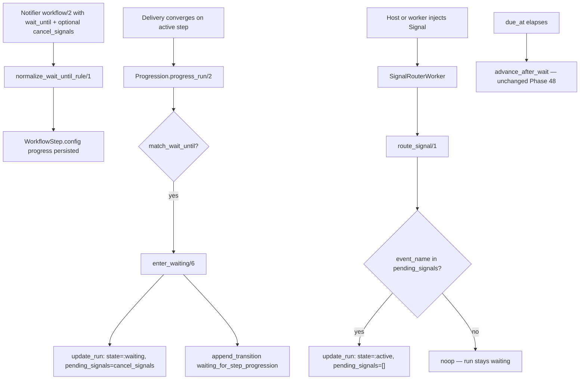

# Phase 48: `wait_until` Pending Signals — Research

**Researched:** 2026-05-29  
**Domain:** Elixir/Ecto workflow progression engine — `wait_until` → `pending_signals` population  
**Confidence:** HIGH — all findings verified against live source in this session

---

<user_constraints>
## User Constraints (from CONTEXT.md)

### Locked Decisions

#### Implementation seam
- **D-01:** Populate `pending_signals` inside `enter_waiting/6` in `lib/chimeway/workflows/progression.ex`, in the same `Repo.transaction` that sets `state: :waiting`, `status_reason`, and `status_context`.
- **D-02:** Do not change `route_signal/1` matching logic — it already queries `pending_signals`; Phase 48 only ensures waiting runs have the list set at entry.

#### Progress-rule DSL
- **D-03:** Extend `wait_until` progress rules with an optional `cancel_signals` key (array of non-empty strings). When present, `enter_waiting` copies that list into `WorkflowRun.pending_signals`. When omitted, persist `[]` (time-only waits behave exactly as today).
- **D-04:** Update `normalize_wait_until_rule/1` in `lib/chimeway/notifier.ex` to accept and validate `cancel_signals` alongside existing keys (`kind`, `anchor`, `delay_seconds`, `to_step`). Reject unknown extra keys per existing mixed-rule-shape guardrails.

#### Canonical event names
- **D-05:** Document `chimeway.notification.read` and `chimeway.notification.seen` as the canonical `cancel_signals` values for inbox-driven early exit. Phase 48 does **not** wire `Chimeway.mark_read/3` or `mark_seen/3` to emit these events — that is READ-02 (Phase 49).
- **D-06:** Do not auto-default inbox read/seen signals for all `wait_until` waits; authors must declare `cancel_signals` explicitly when they want signal-driven early exit.

#### Post-signal behavior (boundary)
- **D-07:** Phase 48 does not change `route_signal/1` post-match behavior (`:waiting` → `:active`, `signal_received` transition, clear `pending_signals`). Read-cancel semantics that halt escalation before `due_at` (READ-03, JOUR-06) belong in Phase 49+.
- **D-08:** Phase 48 success proof: a waiting run with auto-populated `pending_signals` matches an injected signal via `SignalRouterWorker` without host `update_run` glue (mirrors existing `workflows_test.exs` / `feedback_pipeline_e2e_test.exs` patterns).

#### Doc-truth
- **D-09:** Update `guides/flows/multi-step-journeys.md` in this phase — remove the READ-01 engine-gap callout, document `cancel_signals` on `wait_until`, show canonical inbox event names. Defer mention-escalation recipe rewrite to Phase 50 (DEMO-04).

### Claude's Discretion
- Exact validation rules for `cancel_signals` entries (min length, deduplication, max count).
- Whether to mirror `cancel_signals` into `status_context` for operator trace visibility (optional; not required if `explain/2` already surfaces `pending_signals`).
- Test fixture notifier shape for progression/orchestration tests exercising auto-population.

### Deferred Ideas (OUT OF SCOPE)
- **READ-02 / inbox signal emission** — Wire `Chimeway.mark_read/3` and `mark_seen/3` to `Signal.track/4` with canonical event names (Phase 49).
- **Read-cancel escalation halt** — Prevent `due_at` advancement after read signal; `signal_received` → stop or complete semantics (READ-03, Phase 49; JOUR-06, Phase 51).
- **Demo seed choreography removal** — Replace `stage_escalation_webhook/1` with READ-driven TeamPulse escalation (Phase 50).
- **Mention-escalation recipe** — Document read-cancel + `wait_until` fallback as canonical PM JTBD path (DEMO-04, Phase 50).

None — analysis stayed within phase scope.
</user_constraints>

<phase_requirements>
## Phase Requirements

| ID | Description | Research Support |
|----|-------------|------------------|
| READ-01 | Workflow runs entering `wait_until` persist canonical `pending_signals` derived from progress rules (no host glue required) | `enter_waiting/6` is the sole write seam; `cancel_signals` DSL + `normalize_wait_until_rule/1` validation; existing `route_signal/1` / `SignalRouterWorker` matching unchanged; test patterns in `workflow_progression_test.exs`, `workflows_test.exs`, `signal_router_worker_test.exs` |
</phase_requirements>

## Summary

Phase 48 closes a narrow but high-leverage engine gap: when `Chimeway.Workflows.Progression.enter_waiting/6` transitions a run to `:waiting` after a `wait_until` rule matches, it persists `status_reason`, `status_context`, and transition audit rows but **never sets `WorkflowRun.pending_signals`**. Meanwhile `Chimeway.Workflows.route_signal/1` already matches waiting runs where `event_name in pending_signals` (tenant + recipient_identity scoped). Host applications today must manually call `Workflows.update_run/3` after progression — e.g. `DemoHost.Seeds.stage_escalation_webhook/1` sets `pending_signals: ["chimeway.delivery.succeeded"]` by hand.

The fix is intentionally minimal: extend the `wait_until` progress-rule DSL with an optional `cancel_signals` string array, validate it in `Chimeway.Notifier.normalize_wait_until_rule/1`, and copy the normalized list into `pending_signals` inside the existing `Workflows.update_run/3` call in `enter_waiting/6`. Time-only waits (no `cancel_signals` key) continue to persist `[]`, preserving current behavior. Signal routing, post-match transitions, inbox emission, and read-cancel escalation semantics are explicitly out of scope.

**Primary recommendation:** Two-file engine change (`progression.ex` + `notifier.ex`), progression + notifier contract tests, one integration test proving `SignalRouterWorker` matches auto-populated signals, and journey-guide doc-truth update with matching `doc_contract_test.exs` adjustments.

## Architectural Responsibility Map

| Capability | Primary Tier | Secondary Tier | Rationale |
|------------|-------------|----------------|-----------|
| `cancel_signals` DSL validation | API / Backend (Notifier normalization) | — | Progress rules are validated at notifier/workflow declaration time before persistence on `WorkflowStep.config` |
| `pending_signals` population on wait entry | API / Backend (Progression engine) | — | Durable run state mutation belongs in `enter_waiting/6` transaction, not host glue |
| Signal → run matching | API / Backend (`Workflows.route_signal/1`) | Oban worker (`SignalRouterWorker`) | Matching query already exists; worker delegates unchanged |
| Operator visibility of pending signals | API / Backend (`Workflows.explain/2`) | — | `explain/2` already selects `wr.pending_signals`; no new inspection surface needed |
| Inbox read → signal emission | — (deferred Phase 49) | — | `Chimeway.Inbox.mark_read/3` updates timestamps only; no `Signal.track/4` today |
| Journey authoring documentation | Docs (`multi-step-journeys.md`) | Doc contract tests | READ-01 gap callout removal + `cancel_signals` authoring reference |

## Standard Stack

### Core

| Library | Version | Purpose | Why Standard |
|---------|---------|---------|--------------|
| Elixir | ~> 1.17 | Language runtime | Project baseline (`mix.exs`) |
| Ecto / Ecto.SQL | ~> 3.11 | Schema, changesets, transactions | All progression mutations use `Repo.transaction` + `Workflows.update_run/3` |
| PostgreSQL | 15+ | `pending_signals` `{:array, :string}` column | Migrated in `priv/chimeway_migrations/027_create_chimeway_signals_and_spine.exs` |
| Oban | ~> 2.17 (optional) | `SignalRouterWorker` async routing | Already wired; no change in Phase 48 |
| ExUnit | (bundled) | Regression + contract tests | Existing test patterns cover all verification needs |

### Supporting

| Library | Version | Purpose | When to Use |
|---------|---------|---------|-------------|
| Oban.Testing | ~> 2.17 | `perform_job/2` in worker tests | SignalRouterWorker success proof |
| Jason | ~> 1.4 | JSON in demo E2E (unchanged) | Not required for core lib tests |

### Alternatives Considered

| Instead of | Could Use | Tradeoff |
|------------|-----------|----------|
| `cancel_signals` on `wait_until` rule | Host `update_run` after progression | Rejected — violates READ-01; masks engine gap (current pain) |
| Auto-default inbox signals for all waits | Explicit opt-in `cancel_signals` | Rejected per D-06 — surprising DX for time-only escalations |
| Mirror signals in `status_context` | Rely on `explain/2` `pending_signals` | Prefer no mirror — avoids dual-source drift (see Open Questions) |

**Installation:** None — no new packages. `[VERIFIED: mix.exs deps/0]`

## Architecture Patterns

### System Architecture Diagram



### Recommended Change Surface

```
lib/chimeway/
├── notifier.ex          # normalize_wait_until_rule/1 + normalize_cancel_signals/1 (private)
└── workflows/
    └── progression.ex   # enter_waiting/6 — add pending_signals to update_run map

test/chimeway/
├── notifier_contract_test.exs           # cancel_signals validation cases
├── orchestration/workflow_progression_test.exs  # auto-population + route_signal proof
└── doc_contract_test.exs                # journey guide contract updates

guides/flows/
└── multi-step-journeys.md               # cancel_signals DSL + remove READ-01 gap
```

### Pattern 1: Same-transaction durable state (existing — extend)

**What:** All waiting-entry fields (`state`, `status_reason`, `status_context`, `last_transition_at`) are written in one `Workflows.update_run/3` inside the progression transaction.

**When to use:** Always for `enter_waiting/6` — D-01 requires `pending_signals` in the same update map.

**Change point** (`lib/chimeway/workflows/progression.ex` lines 251–287):

```elixir
# BEFORE (current — pending_signals never set; defaults to [] at insert only)
Workflows.update_run(repo, run, %{
  state: :waiting,
  status_reason: @waiting_reason,
  status_context: status_context,
  last_transition_at: now
})

# AFTER (Phase 48)
pending_signals = Map.get(rule, "cancel_signals", [])

Workflows.update_run(repo, run, %{
  state: :waiting,
  status_reason: @waiting_reason,
  status_context: status_context,
  pending_signals: pending_signals,
  last_transition_at: now
})
```

`WorkflowRun.changeset/2` already casts `pending_signals` as optional `{:array, :string}` with default `[]`. `[VERIFIED: lib/chimeway/workflows/workflow_run.ex]`

### Pattern 2: Strict per-kind progress-rule allowlists (existing — extend)

**What:** `normalize_wait_until_rule/1` uses `extra_keys/2` to reject mixed rule shapes; only declared keys pass.

**When to use:** Extend allowlist from `~w(kind anchor delay_seconds to_step)` to include `cancel_signals`.

**Change point** (`lib/chimeway/notifier.ex` lines 655–679):

```elixir
# Allowlist extension
case extra_keys(rule, ~w(kind anchor delay_seconds to_step cancel_signals)) do
  [] ->
    # ... existing anchor/delay/to_step validation ...
    {:ok, normalized_cancel_signals} <- normalize_cancel_signals(cancel_signals_raw),
    # Include "cancel_signals" in output map only when non-empty OR always emit [] — see recommendation below
```

### Pattern 3: Signal routing match (unchanged — D-02)

**What:** `find_runs_waiting_for_signal/3` filters `wr.state == :waiting` and `^event_name in wr.pending_signals`, joined to notification `recipient_identity == actor_id`.

**When to use:** No Phase 48 changes. Auto-populated `pending_signals` makes this path work without host glue.

**Reference** (`lib/chimeway/workflows.ex` lines 433–450):

```elixir
where:
  wr.tenant_id == ^tenant_id and
    n.recipient_identity == ^actor_id and
    wr.state == :waiting and
    ^event_name in wr.pending_signals,
```

### Anti-Patterns to Avoid

- **Post-hoc host `update_run` for signals:** Current demo seed pattern — Phase 48 makes this unnecessary for `wait_until`-driven waits; do not document as primary path after READ-01 ships.
- **Auto-defaulting inbox signals:** Would silently enable signal routing on every time wait — rejected per D-06.
- **Changing `route_signal/1` to advance `to_step` on signal:** READ-03/JOUR-06 semantics belong in Phase 49+; Phase 48 only populates the match list (D-07).
- **Mirroring `cancel_signals` into transition `context`:** Transition context for waiting entry already carries anchor/due metadata; raw signal lists are not required for explainability when `explain/2` exposes `pending_signals`.

## Don't Hand-Roll

| Problem | Don't Build | Use Instead | Why |
|---------|-------------|-------------|-----|
| Signal → waiting run matching | Custom host polling / manual run lookup | Existing `route_signal/1` + `SignalRouterWorker` | FOR UPDATE locking, tenant isolation, trace append already implemented (T-27-03/05) |
| Progress rule validation | Ad-hoc map checks in progression | `Notifier.normalize_wait_until_rule/1` | Fail-fast at declaration; persisted config is replay-safe |
| Async signal dispatch | Inline signal handling in request path | `Chimeway.Signal.track/4` | Atomic signal insert + Oban enqueue in one Multi |
| Custom pending-signal storage | New column or JSON blob | Existing `WorkflowRun.pending_signals` array | Column migrated, indexed query pattern exists |

**Key insight:** Phase 48 is a ~15-line engine glue fix, not a new subsystem. The routing infrastructure is complete; only the population seam was missing.

## Common Pitfalls

### Pitfall 1: Forgetting normalization before runtime

**What goes wrong:** Raw notifier maps with atom keys or unvalidated strings reach `enter_waiting/6` only after workflow upsert — invalid `cancel_signals` shapes could persist if normalization is skipped.

**Why it happens:** Progression reads persisted `step.config["progress"]` JSON, not live notifier callbacks.

**How to avoid:** All validation in `normalize_wait_until_rule/1`; add notifier contract tests for accept/reject cases.

**Warning signs:** `notifier_contract_test.exs` lacks `cancel_signals` cases; invalid rules only fail at runtime.

### Pitfall 2: Asserting `pending_signals` on pre-Phase-48 runs

**What goes wrong:** Existing tests that manually set `pending_signals` on inserted runs (e.g. `feedback_pipeline_e2e_test.exs` fixture) still pass but don't prove auto-population.

**Why it happens:** E2E fixture bypasses progression `enter_waiting/6`.

**How to avoid:** Add progression-driven test: trigger workflow → converge delivery → assert `pending_signals` from rule → `Signal.track` → drain `SignalRouterWorker`.

**Warning signs:** READ-01 marked done but only manual-fixture tests exist.

### Pitfall 3: Doc contract regression on READ callout test

**What goes wrong:** `doc_contract_test.exs` line 84–87 requires `Deferred|READ-0` in journey guide. Removing READ-01 gap text without keeping READ-02 deferral breaks CI.

**Why it happens:** Contract test predates READ-01 shipping.

**How to avoid:** After doc update, retain a "Deferred / READ-02" section (inbox emission still future). Optionally add `cancel_signals` to `@required` list and forbid `"Engine gap today"`.

**Warning signs:** `mix ci.verify_gates` fails on journey guide contract after doc edit.

### Pitfall 4: Expecting signal resume to cancel `due_at` escalation

**What goes wrong:** Tests or docs imply inbox read stops email escalation before `due_at`.

**Why it happens:** Product intent (JOUR-06) vs Phase 48 scope (population only).

**How to avoid:** Document that Phase 48 enables **matching** only; `route_signal/1` sets `:active` but does not implement read-cancel halt (D-07). Phase 49+ owns READ-03.

**Warning signs:** Journey guide promises read-cancel without Phase 49 shipped.

## Code Examples

Verified patterns from the codebase:

### Current `enter_waiting/6` (missing `pending_signals`)

```251:287:lib/chimeway/workflows/progression.ex
  defp enter_waiting(repo, run, step, delivery, rule, now) do
    anchor_timestamp = anchor_timestamp_for(delivery)
    delay_seconds = Map.fetch!(rule, "delay_seconds")
    due_at = DateTime.add(anchor_timestamp, delay_seconds, :second)
    to_step = Map.fetch!(rule, "to_step")

    status_context = %{
      "rule_kind" => "wait_until",
      "anchor" => Map.fetch!(rule, "anchor"),
      "anchor_delivery_id" => delivery.id,
      "anchor_delivery_status" => Atom.to_string(delivery.status),
      "anchor_timestamp" => DateTime.to_iso8601(anchor_timestamp),
      "due_at" => DateTime.to_iso8601(due_at),
      "to_step" => to_step
    }

    with {:ok, updated_run} <-
           Workflows.update_run(repo, run, %{
             state: :waiting,
             status_reason: @waiting_reason,
             status_context: status_context,
             last_transition_at: now
           }),
         {:ok, _transition} <-
           Workflows.append_transition(repo, %{
             # ...
           }) do
      {:ok, {:waiting, updated_run}}
    end
  end
```

### Current `normalize_wait_until_rule/1` allowlist

```655:679:lib/chimeway/notifier.ex
  defp normalize_wait_until_rule(%{} = rule) do
    case extra_keys(rule, ~w(kind anchor delay_seconds to_step)) do
      [] ->
        anchor = Map.get(rule, "anchor", Map.get(rule, :anchor))
        delay_seconds = Map.get(rule, "delay_seconds", Map.get(rule, :delay_seconds))
        to_step = Map.get(rule, "to_step", Map.get(rule, :to_step))

        with {:ok, normalized_anchor} <- normalize_progress_anchor(anchor),
             {:ok, normalized_delay} <- normalize_progress_delay_seconds(delay_seconds),
             {:ok, normalized_to_step} <- normalize_progress_to_step(to_step) do
          {:ok,
           %{
             "kind" => "wait_until",
             "anchor" => normalized_anchor,
             "delay_seconds" => normalized_delay,
             "to_step" => normalized_to_step
           }}
        end

      extra ->
        {:error, {:mixed_rule_shape, extra}}
    end
  end
```

### Existing `route_signal/1` match + transition (unchanged)

```393:450:lib/chimeway/workflows.ex
  def route_signal(
        %Signal{tenant_id: tenant_id, event_name: event_name, actor_id: actor_id} = signal
      ) do
    Repo.transaction(fn ->
      matched_runs = find_runs_waiting_for_signal(tenant_id, actor_id, event_name)
      # ... update_run: state :active, pending_signals: [] ...
    end)
  end

  defp find_runs_waiting_for_signal(tenant_id, actor_id, event_name) do
    Repo.all(
      from(wr in WorkflowRun,
        join: n in Chimeway.Notifications.Notification,
        on: wr.notification_id == n.id,
        where:
          wr.tenant_id == ^tenant_id and
            n.recipient_identity == ^actor_id and
            wr.state == :waiting and
            ^event_name in wr.pending_signals,
        lock: "FOR UPDATE",
        select: wr
      )
    )
  end
```

### Recommended `wait_until` authoring shape (Phase 48)

```elixir
%{
  "kind" => "wait_until",
  "anchor" => "prior_delivery_terminal_at",
  "delay_seconds" => 7200,
  "to_step" => "email",
  "cancel_signals" => [
    "chimeway.notification.read",
    "chimeway.notification.seen"
  ]
}
```

Canonical inbox event names follow the existing `chimeway.delivery.*` namespace pattern (`process_feedback_worker.ex` emits `chimeway.delivery.#{outcome}`). Phase 48 documents but does not emit `chimeway.notification.*` — `Chimeway.Inbox` has no signal calls today. `[VERIFIED: lib/chimeway/inbox.ex]`

### Test pattern: progression wait_until entry (extend with pending_signals assertion)

From `test/chimeway/orchestration/workflow_progression_test.exs` — after convergence hook moves run to `:waiting`, assert:

```elixir
assert updated_run.pending_signals == []  # time-only fixture (no cancel_signals)

# With cancel_signals fixture:
assert updated_run.pending_signals == ["chimeway.delivery.succeeded"]
```

### Test pattern: SignalRouterWorker proof (D-08)

Mirror `test/chimeway/dispatch/signal_router_worker_test.exs` + progression trigger:

1. Add `cancel_signals` to `ChimewayTest.Notifiers.WorkflowProgression` fixture (or dedicated notifier module).
2. Trigger → converge in_app delivery → run enters `:waiting` with auto-populated list.
3. `Chimeway.Signal.track(tenant, recipient, event_name, %{})` → `perform_job(SignalRouterWorker, ...)`.
4. Assert run `:active`, `pending_signals == []`, one `signal_received` transition.

Do **not** require changes to `feedback_pipeline_e2e_test.exs` manual fixture for Phase 48 pass — that file proves delivery-feedback routing with hand-set `pending_signals`; core lib test is sufficient per D-08 wording.

## Discretion Recommendations

### `cancel_signals` validation rules (Claude's discretion → recommend for planner)

| Rule | Recommendation | Rationale |
|------|----------------|-----------|
| Type | Must be a list (not map/string) | Matches `{:array, :string}` column |
| Empty list | `[]` valid when key present | Explicit no-signal wait |
| Key omitted | Normalization omits key; runtime uses `Map.get(rule, "cancel_signals", [])` | D-03 time-only behavior |
| Entry strings | Trim; reject blank after trim | Matches `normalize_progress_to_step/1` / `normalize_channel/1` |
| Min length | 1 character after trim | "Non-empty strings" per D-03 |
| Dedup | `Enum.uniq/1` after normalization, preserve first-seen order | Prevents redundant PG array entries; predictable matching |
| Max count | **10** signals per rule | Bounds query cardinality; sufficient for inbox + delivery combos |
| Namespace | No enforced prefix at validation | Authors may use `chimeway.delivery.*` or `chimeway.notification.*`; document canonical values in guide (D-05) |
| Error tags | `{:invalid_cancel_signals, reason}` subtags: `:not_a_list`, `:blank_entry`, `:too_many`, `:invalid_type` | Consistent with `{:invalid_delay_seconds, _}` pattern |

Suggested private helper signature:

```elixir
defp normalize_cancel_signals(:unset), do: {:ok, []}  # key absent
defp normalize_cancel_signals(signals) when is_list(signals), do: ...
defp normalize_cancel_signals(other), do: {:error, {:invalid_cancel_signals, {:not_a_list, other}}}
```

Persist normalized `cancel_signals` in output map **only when non-empty** to keep existing serialized fixtures stable; runtime `Map.get(rule, "cancel_signals", [])` handles both shapes.

### `status_context` mirroring (Claude's discretion → recommend **no**)

**Do not mirror `cancel_signals` into `status_context`.**

| Factor | Assessment |
|--------|------------|
| `Workflows.explain/2` | Already returns `pending_signals: wr.pending_signals` |
| Waiting transition context | Curated anchor/due fields only — no signal lists today |
| Drift risk | Dual writes (`pending_signals` + `status_context`) could diverge on bugs |
| Operator need | READ-01 acceptance is routing, not trace enrichment |

If Phase 49+ needs signal context in transitions, add `event_name` on `signal_received` transition (already exists) rather than duplicating the full list into `status_context`.

### Test fixture recommendation

Extend **`ChimewayTest.Notifiers.WorkflowProgression`** (top of `workflow_progression_test.exs`) with a scenario param or sibling module `WorkflowProgressionWithSignals` adding:

```elixir
"cancel_signals" => ["chimeway.notification.read"]
```

Keep existing tests on time-only rule (assert `pending_signals == []`). Add one new describe block: `"wait_until auto-populates pending_signals (READ-01)"`.

## Doc Contract Test Implications

File: `test/chimeway/doc_contract_test.exs`

| Current contract | Phase 48 action |
|------------------|-----------------|
| `@required` includes `pending_signals` | Keep; add `cancel_signals` to `@required` |
| `"includes Deferred or READ milestone callout"` (`~r/Deferred\|READ-0/`) | **Keep passing** — retain READ-02 deferral after removing READ-01 gap |
| No forbidden string for gap callout | Optionally add `"Engine gap today"` to `@forbidden_strings` |
| Progress rules table in guide | Update `wait_until` row: optional `cancel_signals` key |

Guide edits (`guides/flows/multi-step-journeys.md`):

- Remove §7 "Engine gap today" paragraph (lines 184–185).
- Remove READ-01 from "Deferred / Future" list; keep READ-02 bullet.
- Add authoring example with `cancel_signals` and canonical `chimeway.notification.read` / `.seen`.
- Update progress rules table (§2) required keys column.

Run gate: `mix ci.verify_gates` (doc contract only, no Postgres).

## Assumptions Log

| # | Claim | Section | Risk if Wrong |
|---|-------|---------|---------------|
| A1 | Max 10 `cancel_signals` entries is sufficient | Discretion Recommendations | Low — easy to raise limit |
| A2 | Normalized rule omits empty `cancel_signals` key | Discretion Recommendations | Low — runtime `Map.get/3` handles both |
| A3 | `feedback_pipeline_e2e_test.exs` manual fixture can remain unchanged in Phase 48 | Code Examples | Low — core lib test proves READ-01; demo refactor is Phase 50 |

**If planner needs certainty:** Confirm max count and whether to forbid duplicate event names beyond dedup.

## Open Questions

1. **Should `advance_after_wait/5` clear stale `pending_signals`?**
   - What we know: Due-elapse path sets `state: :active` with new `status_context` but does not explicitly set `pending_signals`.
   - What's unclear: If a signal partially matched before due_at, could stale signals remain?
   - Recommendation: Out of Phase 48 scope — `route_signal/1` clears on match; due-at path doesn't re-enter waiting. Note for Phase 49 if read-cancel adds `:stopped` semantics.

2. **Doc contract: forbid "Engine gap today" string?**
   - Recommendation: Yes — prevents regression of READ-01 gap documentation.

## Validation Architecture

### Test Framework

| Property | Value |
|----------|-------|
| Framework | ExUnit (Elixir 1.17+) |
| Config file | `mix.exs` aliases (`ci.test`, `ci.verify_gates`) |
| Quick run command | `mix test test/chimeway/orchestration/workflow_progression_test.exs test/chimeway/notifier_contract_test.exs --warnings-as-errors` |
| Full suite command | `mix ci.test` |
| Doc gate command | `mix ci.verify_gates` |
| Pre-ship example gate | `mix verify.example` (optional; demo E2E not required for READ-01 core) |

### Phase Requirements → Test Map

| Req ID | Behavior | Test Type | Automated Command | File Exists? |
|--------|----------|-----------|-------------------|-------------|
| READ-01 | Time-only `wait_until` → `pending_signals == []` | integration | `mix test test/chimeway/orchestration/workflow_progression_test.exs --warnings-as-errors` | ✅ extend existing |
| READ-01 | `cancel_signals` on rule → populated on `:waiting` entry | integration | same | ❌ Wave 0 — add describe + fixture |
| READ-01 | Normalization accepts/rejects `cancel_signals` shapes | contract | `mix test test/chimeway/notifier_contract_test.exs --warnings-as-errors` | ✅ extend existing |
| READ-01 | Injected signal matches via `SignalRouterWorker` without host glue | integration | `mix test test/chimeway/orchestration/workflow_progression_test.exs test/chimeway/dispatch/signal_router_worker_test.exs --warnings-as-errors` | ✅ extend progression test |
| READ-01 | Journey guide documents `cancel_signals`; READ-01 gap removed | doc contract | `mix ci.verify_gates` | ✅ update guide + contract |

### Sampling Rate

- **Per task commit:** Quick run command (progression + notifier tests)
- **Per wave merge:** `mix ci.test`
- **Phase gate:** `mix ci.test` + `mix ci.verify_gates` green before `/gsd-verify-work`

### Wave 0 Gaps

- [ ] `workflow_progression_test.exs` — describe `"wait_until auto-populates pending_signals (READ-01)"` with `cancel_signals` fixture + optional SignalRouterWorker assertion
- [ ] `notifier_contract_test.exs` — accept valid `cancel_signals`, reject blank/duplicate-over-limit/mixed-shape
- [ ] `multi-step-journeys.md` — remove READ-01 gap; document DSL
- [ ] `doc_contract_test.exs` — add `cancel_signals` to `@required`; optionally forbid `"Engine gap today"`

## Security Domain

Engine-layer change affecting durable workflow state and signal routing eligibility. ASVS L1 appropriate — no new auth surface; preserve existing tenant/actor isolation.

### Applicable ASVS Categories

| ASVS Category | Applies | Standard Control |
|---------------|---------|-----------------|
| V4 Access Control | yes | Existing `route_signal/1` tenant_id + recipient_identity join; Phase 48 must not widen match surface |
| V5 Input Validation | yes | `normalize_cancel_signals/1` — typed list, bounded count, non-empty strings |
| V7 Error Handling | partial | Normalization returns tagged errors; no raw payload in transition context (unchanged) |
| V8 Data Protection | yes | Do not persist raw signal payloads in `status_context`; `pending_signals` is event-name allowlist only |
| V2 Authentication | no | Host owns auth |
| V6 Cryptography | no | Not applicable |

### Known Threat Patterns

| Pattern | STRIDE | Standard Mitigation |
|---------|--------|---------------------|
| Cross-tenant signal resume | Elevation / Spoofing | `find_runs_waiting_for_signal/3` filters `wr.tenant_id == ^tenant_id` — do not change (T-27-03) |
| Cross-actor signal resume | Spoofing | Join requires `n.recipient_identity == ^actor_id` — unchanged |
| Signal list injection via notifier DSL | Tampering | Validate at normalization; bound list length; reject non-strings |
| Payload leakage in traces | Information disclosure | `route_signal/1` records `event_name` only in transition context — unchanged (T-27-04) |
| DoS via huge `cancel_signals` array | Denial of service | Max count validation at normalization (recommended 10) |

## Sources

### Primary (HIGH confidence)

- `lib/chimeway/workflows/progression.ex` — `enter_waiting/6`, `match_wait_until/2` `[VERIFIED: codebase]`
- `lib/chimeway/notifier.ex` — `normalize_wait_until_rule/1`, progress rule validation `[VERIFIED: codebase]`
- `lib/chimeway/workflows.ex` — `route_signal/1`, `explain/2` `[VERIFIED: codebase]`
- `lib/chimeway/workflows/workflow_run.ex` — `pending_signals` schema `[VERIFIED: codebase]`
- `.planning/phases/48-wait-until-pending-signals/48-CONTEXT.md` — locked decisions `[VERIFIED: planning artifact]`
- `test/chimeway/orchestration/workflow_progression_test.exs` — wait_until test patterns `[VERIFIED: codebase]`
- `test/chimeway/workflows_test.exs` — route_signal matching `[VERIFIED: codebase]`
- `test/chimeway/doc_contract_test.exs` — journey guide contracts `[VERIFIED: codebase]`
- `guides/flows/multi-step-journeys.md` — READ-01 gap callout (lines 184–193) `[VERIFIED: codebase]`

### Secondary (MEDIUM confidence)

- `examples/chimeway_demo_host/lib/demo_host/seeds.ex` — manual `pending_signals` host glue to retire in Phase 50 `[VERIFIED: codebase]`
- `examples/chimeway_demo_host/test/demo_host_web/controllers/feedback_pipeline_e2e_test.exs` — manual fixture pattern `[VERIFIED: codebase]`

## Metadata

**Confidence breakdown:**

| Area | Level | Reason |
|------|-------|--------|
| Standard stack | HIGH | No new deps; Elixir/Ecto/Oban already in use |
| Architecture | HIGH | Change seam isolated to two functions; routing proven |
| Pitfalls | HIGH | Gap documented in RETROSPECTIVE, journey guide, and tests |
| Validation | HIGH | Existing test files cover all behaviors; Wave 0 is extensions only |
| Security | HIGH | Threat model inherited from Phase 27/31; validation is additive |

**Research date:** 2026-05-29  
**Valid until:** 2026-06-28 (stable engine domain)
