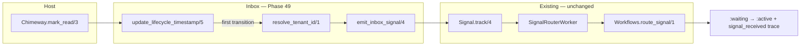

# Phase 49: Inbox Read → Signal — Pattern Mapping

**Mapped:** 2026-05-29  
**Sources:** `49-CONTEXT.md`, `49-RESEARCH.md`, live codebase  
**Purpose:** File-level role classification, data-flow placement, and concrete analog excerpts for planners and implementers.

---

## Change Surface Summary

| File | Action | Role | Data-flow tier |
|------|--------|------|----------------|
| `lib/chimeway/inbox.ex` | **Modify** | Emit seam (lifecycle → signal) | Write path: inbox API → `Signal.track/4` |
| `test/chimeway/inbox_state_transition_test.exs` | **Modify** | Unit proof (READ-02 emission/idempotency) | Test: lifecycle → signal row + Oban enqueue |
| `test/chimeway/orchestration/workflow_progression_test.exs` | **Modify** | Integration proof (READ-02/03 E2E) | Test: mark_read → worker → resume → trace |
| `test/chimeway/doc_contract_test.exs` | **Modify** | Doc-truth gate (D-09) | Contract: guide strings ↔ shipped behavior |
| `guides/flows/multi-step-journeys.md` | **Modify** | Authoring documentation | Docs: inbox emission path, remove deferral |

**Explicitly unchanged:** `lib/chimeway.ex`, `lib/chimeway/signal.ex`, `lib/chimeway/workflows.ex`, `lib/chimeway/dispatch/signal_router_worker.ex`, `test/chimeway/signal_test.exs`, `test/chimeway/workflows_test.exs` (regression only).

---

## Data Flow (Phase 49 Scope)



**Invariant:** Inbox timestamp update commits in its own `Repo.update_all/3`; `Signal.track/4` runs afterward in a separate `Ecto.Multi` (D-07).

---

## File Pattern Map

### 1. `lib/chimeway/inbox.ex`

| Property | Value |
|----------|-------|
| **Role** | Primary implementation seam — lifecycle mutation + conditional signal emission |
| **Data-flow tier** | API/backend write path; bridges inbox facts to durable signals |
| **Change type** | Extend existing module (~40–60 lines); add private helpers, do not touch public facade in `chimeway.ex` |

**Closest analog:** `lib/chimeway/webhooks/process_feedback_worker.ex` — primary persistence first, then `emit_signal/2` → `Signal.track/4` in a separate transaction.

**Analog excerpt — feedback emission seam (mirror for inbox):**

```158:168:lib/chimeway/webhooks/process_feedback_worker.ex
    defp emit_signal(delivery, outcome) do
      event_name = "chimeway.delivery.#{outcome}"
      payload = %{"delivery_id" => delivery.id, "status" => to_string(outcome)}

      payload =
        if outcome in [:bounced, :failed],
          do: Map.put(payload, "error", to_string(outcome)),
          else: payload

      Chimeway.Signal.track(delivery.tenant_id, delivery.actor_id, event_name, payload)
    end
```

**Analog excerpt — separate-transaction coupling (D-07):**

```95:104:lib/chimeway/webhooks/process_feedback_worker.ex
    defp run_feedback_pipeline(delivery, %Ingress{} = ingress) do
      outcome = String.to_existing_atom(canonicalize_status(ingress.normalized_status))
      attempt_params = build_attempt_params(outcome, ingress)

      with {:ok, _} <- Deliveries.record_attempt(delivery, attempt_params),
           {:ok, _} <- emit_signal(delivery, outcome),
           {:ok, _} <- mark_processed(ingress) do
        :ok
      end
    end
```

**Current inbox baseline (what changes):**

```22:54:lib/chimeway/inbox.ex
  @spec mark_seen(Ecto.UUID.t(), String.t(), DateTime.t()) :: :ok | {:error, :not_found}
  def mark_seen(notification_id, recipient_identity, at \\ DateTime.utc_now()) do
    update_lifecycle_timestamp(notification_id, recipient_identity, :seen_at, at)
  end

  @spec mark_read(Ecto.UUID.t(), String.t(), DateTime.t()) :: :ok | {:error, :not_found}
  def mark_read(notification_id, recipient_identity, at \\ DateTime.utc_now()) do
    update_lifecycle_timestamp(notification_id, recipient_identity, :read_at, at)
  end
  # ...
  defp update_lifecycle_timestamp(notification_id, recipient_identity, field, at) do
    timestamp = DateTime.truncate(at, :microsecond)

    query =
      Notification
      |> where([notification], notification.id == ^notification_id)
      |> where([notification], notification.recipient_identity == ^recipient_identity)

    case Repo.update_all(query, set: [{field, timestamp}, {:updated_at, timestamp}]) do
      {1, _} -> :ok
      _other -> {:error, :not_found}
    end
  end
```

**Target pattern — canonical events + payload (D-03, D-05):**

```elixir
@read_event "chimeway.notification.read"
@seen_event "chimeway.notification.seen"

defp emit_inbox_signal(tenant_id, recipient_identity, notification_id, event_name) do
  Chimeway.Signal.track(
    tenant_id,
    recipient_identity,
    event_name,
    %{"notification_id" => notification_id}
  )
end
```

**Target pattern — first-transition guard + re-mark `:ok` (D-06, Pitfall 1):**

- Add `where is_nil(field)` to `update_all` query for `mark_read` / `mark_seen` only.
- On `{1, _}` → resolve tenant → maybe emit.
- On `{0, _}` → load notification by id+recipient; if field already set → `:ok` (no signal); else `{:error, :not_found}`.
- `archive/3` keeps unconditional update, no emission (out of scope).

**Target pattern — tenant resolution (D-02):**

**Closest analog:** `Workflows.active_step_linkage/1` — `WorkflowRun` joined/filtered by `notification_id`.

```137:150:lib/chimeway/workflows.ex
  def active_step_linkage(notification_id) when is_binary(notification_id) do
    query =
      from(wr in WorkflowRun,
        join: ws in WorkflowStep,
        on: wr.current_step_id == ws.id,
        where: wr.notification_id == ^notification_id,
        select: %{
          workflow_run_id: wr.id,
          workflow_step_id: ws.id,
          channel: ws.channel
        }
      )

    {:ok, Repo.one(query)}
  end
```

**Recommended `resolve_tenant_id/1`:** `WorkflowRun.tenant_id` first (`limit: 1`), fallback to earliest `Delivery.tenant_id` by `inserted_at`. Skip emission when nil — do not use `"default"` (research discretion).

**Aliases to add:** `Chimeway.Signal`, `Chimeway.Workflows.WorkflowRun`, `Chimeway.Delivery`.

**Public contract preserved:** `mark_read/3` and `mark_seen/3` remain `:ok | {:error, :not_found}`; lifecycle `:ok` even if `Signal.track/4` fails (Pitfall 5).

---

### 2. `test/chimeway/inbox_state_transition_test.exs`

| Property | Value |
|----------|-------|
| **Role** | Unit test layer — READ-02 emission, idempotency, independence, tenant edge |
| **Data-flow tier** | Test: inbox API → signal persistence + Oban enqueue (no full progression) |
| **Change type** | Extend existing describe blocks; add `"inbox signal emission (READ-02)"` |

**Closest analog:** `test/chimeway/signal_test.exs` — `Oban.Testing` + `assert_enqueued` for `SignalRouterWorker`.

```1:35:test/chimeway/signal_test.exs
defmodule Chimeway.SignalTest do
  use Chimeway.DataCase, async: false
  use Oban.Testing, repo: Chimeway.Repo

  alias Chimeway.Dispatch.SignalRouterWorker
  alias Chimeway.Repo
  alias Chimeway.Signals.Signal

  describe "track/4 — Phase 27 host signal API" do
    # ...
    test "enqueues a SignalRouterWorker job carrying the new signal id" do
      assert {:ok, %Signal{id: signal_id}} =
               Chimeway.Signal.track("acme", "user_42", "clicked", %{"link" => "/x"})

      assert_enqueued(worker: SignalRouterWorker, args: %{"signal_id" => signal_id})
    end
```

**Existing independence tests to extend (D-04, INBX-02/03):**

```10:32:test/chimeway/inbox_state_transition_test.exs
  test "mark_seen/3 sets seen_at without mutating read_at or archived_at" do
    notification = insert_notification!("seen-case")
    seen_at = DateTime.utc_now() |> DateTime.truncate(:microsecond)

    assert :ok = Inbox.mark_seen(notification.id, "user:42", seen_at)

    persisted = Repo.get!(Notification, notification.id)
    assert persisted.seen_at == seen_at
    assert is_nil(persisted.read_at)
    assert is_nil(persisted.archived_at)
  end

  test "mark_read/3 sets read_at without auto-archiving" do
    notification = insert_notification!("read-case")
    read_at = DateTime.utc_now() |> DateTime.truncate(:microsecond)

    assert :ok = Inbox.mark_read(notification.id, "user:42", read_at)
```

**New cases to add:**

| Case | Assertion |
|------|-----------|
| First `mark_read` | 1 signal row, `event_name == "chimeway.notification.read"`, `payload["notification_id"]`, `assert_enqueued(SignalRouterWorker)` |
| Re-mark read | `:ok`, signal count still 1 |
| First `mark_seen` | distinct `"chimeway.notification.seen"` event |
| `mark_read` does not emit seen | `read_at` set, `seen_at` nil, no `.seen` signal |
| Wrong recipient | `{:error, :not_found}`, zero signals |
| Tenant unresolved | notification-only row (no delivery/run) → `:ok` lifecycle, zero signals |

**Fixture note:** `insert_notification!/1` creates notification without delivery/run — use for tenant-skip test; for emission tests, insert `Delivery` or trigger via `Chimeway.trigger/3` to populate `tenant_id`.

---

### 3. `test/chimeway/orchestration/workflow_progression_test.exs`

| Property | Value |
|----------|-------|
| **Role** | Integration proof — READ-02 (no host glue) + READ-03 (trace safety) |
| **Data-flow tier** | Test: full path trigger → wait → mark_read → worker → `:active` + `signal_received` |
| **Change type** | Add sibling test; keep Phase 48 manual-injection test as routing regression |

**Closest analog:** Existing `"injected signal resumes waiting run via SignalRouterWorker"` — same fixture, replace manual `Signal.track` with `Chimeway.mark_read/3`.

**Fixture (already declares `cancel_signals`):**

```111:129:test/chimeway/orchestration/workflow_progression_test.exs
  def workflow(_params, _recipient) do
    {:ok,
     %{
       workflow_key: "test.workflow_progression_with_signals.workflow",
       workflow_version: 1,
       steps: [
         %{
           step_key: "in_app",
           step_order: 1,
           channel: :in_app,
           config: %{
             "progress" => [
               %{
                 "kind" => "wait_until",
                 "anchor" => "prior_delivery_terminal_at",
                 "delay_seconds" => 1800,
                 "to_step" => "email",
                 "cancel_signals" => ["chimeway.notification.read"]
               },
```

**Phase 48 manual injection (keep unchanged — routing regression):**

```357:398:test/chimeway/orchestration/workflow_progression_test.exs
    test "injected signal resumes waiting run via SignalRouterWorker without host update_run glue" do
      # ... setup to :waiting with pending_signals == ["chimeway.notification.read"]
      {:ok, signal} =
        Signal.track(
          waiting_run.tenant_id,
          notification.recipient_identity,
          "chimeway.notification.read",
          %{}
        )

      assert :ok = perform_job(SignalRouterWorker, %{"signal_id" => signal.id})

      resumed_run = Repo.get!(WorkflowRun, workflow_run.id)
      assert resumed_run.state == :active
      assert resumed_run.pending_signals == []
      assert resumed_run.status_reason == "signal_received"
      # ...
      assert signal_transition.context["event_name"] == "chimeway.notification.read"
    end
```

**New test pattern — `"mark_read resumes waiting run (READ-02/03)"`:**

```elixir
assert :ok = Chimeway.mark_read(notification.id, notification.recipient_identity)
assert :ok = perform_job(SignalRouterWorker, fn job -> job.args end)

resumed_run = Repo.get!(WorkflowRun, workflow_run.id)
assert resumed_run.state == :active
assert resumed_run.status_reason == "signal_received"

[signal_transition] =
  list_transitions(workflow_run.id) |> Enum.filter(&(&1.reason == "signal_received"))

assert signal_transition.context == %{"event_name" => "chimeway.notification.read"}
refute Map.has_key?(signal_transition.context, "payload")
refute Map.has_key?(signal_transition.context, "notification_id")
```

**READ-03 trace safety analog (unchanged engine — reference only):**

```280:288:test/chimeway/workflows_test.exs
      signal_transitions = Enum.filter(transitions, &(&1.reason == "signal_received"))
      assert length(signal_transitions) == 1

      [transition] = signal_transitions
      assert transition.from_state == :waiting
      assert transition.to_state == :active
      # Transition context records the event name but NOT the payload (safety)
      assert transition.context["event_name"] == "invoice_paid"
      refute Map.has_key?(transition.context, "payload")
```

**Scope boundary (Pitfall 2):** Assert resume to `:active` and trace only — do not assert email step cancelled or `email_delivery_count == 0` (JOUR-06 / Phase 51).

**Setup already provides:** `use Oban.Testing`, `trigger_workflow_with_signals!/1`, `PlanOnly` dispatcher — reuse as-is.

---

### 4. `guides/flows/multi-step-journeys.md`

| Property | Value |
|----------|-------|
| **Role** | Authoring documentation — inbox emission path, canonical event names |
| **Data-flow tier** | Docs: consumer-facing contract for `mark_read`/`mark_seen` → signal routing |
| **Change type** | Remove READ-02 deferral; add §7 inbox emission subsection |

**Closest analog:** §6 delivery-feedback signal routing — numbered pipeline + `Signal.track` signature example.

```153:171:guides/flows/multi-step-journeys.md
## 6. Delivery-Feedback Signal Routing (Production Path)

The proven production path for delivery outcomes driving workflow progression:

1. Provider webhook → `Chimeway.Webhooks` ingress → `Chimeway.Webhooks.ProcessFeedbackWorker`
2. Worker records the attempt and calls `Chimeway.Signal.track/4` with canonical event names: `chimeway.delivery.succeeded`, `chimeway.delivery.bounced`, or `chimeway.delivery.failed`
3. `Chimeway.Dispatch.SignalRouterWorker` (Oban queue `:chimeway_signals`) delegates to `Chimeway.Workflows.route_signal/1`
4. For waiting runs with matching `pending_signals`, the run resumes; for active runs, `on_outcome` / `stop` rules evaluate on delivery convergence inside `progress_run/2`

Signal signature — tenant first, then actor:

```elixir
Chimeway.Signal.track(
  "org_456",
  "user:123",
  "chimeway.delivery.succeeded",
  %{"delivery_id" => delivery_id}
)
```
```

**Content to remove (lines 197–205 — stale deferral):**

```197:205:guides/flows/multi-step-journeys.md
Phase 48 documents these names but does **not** emit them. Wiring `Chimeway.mark_read/3` and `Chimeway.mark_seen/3` to emit durable signals is READ-02 (Phase 49).

## Deferred / Future (READ Milestone)

Inbox read/seen signal emission (READ-02) is not wired in v1.7 Phase 48:

- **READ-02:** Wire inbox read/seen events to workflow cancellation without host glue

Until READ-02 ships, the primary escalation story remains time-based `wait_until` progression. Do not assume that viewing a notification stops a scheduled email step — even when `cancel_signals` is declared, the engine only routes signals that are actually emitted.
```

**Content to add (§7 extension — mirror §6 structure):**

1. `Chimeway.mark_read/3` / `Chimeway.mark_seen/3` → internal `Signal.track/4` on first transition
2. Canonical events: `chimeway.notification.read`, `chimeway.notification.seen` (distinct — D-04)
3. Payload: `%{"notification_id" => id}`; trace shows event name only (cross-link READ-03)
4. `cancel_signals` in `wait_until` now end-to-end truthful with inbox emission

**Secondary doc analog:** `guides/recipes/feedback-escalation-workflow.md` — persona walkthrough of webhook → signal → trace (same narrative shape for inbox path).

---

### 5. `test/chimeway/doc_contract_test.exs`

| Property | Value |
|----------|-------|
| **Role** | Doc-truth enforcement gate (D-09) |
| **Data-flow tier** | Contract: guide text must match shipped engine behavior |
| **Change type** | Flip Phase 48 deferral contract → READ-02-shipped assertions |

**Closest analog:** Phase 48-03 pattern — `@required` / `@forbidden_strings` on journey guide content.

**Current deferral test (remove/replace):**

```86:89:test/chimeway/doc_contract_test.exs
    test "includes Deferred or READ milestone callout", %{content: content} do
      assert String.match?(content, ~r/Deferred|READ-0/),
             "journey guide must defer aspirational read-to-cancel behavior"
    end
```

**Current `@required` baseline:**

```68:77:test/chimeway/doc_contract_test.exs
    @required ~w(
      wait_until
      on_outcome
      Chimeway.trigger
      Chimeway.Signal.track
      Chimeway.Dispatch.WorkflowProgressionWorker
      Chimeway.Dispatch.SignalRouterWorker
      pending_signals
      cancel_signals
    )
```

**Target contract changes:**

| Action | Strings |
|--------|---------|
| Add to `@required` | `Chimeway.mark_read`, `Chimeway.mark_seen`, `chimeway.notification.read`, `chimeway.notification.seen` |
| Add to `@forbidden_strings` | `does **not** emit`, `READ-02 (Phase 49)`, `Engine gap today` (keep) |
| Remove test | `"includes Deferred or READ milestone callout"` |
| Add test (optional) | Forbid `Deferred / Future (READ Milestone)` section heading |

**Verification gate:** `mix ci.verify_gates`

---

## Unchanged Files — Reference Only

These files are the receive-side stack Phase 49 depends on but does not modify.

### `lib/chimeway/signal.ex` — durable insert + enqueue

```22:39:lib/chimeway/signal.ex
  def track(tenant_id, actor_id, event_name, payload \\ %{}) do
    attrs = %{
      tenant_id: tenant_id,
      actor_id: actor_id,
      event_name: event_name,
      payload: payload
    }

    Multi.new()
    |> Multi.insert(:signal, Signal.changeset(%Signal{}, attrs))
    |> Oban.insert(:job, fn %{signal: signal} ->
      SignalRouterWorker.new(%{"signal_id" => signal.id})
    end)
    |> Repo.transaction()
```

### `lib/chimeway/dispatch/signal_router_worker.ex` — async routing entry

```22:33:lib/chimeway/dispatch/signal_router_worker.ex
  def perform(%Oban.Job{args: %{"signal_id" => signal_id}}) do
    case Repo.get(Signal, signal_id) do
      nil ->
        {:error, :signal_not_found}

      %Signal{} = signal ->
        case Workflows.route_signal(signal) do
          {:ok, _results} -> :ok
          {:error, reason} -> {:error, reason}
        end
    end
  end
```

### `lib/chimeway/workflows.ex` — `route_signal/1` trace (D-08 unchanged)

```403:421:lib/chimeway/workflows.ex
      Enum.reduce_while(matched_runs, %{}, fn run, acc ->
        with {:ok, updated_run} <-
               update_run(Repo, run, %{
                 state: :active,
                 pending_signals: [],
                 status_reason: "signal_received",
                 last_transition_at: now,
                 suspended_until: nil
               }),
             {:ok, transition} <-
               append_transition(Repo, %{
                 workflow_run_id: run.id,
                 from_state: :waiting,
                 to_state: :active,
                 reason: "signal_received",
                 context: %{"event_name" => event_name},
                 delivery_id: Map.get(signal.payload, "delivery_id"),
                 inserted_at: now
               }) do
```

### `lib/chimeway.ex` — thin facade (D-01)

```49:58:lib/chimeway.ex
  def mark_seen(notification_id, recipient_identity, at \\ DateTime.utc_now()) do
    Inbox.mark_seen(notification_id, recipient_identity, at)
  end

  def mark_read(notification_id, recipient_identity, at \\ DateTime.utc_now()) do
    Inbox.mark_read(notification_id, recipient_identity, at)
  end
```

---

## Anti-Pattern Checklist

| Anti-pattern | Correct pattern |
|--------------|-----------------|
| Host calls `Signal.track` after `mark_read` | Emission inside `Inbox` only |
| Single `Ecto.Multi` for inbox + signal | Separate transactions (D-07) |
| Emit seen on read (or vice versa) | Distinct events only (D-04) |
| `"default"` tenant when unresolved | Skip emission; lifecycle still `:ok` |
| Re-mark returns `:not_found` | Disambiguate `{0,_}` with load-by-id (Pitfall 1) |
| Doc deferral test left passing | Flip contract when deferral removed (Pitfall 3) |
| Progression test still uses manual `Signal.track` for READ-02 proof | Add `mark_read` sibling test (Pitfall 4) |

---

## Verification Commands

| Scope | Command |
|-------|---------|
| Unit (inbox emission) | `mix test test/chimeway/inbox_state_transition_test.exs --warnings-as-errors` |
| Integration (E2E) | `mix test test/chimeway/orchestration/workflow_progression_test.exs --warnings-as-errors` |
| Doc contract | `mix ci.verify_gates` |
| Phase gate | `mix ci.test` + `mix ci.verify_gates` |

---

*Phase: 49-Inbox Read → Signal*  
*Pattern mapping complete: 2026-05-29*
