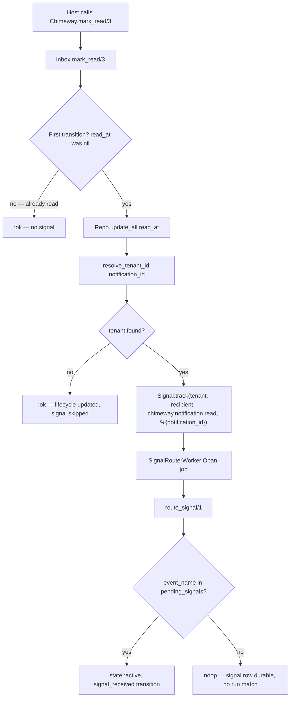

# Phase 49: Inbox Read → Signal — Research

**Researched:** 2026-05-29  
**Domain:** Elixir/Ecto inbox lifecycle → durable signal emission → workflow resume  
**Confidence:** HIGH — all findings verified against live source in this session

---

<user_constraints>
## User Constraints (from CONTEXT.md)

### Locked Decisions

#### Implementation seam
- **D-01:** Wire signal emission inside `Chimeway.Inbox` after successful lifecycle timestamp update, calling `Chimeway.Signal.track/4`. Keep `Chimeway.mark_read/3` and `mark_seen/3` as thin facades — no duplicate logic in `lib/chimeway.ex`.

#### Tenant resolution
- **D-02:** Resolve `tenant_id` for signal tracking via join: notification → `workflow_run` (preferred), fallback to first `delivery` row for that notification. Notifications do not store `tenant_id` directly; both `WorkflowRun` and `Delivery` inherit it from `trigger/3` opts.

#### Canonical event names
- **D-03:** `mark_read/3` emits `chimeway.notification.read`; `mark_seen/3` emits `chimeway.notification.seen`. Exact strings per Phase 48 D-05 — no namespace variation.

#### Read vs seen semantics
- **D-04:** Emit distinct signals only — `mark_read` does not auto-emit `chimeway.notification.seen` and vice versa. Preserves INBX-02/INBX-03 independence (read_at and seen_at are separate lifecycle facts).

#### Signal payload
- **D-05:** Signal payload includes `%{"notification_id" => notification_id}` for downstream correlation. Operator traces continue to show event name only in `signal_received` transition context (READ-03 — no raw payload in trace).

#### Idempotent emission
- **D-06:** Emit signals only on first transition (nil → timestamp). Re-marking an already-read or already-seen notification is a no-op for signal emission — no duplicate signal rows.

#### Transaction coupling
- **D-07:** Inbox timestamp update completes first; `Signal.track/4` runs in its own `Ecto.Multi` transaction (signal insert + Oban enqueue). Do not wrap inbox update and signal track in one atomic Multi.

#### READ-03 / route_signal behavior
- **D-08:** No changes to `route_signal/1`, `SignalRouterWorker`, or progression post-match behavior. READ-03 is satisfied by existing `signal_received` transition with `%{"event_name" => event_name}` context. Phase 49 proves end-to-end: `mark_read` → signal → resume → trace.

#### Doc-truth
- **D-09:** Update `guides/flows/multi-step-journeys.md` — remove READ-02 deferral, document inbox emission wiring for `mark_read`/`mark_seen`. Extend `test/chimeway/doc_contract_test.exs` to lock the new doc truth (mirrors Phase 48-03 pattern).

### Claude's Discretion
- Exact query for tenant resolution fallback when neither workflow_run nor delivery exists (emit signal with `"default"` vs skip emission).
- Whether to add `notification_id` to `delivery_id` join path in trace explain surfaces (optional polish; not required for READ-03).
- Test fixture shape for inbox → signal → progression integration proof.

### Deferred Ideas (OUT OF SCOPE)
- **Demo seed choreography removal** — Replace `stage_escalation_webhook/1` with READ-driven TeamPulse escalation (Phase 50, DEMO-03).
- **JOUR-06 journey proof** — End-to-end mark_read cancels escalation before `wait_until` due_at (Phase 51).
- **Mention-escalation recipe** — Document read-cancel + `wait_until` fallback as canonical PM JTBD path (DEMO-04, Phase 50).
- **Changes to `route_signal/1` matching or post-match behavior** — Phase 48 D-07 boundary holds.

</user_constraints>

<phase_requirements>
## Phase Requirements

| ID | Description | Research Support |
|----|-------------|------------------|
| READ-02 | `Chimeway.mark_read/3` and `mark_seen/3` emit durable signals that route workflow progression through the existing signal router without host glue | `Inbox` seam + `Signal.track/4` + `SignalRouterWorker`; tenant resolution via `WorkflowRun` / `Delivery`; idempotent first-transition emission; E2E test replacing manual `Signal.track` in progression fixture |
| READ-03 | Inbox-read signal early-resume from `:waiting` records an explainable `signal_received` transition in operator traces | Existing `route_signal/1` already writes `context: %{"event_name" => event_name}` only; Phase 49 proves `mark_read` → worker → trace path; no engine changes required |
</phase_requirements>

## Summary

Phase 49 closes the second half of the READ engine glue: Phase 48 populated `pending_signals` on `wait_until` entry from `cancel_signals`; Phase 49 makes inbox lifecycle APIs emit the canonical events those lists reference. Today `Chimeway.Inbox.mark_read/3` and `mark_seen/3` perform scoped `Repo.update_all/3` on `read_at` / `seen_at` only — no signal calls exist anywhere in `lib/chimeway/inbox.ex`.

The fix is a focused extension of `Inbox`: after a **first** lifecycle transition (nil → timestamp), resolve `tenant_id`, call `Signal.track(tenant_id, recipient_identity, event_name, %{"notification_id" => id})`, and let the existing `SignalRouterWorker` → `route_signal/1` path resume matching `:waiting` runs. Delivery feedback (`ProcessFeedbackWorker.emit_signal/2`) is the established reference: primary work completes first, signal emission runs in a separate `Signal.track/4` transaction.

**Primary recommendation:** One primary engine file (`inbox.ex`), inbox unit tests for emission/idempotency/tenant edge cases, one progression integration test proving `mark_read` → resume (extending Phase 48's `WorkflowProgressionWithSignals` fixture), journey-guide doc-truth update with `doc_contract_test.exs` adjustments that **flip** the Phase 48 READ-02 deferral contract to READ-02-shipped assertions.

## Architectural Responsibility Map

| Capability | Primary Tier | Secondary Tier | Rationale |
|------------|-------------|----------------|-----------|
| Inbox lifecycle timestamp update | API / Backend (`Chimeway.Inbox`) | Public facade (`Chimeway.mark_read/3`) | D-01: emission lives inside Inbox, not duplicated in `chimeway.ex` |
| First-transition detection | API / Backend (`Inbox`) | — | D-06: `where is_nil(field)` on update + already-set no-op path |
| Tenant resolution for signals | API / Backend (`Inbox` private query) | — | D-02: `WorkflowRun.tenant_id` preferred, `Delivery.tenant_id` fallback |
| Durable signal insert + Oban enqueue | API / Backend (`Chimeway.Signal.track/4`) | — | Existing Multi; D-07 separate from inbox update |
| Signal → waiting run match + resume | API / Backend (`Workflows.route_signal/1`) | Oban (`SignalRouterWorker`) | Unchanged per D-08; Phase 48 already proved matching |
| Operator trace (`signal_received`) | API / Backend (`Workflows.route_signal/1`) | `Workflows.list_traces/3` | Event name only in context — READ-03 already implemented |
| Journey authoring documentation | Docs (`multi-step-journeys.md`) | Doc contract tests | D-09: remove READ-02 deferral; document emission |

## Standard Stack

### Core

| Library | Version | Purpose | Why Standard |
|---------|---------|---------|--------------|
| Elixir | ~> 1.17 | Language runtime | Project baseline |
| Ecto / Ecto.SQL | ~> 3.11 | Scoped updates, tenant lookup queries | Inbox already uses `update_all`; tenant joins are simple `Repo.one/1` |
| PostgreSQL | 15+ | `chimeway_signals`, `chimeway_workflow_runs`, `chimeway_deliveries` | All tables exist from prior phases |
| Oban | ~> 2.17 (optional) | `SignalRouterWorker` async routing | `Signal.track/4` already enqueues worker |
| ExUnit + Oban.Testing | (bundled) | Unit + integration proof | Patterns in `signal_test.exs`, `workflow_progression_test.exs` |

### Alternatives Considered

| Instead of | Could Use | Tradeoff |
|------------|-----------|----------|
| Emit inside `Inbox` after update | Host callback / webhook on mark_read | Rejected — violates READ-02; reintroduces glue Phase 48 removed |
| Single Multi wrapping inbox + signal | Separate transactions (D-07) | Rejected — inbox update must commit even if Oban enqueue fails transiently; matches feedback worker pattern |
| `tenant_id` on `Notification` schema | Join to run/delivery | Rejected — schema change out of scope; trigger opts already flow to run/delivery |
| Auto-emit seen on read (or vice versa) | Distinct events only (D-04) | Rejected — breaks INBX-02/INBX-03 independence proven in tests |

**Installation:** None — no new packages. `[VERIFIED: mix.exs deps/0]`

## Architecture Patterns

### System Architecture Diagram



### Recommended Change Surface

```
lib/chimeway/
└── inbox.ex                    # mark_read/3, mark_seen/3, update_lifecycle_timestamp/4,
                                # resolve_tenant_id/1, maybe_emit_inbox_signal/4

test/chimeway/
├── inbox_state_transition_test.exs       # emission, idempotency, seen/read independence
├── orchestration/workflow_progression_test.exs  # mark_read → resume E2E (READ-02/03)
└── doc_contract_test.exs                 # flip READ-02 deferral → shipped contract

guides/flows/
└── multi-step-journeys.md                # §7 inbox emission; remove Deferred READ-02
```

**No changes:** `lib/chimeway.ex` (facades stay thin), `lib/chimeway/workflows.ex`, `lib/chimeway/dispatch/signal_router_worker.ex`, `lib/chimeway/signal.ex`.

### Pattern 1: Feedback-worker emission seam (existing — mirror)

**What:** `ProcessFeedbackWorker` completes primary persistence, then calls `emit_signal/2` which delegates to `Signal.track/4` in its own transaction.

**When to use:** Inbox lifecycle follows the same shape per D-07.

**Reference** (`lib/chimeway/webhooks/process_feedback_worker.ex` lines 158–168):

```elixir
defp emit_signal(delivery, outcome) do
  event_name = "chimeway.delivery.#{outcome}"
  payload = %{"delivery_id" => delivery.id, "status" => to_string(outcome)}
  Chimeway.Signal.track(delivery.tenant_id, delivery.actor_id, event_name, payload)
end
```

**Inbox analogue:**

```elixir
@read_event "chimeway.notification.read"
@seen_event "chimeway.notification.seen"

defp emit_inbox_signal(tenant_id, recipient_identity, notification_id, event_name) do
  Chimeway.Signal.track(
    tenant_id,
    recipient_identity,
    event_name,
    %{"notification_id" => notification_id}
  )
end
```

`actor_id` for inbox signals is `recipient_identity` — matches `route_signal/1` join on `n.recipient_identity == ^actor_id`. `[VERIFIED: lib/chimeway/workflows.ex find_runs_waiting_for_signal/3]`

### Pattern 2: First-transition-only update (new — D-06)

**What:** Current `update_lifecycle_timestamp/4` updates unconditionally — re-mark still returns `{1, _}`. Phase 49 must distinguish first transition for signal emission without breaking `:ok` on benign re-mark.

**Recommended approach:**

```elixir
defp update_lifecycle_timestamp(notification_id, recipient_identity, field, at, event_name) do
  timestamp = DateTime.truncate(at, :microsecond)

  first_transition_query =
    Notification
    |> where([n], n.id == ^notification_id)
    |> where([n], n.recipient_identity == ^recipient_identity)
    |> where([n], is_nil(field(n, ^field)))

  case Repo.update_all(first_transition_query, set: [{field, timestamp}, {:updated_at, timestamp}]) do
    {1, _} ->
      maybe_emit_inbox_signal(notification_id, recipient_identity, event_name)
      :ok

    {0, _} ->
      # Already set → :ok without signal; missing/wrong recipient → :not_found
      case Repo.get_by(Notification, id: notification_id, recipient_identity: recipient_identity) do
        %Notification{} = notification ->
          if is_nil(Map.get(notification, field)), do: {:error, :not_found}, else: :ok

        nil ->
          {:error, :not_found}
      end
  end
end
```

`mark_read/3` passes `:read_at` + `@read_event`; `mark_seen/3` passes `:seen_at` + `@seen_event`. `archive/3` keeps the old unconditional path with no `event_name` (out of scope).

### Pattern 3: Tenant resolution (new — D-02)

**What:** Notifications have no `tenant_id` column. Both `WorkflowRun` and `Delivery` store `tenant_id` from `Chimeway.trigger/3` opts at creation time.

**Recommended query** (private `resolve_tenant_id/1`):

```elixir
defp resolve_tenant_id(notification_id) do
  workflow_tenant =
    Repo.one(
      from wr in WorkflowRun,
        where: wr.notification_id == ^notification_id,
        select: wr.tenant_id,
        limit: 1
    )

  workflow_tenant ||
    Repo.one(
      from d in Delivery,
        where: d.notification_id == ^notification_id,
        order_by: [asc: d.inserted_at],
        select: d.tenant_id,
        limit: 1
    )
end
```

**Discretion recommendation — skip emission when tenant is nil:** Do **not** emit with `"default"`. `delivery_planning.ex` uses `"default"` only as a planning fallback; emitting signals under a synthetic tenant risks incorrect cross-tenant routing or silent no-matches that mask data issues. Lifecycle update still returns `:ok`; signal emission is best-effort progression glue. Add a unit test asserting zero signal rows when notification has no run and no delivery.

### Pattern 4: Signal routing + trace (unchanged — D-08)

**What:** `route_signal/1` transitions `:waiting` → `:active`, clears `pending_signals`, appends transition with event name only.

**Reference** (`lib/chimeway/workflows.ex` lines 393–431):

```elixir
append_transition(Repo, %{
  workflow_run_id: run.id,
  from_state: :waiting,
  to_state: :active,
  reason: "signal_received",
  context: %{"event_name" => event_name},
  delivery_id: Map.get(signal.payload, "delivery_id"),  # nil for inbox signals — acceptable
  inserted_at: now
})
```

`notification_id` in signal payload is **not** copied to transition context — satisfies READ-03 payload redaction. Optional polish to set `delivery_id` from payload is out of scope (D-05 uses `notification_id`, not `delivery_id`).

### Anti-Patterns to Avoid

- **Host `Signal.track` after `mark_read`:** The glue Phase 49 removes — emission must be automatic inside `Inbox`.
- **Wrapping inbox + signal in one Multi:** Violates D-07; couples lifecycle UX to Oban availability.
- **Emitting seen on read (or read on seen):** Violates D-04 and existing INBX-02/INBX-03 tests.
- **Changing `route_signal/1` to advance `to_step` on inbox signal:** JOUR-06 / read-cancel halt semantics are Phase 51; Phase 49 only proves resume to `:active`.
- **Using `"default"` tenant when unresolved:** Risks wrong routing; prefer skip.

## Don't Hand-Roll

| Problem | Don't Build | Use Instead | Why |
|---------|-------------|-------------|-----|
| Async signal dispatch | Inline `route_signal/1` in request path | `Signal.track/4` + `SignalRouterWorker` | Atomic insert+enqueue; decouples inbox API latency from progression |
| Waiting-run lookup | Custom host polling | Existing `route_signal/1` | FOR UPDATE locking, tenant+actor isolation already implemented |
| Duplicate signal prevention on re-mark | DB unique index on (notification, event) | First-transition `where is_nil(field)` guard | Simpler; signals are immutable facts — avoid emission rather than dedup at insert |
| Tenant on Notification schema | Migration + backfill | Join WorkflowRun → Delivery fallback | Both child rows already carry tenant from trigger |

**Key insight:** Phase 49 is an ~40–60 line `inbox.ex` extension plus tests/docs — not a new subsystem. Phase 48 built the receive side; Phase 49 builds the emit side.

## Common Pitfalls

### Pitfall 1: Re-mark returns `:not_found` after adding first-transition guard

**What goes wrong:** Adding `is_nil(read_at)` to the update `where` without an already-set fallback changes re-mark semantics from `:ok` to `{:error, :not_found}`.

**Why it happens:** `{0, _}` from `update_all` is ambiguous between "not found" and "already read".

**How to avoid:** After `{0, _}`, load notification by id+recipient; if field already set → `:ok` without signal (Pattern 2).

**Warning signs:** `inbox_integration_test.exs` or new idempotency test fails on second `mark_read`.

### Pitfall 2: Asserting email escalation cancelled on signal resume

**What goes wrong:** Tests imply `mark_read` prevents `due_at` email step — that's JOUR-06, not READ-02/03.

**Why it happens:** Product narrative conflates "resume to `:active`" with "halt escalation workflow".

**How to avoid:** Phase 49 assertions stop at `:active`, `signal_received` trace, `pending_signals == []`. Do not assert zero email deliveries or `:stopped` unless explicitly testing Phase 51 scope.

**Warning signs:** Test expects `email_delivery_count == 0` after `mark_read` before `due_at`.

### Pitfall 3: Doc contract regression on READ deferral test

**What goes wrong:** Phase 48 **intentionally kept** `test "includes Deferred or READ milestone callout"` passing via READ-02 deferral text. Phase 49 **removes** that deferral — the test must be updated, not the guide left in a lying state.

**Why it happens:** Copying Phase 48-03 doc pattern without flipping the deferral contract.

**How to avoid:** Remove Deferred READ-02 section from guide; replace doc contract test with READ-02-shipped assertions (e.g. require `Chimeway.mark_read`, forbid "does **not** emit", forbid "READ-02 (Phase 49)").

**Warning signs:** Guide says emission ships but contract still requires `Deferred|READ-0`.

### Pitfall 4: Manual `Signal.track` in progression test left unchanged

**What goes wrong:** READ-02 marked done but proof still injects signals manually — doesn't prove inbox emission path.

**Why it happens:** Phase 48 test `"injected signal resumes waiting run"` uses direct `Signal.track`.

**How to avoid:** Add sibling test: same fixture, call `Chimeway.mark_read(notification.id, recipient_identity)`, `perform_job(SignalRouterWorker, ...)`, assert resume + trace. Keep Phase 48 manual-injection test as regression for routing itself.

### Pitfall 5: Signal emission failure fails mark_read

**What goes wrong:** Wrapping lifecycle + signal in one transaction or matching on `{:ok, _}` from `track/4` causes inbox API to error when Oban insert fails.

**Why it happens:** Over-eager error propagation.

**How to avoid:** D-07 — lifecycle `:ok` is independent; treat `Signal.track` failure as logged/telemetry event or silent skip (match feedback worker: `with` chain in worker, but inbox should not roll back timestamp). **Discretion:** recommend `:ok` on lifecycle success even if `track/4` returns `{:error, _}` — document in moduledoc. Planner may alternatively surface `{:ok, %{emitted: false}}` — avoid breaking existing `:ok | {:error, :not_found}` contract.

## Code Examples

### Current `Inbox` — no signal emission

```22:54:lib/chimeway/inbox.ex
  def mark_seen(notification_id, recipient_identity, at \\ DateTime.utc_now()) do
    update_lifecycle_timestamp(notification_id, recipient_identity, :seen_at, at)
  end

  def mark_read(notification_id, recipient_identity, at \\ DateTime.utc_now()) do
    update_lifecycle_timestamp(notification_id, recipient_identity, :read_at, at)
  end
  # ...
  defp update_lifecycle_timestamp(notification_id, recipient_identity, field, at) do
    # Repo.update_all — no is_nil guard, no Signal.track
  end
```

### `Signal.track/4` — durable insert + worker enqueue

```22:40:lib/chimeway/signal.ex
  def track(tenant_id, actor_id, event_name, payload \\ %{}) do
    Multi.new()
    |> Multi.insert(:signal, Signal.changeset(%Signal{}, attrs))
    |> Oban.insert(:job, fn %{signal: signal} ->
      SignalRouterWorker.new(%{"signal_id" => signal.id})
    end)
    |> Repo.transaction()
  end
```

### Phase 48 progression fixture — ready for inbox E2E

`ChimewayTest.Notifiers.WorkflowProgressionWithSignals` already declares:

```128:128:test/chimeway/orchestration/workflow_progression_test.exs
                 "cancel_signals" => ["chimeway.notification.read"]
```

Phase 48 test manually calls `Signal.track` then `perform_job`. Phase 49 replaces injection with:

```elixir
assert :ok = Chimeway.mark_read(notification.id, notification.recipient_identity)
assert :ok = perform_job(SignalRouterWorker, fn job -> ... end)  # drain enqueued job

resumed_run = Repo.get!(WorkflowRun, workflow_run.id)
assert resumed_run.state == :active
assert resumed_run.status_reason == "signal_received"

{:ok, traces} = Chimeway.Workflows.list_traces(waiting_run.tenant_id, workflow_run.id)
assert Enum.any?(traces, &(&1.reason == "signal_received" and &1.context == %{"event_name" => "chimeway.notification.read"}))
```

### READ-03 trace safety — already proven

```286:288:test/chimeway/workflows_test.exs
      assert transition.context["event_name"] == "invoice_paid"
      refute Map.has_key?(transition.context, "payload")
```

Inbox signal payload with `notification_id` must not appear in transition context — `route_signal/1` never copies raw payload.

### `mark_seen` distinct event test sketch

```elixir
# Extend WorkflowProgressionWithSignals cancel_signals to include .seen OR use separate fixture
assert :ok = Chimeway.mark_seen(notification.id, recipient_identity)
# perform_job → assert context["event_name"] == "chimeway.notification.seen"
# assert read_at still nil (INBX-03)
```

## Discretion Recommendations

### Tenant resolution when neither run nor delivery exists

| Option | Recommendation | Rationale |
|--------|----------------|-----------|
| Emit with `"default"` | **Reject** | Planning fallback ≠ signal routing tenant; risks false matches or masked missing data |
| Skip emission, return `:ok` on lifecycle | **Accept** | Lifecycle is primary; notifications without deliveries are valid (integration notifier creates rows with deliveries though) |
| Return `{:error, :tenant_unresolved}` | Reject | Breaks inbox API contract; host cannot fix at mark time |

### `notification_id` on transition `delivery_id` column

**Skip for Phase 49.** `route_signal/1` only reads `payload["delivery_id"]` for FK linkage. Inbox signals use `notification_id` in payload for correlation elsewhere. READ-03 satisfied by event name in context. Optional Phase 50+ polish if operator surfaces need notification linkage on transitions.

### Test fixture shape

| Test file | Describe block | Purpose |
|-----------|----------------|---------|
| `inbox_state_transition_test.exs` | `"inbox signal emission (READ-02)"` | Unit: first mark emits signal + enqueues worker; re-mark no second signal; seen/read independence; wrong recipient no signal |
| `orchestration/workflow_progression_test.exs` | `"mark_read resumes waiting run (READ-02/03)"` | Integration: full trigger → wait → mark_read → worker → active + trace |
| `signal_test.exs` | (optional) | Only if inbox-specific payload shape needs contract — otherwise inbox tests sufficient |

Use `use Oban.Testing` in inbox emission tests to `assert_enqueued(worker: SignalRouterWorker, ...)`.

## Doc Contract Test Implications

File: `test/chimeway/doc_contract_test.exs`

| Current contract (Phase 48) | Phase 49 action |
|-----------------------------|-----------------|
| `"includes Deferred or READ milestone callout"` (`~r/Deferred\|READ-0/`) | **Remove or replace** — READ-02 ships; deferral test becomes a regression hazard |
| `@forbidden_strings` includes `"Engine gap today"` | Keep |
| `@required` includes `cancel_signals`, `Chimeway.Signal.track` | Add `Chimeway.mark_read`, `Chimeway.mark_seen`, `chimeway.notification.read`, `chimeway.notification.seen` |
| No forbidden deferral strings | Add `"does **not** emit"` and/or `"READ-02 (Phase 49)"` to `@forbidden_strings` |

Guide edits (`guides/flows/multi-step-journeys.md`):

- **Remove** lines 197–205 (Phase 48 does not emit / Deferred READ-02 section).
- **Add** §7 subsection: inbox lifecycle emits via `Chimeway.mark_read/3` / `mark_seen/3` → `Signal.track` with canonical event names and `notification_id` payload.
- **Update** §6 signal signature example or cross-link to inbox path.
- **Clarify** `mark_read` and `mark_seen` are distinct signals (D-04).
- Retain `cancel_signals` authoring from Phase 48 — now end-to-end truthful.

Run gate: `mix ci.verify_gates` + `mix ci.test`.

## Assumptions Log

| # | Claim | Section | Risk if Wrong |
|---|-------|---------|---------------|
| A1 | `Signal.track` failure should not fail `mark_read` return | Pitfall 5 | Low — planner can choose strict vs lenient; recommend lenient |
| A2 | Skip signal when tenant unresolved | Discretion | Low — rare edge case (notification without delivery/run) |
| A3 | `archive/3` does not emit signals | Out of scope | None — not in requirements |
| A4 | Multiple workflow runs per notification unlikely | Tenant resolution | Low — `limit: 1` on run query matches existing `active_step_linkage` pattern |

## Open Questions

1. **Should `mark_read` update timestamp on re-mark (refresh `read_at`)?**
   - What we know: Current code overwrites timestamp on every call; first-transition guard only affects signal emission.
   - Recommendation: Keep timestamp refresh on re-mark if we use `is_nil` only for signal branch — already-set path returns `:ok` without update. **Alternatively**, re-mark could refresh `read_at` without re-emitting — planner choice; tests should document chosen behavior.

2. **Telemetry for skipped emission (no tenant)?**
   - Recommendation: Optional `:telemetry` execute event in discretion — not required for READ-02 acceptance.

3. **Does `mark_seen` test need its own progression E2E?**
   - Recommendation: One `mark_read` E2E sufficient for READ-02/03; unit test for `mark_seen` event name. Add `mark_seen` E2E only if planner wants symmetric coverage.

## Validation Architecture

### Test Framework

| Property | Value |
|----------|-------|
| Framework | ExUnit (Elixir 1.17+) |
| Config file | `mix.exs` aliases (`ci.test`, `ci.verify_gates`) |
| Quick run command | `mix test test/chimeway/inbox_state_transition_test.exs test/chimeway/orchestration/workflow_progression_test.exs --warnings-as-errors` |
| Full suite command | `mix ci.test` |
| Doc gate command | `mix ci.verify_gates` |
| Signal/worker unit command | `mix test test/chimeway/signal_test.exs test/chimeway/dispatch/signal_router_worker_test.exs --warnings-as-errors` |

### Phase Requirements → Test Map

| Req ID | Behavior | Test Type | Automated Command | File Exists? |
|--------|----------|-----------|-------------------|-------------|
| READ-02 | `mark_read/3` first call inserts Signal row + enqueues `SignalRouterWorker` | unit | `mix test test/chimeway/inbox_state_transition_test.exs --warnings-as-errors` | ✅ extend existing |
| READ-02 | `mark_seen/3` emits `chimeway.notification.seen` (distinct from read) | unit | same | ❌ Wave 0 — add cases |
| READ-02 | Re-mark read/seen does not insert duplicate signals | unit | same | ❌ Wave 0 — idempotency case |
| READ-02 | `mark_read` does not emit seen signal (INBX-02/03) | unit | same | ✅ extend existing independence tests |
| READ-02 | No signal when tenant cannot be resolved | unit | same | ❌ Wave 0 — edge fixture |
| READ-02 | `mark_read` → worker → waiting run resumes without host `Signal.track` | integration | `mix test test/chimeway/orchestration/workflow_progression_test.exs --warnings-as-errors` | ✅ extend Phase 48 fixture |
| READ-03 | `signal_received` transition has `event_name` only, no payload keys | integration | same | ✅ assert on `list_traces` / transitions |
| READ-03 | `Workflows.explain/2` shows resumed `:active` state | integration | same | ❌ Wave 0 — optional assertion |
| D-09 | Journey guide documents inbox emission; READ-02 deferral removed | doc contract | `mix ci.verify_gates` | ✅ update guide + contract |
| Regression | `route_signal/1` unchanged | unit | `mix test test/chimeway/workflows_test.exs --warnings-as-errors` | ✅ no changes expected |
| Regression | Phase 48 `pending_signals` population | integration | `mix test test/chimeway/orchestration/workflow_progression_test.exs --warnings-as-errors` | ✅ keep existing READ-01 tests |

### Sampling Rate

- **Per task commit:** Quick run command (inbox + progression tests)
- **Per wave merge:** `mix ci.test`
- **Phase gate:** `mix ci.test` + `mix ci.verify_gates` green before `/gsd-verify-work`

### Wave 0 Gaps

- [ ] `inbox_state_transition_test.exs` — describe `"inbox signal emission (READ-02)"` with Oban.Testing enqueue assertions
- [ ] `inbox_state_transition_test.exs` — re-mark idempotency (signal count == 1)
- [ ] `inbox_state_transition_test.exs` — tenant-unresolved skip (notification-only row, no delivery)
- [ ] `workflow_progression_test.exs` — describe `"mark_read resumes waiting run (READ-02/03)"` using `Chimeway.mark_read` instead of manual `Signal.track`
- [ ] `multi-step-journeys.md` — remove READ-02 deferral; document inbox emission path
- [ ] `doc_contract_test.exs` — replace deferral regex test; add `@required` inbox strings; forbid stale deferral phrases

### Nyquist Compliance Notes

- Every READ-02/03 acceptance behavior maps to an automated test row above — no conversational-only gates for engine behavior.
- Doc-truth (D-09) maps to `mix ci.verify_gates` — same pattern as Phase 48-03.
- JOUR-06 (read-cancel before `due_at`) is **explicitly deferred** to Phase 51 — do not fold into Phase 49 Nyquist map.

## Security Domain

Inbox APIs drive durable signals that can resume workflow runs. ASVS L1 — preserve tenant/actor isolation; no new auth surface.

### Applicable ASVS Categories

| ASVS Category | Applies | Standard Control |
|---------------|---------|------------------|
| V4 Access Control | yes | Existing `route_signal/1` tenant + `recipient_identity` join; inbox APIs already scope by notification id + recipient |
| V5 Input Validation | partial | `recipient_identity` + `notification_id` scoped queries unchanged; signal payload is fixed shape |
| V7 Error Handling | partial | Lifecycle errors remain `{:error, :not_found}`; signal skip on missing tenant must not leak cross-tenant data |
| V8 Data Protection | yes | READ-03: transition context event name only — no raw payload; `notification_id` in signal row payload is acceptable (operator trace redaction unchanged) |
| V2 Authentication | no | Host owns auth |
| V6 Cryptography | no | N/A |

### Known Threat Patterns

| Pattern | STRIDE | Standard Mitigation |
|---------|--------|---------------------|
| Cross-tenant signal emission | Spoofing / Elevation | Resolve tenant from run/delivery on same notification — never accept tenant from caller in mark_read API |
| Cross-recipient mark + signal | Spoofing | Existing `recipient_identity` scope on update; `actor_id` = recipient on track |
| Signal flood on re-mark | Denial of service | D-06 first-transition guard |
| Payload leakage in operator traces | Information disclosure | `route_signal/1` unchanged — context is `event_name` only (T-27-04) |
| Forged notification_id in payload | Tampering | Payload is system-generated, not caller-supplied |

## Sources

### Primary (HIGH confidence)

- `lib/chimeway/inbox.ex` — current lifecycle APIs, no signal calls `[VERIFIED: codebase]`
- `lib/chimeway/signal.ex` — `track/4` Multi + Oban enqueue `[VERIFIED: codebase]`
- `lib/chimeway/workflows.ex` — `route_signal/1`, `list_traces/3`, `explain/2` `[VERIFIED: codebase]`
- `lib/chimeway/webhooks/process_feedback_worker.ex` — `emit_signal/2` reference pattern `[VERIFIED: codebase]`
- `lib/chimeway/dispatch/signal_router_worker.ex` — worker delegate `[VERIFIED: codebase]`
- `lib/chimeway/notifications/notification.ex` — `read_at` / `seen_at` fields `[VERIFIED: codebase]`
- `lib/chimeway/workflows/workflow_run.ex` — `tenant_id`, `pending_signals` `[VERIFIED: codebase]`
- `lib/chimeway/delivery.ex` — `tenant_id` on deliveries `[VERIFIED: codebase]`
- `.planning/phases/49-inbox-read-signal/49-CONTEXT.md` — locked decisions `[VERIFIED: planning artifact]`
- `.planning/phases/48-wait-until-pending-signals/48-RESEARCH.md` — upstream pending_signals population `[VERIFIED: planning artifact]`
- `test/chimeway/orchestration/workflow_progression_test.exs` — Phase 48 fixture + manual signal test `[VERIFIED: codebase]`
- `test/chimeway/inbox_state_transition_test.exs` — INBX-02/03 independence `[VERIFIED: codebase]`
- `test/chimeway/workflows_test.exs` — trace payload safety `[VERIFIED: codebase]`
- `test/chimeway/doc_contract_test.exs` — deferral contract to flip `[VERIFIED: codebase]`
- `guides/flows/multi-step-journeys.md` — READ-02 deferral at lines 197–205 `[VERIFIED: codebase]`

### Secondary (MEDIUM confidence)

- `test/chimeway/inbox_integration_test.exs` — public API mark_read/seen path `[VERIFIED: codebase]`
- `examples/chimeway_demo_host/lib/demo_host/seeds.ex` — `stage_escalation_webhook/1` retired in Phase 50 `[VERIFIED: codebase reference]`

## Metadata

**Confidence breakdown:**

| Area | Level | Reason |
|------|-------|--------|
| Standard stack | HIGH | No new deps |
| Architecture | HIGH | Emit side mirrors proven feedback worker pattern; receive side shipped in Phase 48 |
| Pitfalls | HIGH | Idempotency + doc contract flip are the main planner traps |
| Validation | HIGH | Clear unit + integration split; Wave 0 gaps are additive |
| Security | HIGH | Inherited threat model; tenant resolution is the only new surface |

**Research date:** 2026-05-29  
**Valid until:** 2026-06-28 (stable engine domain)
