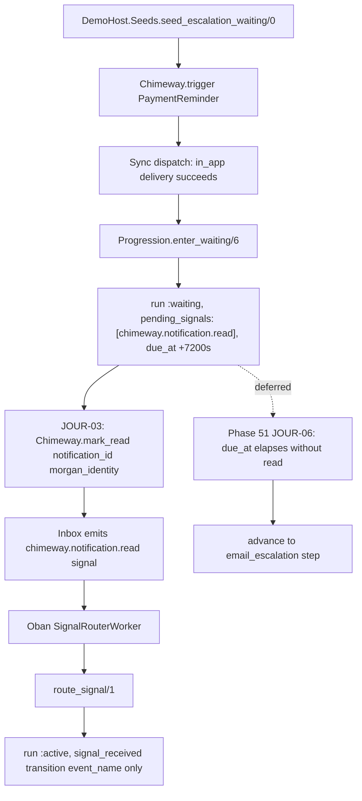

# Phase 50: Natural Escalation Demo — Research

**Researched:** 2026-05-29  
**Domain:** TeamPulse demo host — READ-driven workflow escalation + adoption docs  
**Confidence:** HIGH — all findings verified against live source in this session

---

<user_constraints>
## User Constraints (from CONTEXT.md)

### Locked Decisions

#### PaymentReminder workflow redesign (DEMO-03 / D-01)
- **D-01:** Refactor `DemoHost.Notifiers.PaymentReminder` from webhook-driven progression (`chimeway.delivery.succeeded`) to the mention-escalation pattern: `in_app` step with `wait_until` (`delay_seconds: 7200`, `to_step: "email_escalation"`) and `cancel_signals: ["chimeway.notification.read"]`, followed by an `email` escalation step. Morgan persona keeps payment-reminder copy; workflow mechanics match PM JTBD ("if they don't open in 2 hours, send email").

#### Seed simplification (DEMO-03 / D-02)
- **D-02:** `seed_escalation_waiting/0` becomes trigger-only — call `Chimeway.trigger/3` with `PaymentReminder` and return the normalized result. Delete `stage_escalation_webhook/1` and remove the temporary `PendingWebhookAdapter` `Application.put_env` swap. Natural engine progression after in_app delivery succeeds leaves the run `:waiting` with auto-populated `pending_signals` from `cancel_signals`.

#### JOUR-03 journey test rewrite (DEMO-03 / D-03)
- **D-03:** Rewrite JOUR-03 from webhook POST to READ-driven path: seed escalation → identify in_app notification → `Chimeway.mark_read/3` → drain `:chimeway_signals` → assert run transitions `:waiting` → `:active` with `signal_received` transition (`event_name` only in context). Time-elapse escalation (email fires after `due_at`) is deferred to JOUR-06 (Phase 51); webhook progression remains covered by `feedback_pipeline_e2e_test.exs`.

#### Mention-escalation recipe (DEMO-04 / D-04)
- **D-04:** Create `guides/recipes/mention-escalation.md` as a PM persona walkthrough for read-cancel plus `wait_until` time fallback — distinct from `guides/recipes/feedback-escalation-workflow.md` (delivery-feedback / webhook path). Update `guides/flows/multi-step-journeys.md` § "Missed Engagement Escalation" intro (line 7) to position read-cancel and `wait_until` as complementary mechanisms, not mutually exclusive.

#### PendingWebhookAdapter removal (D-05)
- **D-05:** Delete `DemoHost.Adapters.PendingWebhookAdapter` once seeds no longer reference it. No deprecation shim — the module exists solely to support removed choreography.

#### Doc contract extension (D-06)
- **D-06:** Extend `test/chimeway/doc_contract_test.exs` to lock mention-escalation recipe truth (read-cancel + `wait_until` fallback pattern), mirroring Phase 48–49 doc-contract patterns. Cross-link new recipe from `multi-step-journeys.md` and relevant index surfaces if present.

### Claude's Discretion
- Exact `step_key` names and channel ordering in refactored `PaymentReminder` workflow (must satisfy D-01 semantics).
- Whether JOUR-03 asserts `pending_signals` contents on the waiting run before `mark_read`.
- Doc-contract `@required_phrases` / `@forbidden_phrases` exact strings for the new recipe.
- PaymentReminder moduledoc and `seeds.ex` `@moduledoc` scenario descriptions after refactor.

### Deferred Ideas (OUT OF SCOPE)
- **JOUR-06 time-elapse proof** — mark_read cancels escalation before `wait_until` due_at; email fires only when unread (Phase 51).
- **README webhook contradiction** — demo host README still says "Payment escalation awaiting webhook" (Phase 52 DOCS).
- **Admin Morgan escalation trace** — JOUR-08 admin journey (Phase 51).
- **Engine changes** — `route_signal/1`, progression post-match behavior, inbox emission (Phases 48–49 locked).
- **`feedback_pipeline_e2e_test.exs`** — retain as delivery-feedback reference; do not rewrite for READ path.

</user_constraints>

<phase_requirements>
## Phase Requirements

| ID | Description | Research Support |
|----|-------------|------------------|
| DEMO-03 | TeamPulse payment escalation demo uses READ-driven progression (no `stage_escalation_webhook/1` or staged webhook choreography) | Refactor `PaymentReminder.workflow/2`; simplify `seed_escalation_waiting/0`; delete `PendingWebhookAdapter`; rewrite JOUR-03 to `mark_read` → signal → resume |
| DEMO-04 | Mention-escalation reference recipe documents read-cancel plus time-based `wait_until` fallback as the primary PM JTBD path | Create `guides/recipes/mention-escalation.md`; fix `multi-step-journeys.md` intro contradiction; extend `doc_contract_test.exs`; add recipe to `mix.exs` docs extras |
</phase_requirements>

## Executive Summary

Phase 50 is a **demo-and-docs alignment phase** — no engine changes. Phases 48–49 shipped the READ glue (`cancel_signals` → `pending_signals` at `enter_waiting/6`, inbox `mark_read` → `chimeway.notification.read` signal). The TeamPulse payment-escalation story still **masks that glue** with host choreography: `seed_escalation_waiting/0` swaps in `PendingWebhookAdapter`, then `stage_escalation_webhook/1` manually forces `state: :waiting` and `pending_signals: ["chimeway.delivery.succeeded"]`. JOUR-03 proves the webhook path, not READ.

The fix is a vertical slice: reshape `PaymentReminder` to the canonical `wait_until` + `cancel_signals` pattern already documented in `multi-step-journeys.md` (lines 43–70), make seeds trigger-only, rewrite JOUR-03 to mirror the engine proof in `workflow_progression_test.exs` (lines 401–445), publish a PM-facing mention-escalation recipe distinct from the webhook recipe, and lock doc truth in CI.

**Primary recommendation:** Two implementation waves — (1) demo code + JOUR-03 as one cohesive DEMO-03 deliverable, (2) mention-escalation recipe + journey-guide intro fix + doc contract + `mix.exs` extras for DEMO-04. Delete `PendingWebhookAdapter` in wave 1; do not add a deprecation shim.

## Current State Analysis

### PaymentReminder — webhook-shaped workflow, not mention-escalation

```53:78:examples/chimeway_demo_host/lib/demo_host/notifiers/payment_reminder.ex
  @impl true
  def workflow(_params, _recipient) do
    {:ok,
     %{
       workflow_key: "teampulse.payment_reminder",
       workflow_version: 1,
       steps: [
         %{
           step_key: "initial_notice",
           step_order: 1,
           channel: :in_app,
           config: %{
             "progress" => [
               %{"kind" => "stop", "outcome" => "bounced"}
             ]
           }
         },
         %{
           step_key: "paid_confirmation",
           step_order: 2,
           channel: :in_app,
           config: %{}
         }
       ]
     }}
  end
```

**Gaps vs D-01:**
- No `wait_until` rule, no `cancel_signals`, no `email` workflow step.
- Second step is `paid_confirmation` (in_app) — implies delivery-feedback progression, not inbox-read escalation.
- Moduledoc (lines 3–7) documents webhook pairing with seeds and E2E tests.

Channels `[:in_app, :email]` (line 32) are already declared for rendering — only `workflow/2` needs reshaping.

### Seeds — staged webhook choreography

```111:191:examples/chimeway_demo_host/lib/demo_host/seeds.ex
  @doc """
  JOUR-03: payment reminder with a delivery awaiting webhook feedback.
  ...
  """
  def seed_escalation_waiting do
    previous_adapters = Application.get_env(:chimeway, :channel_adapters, %{})

    Application.put_env(:chimeway, :channel_adapters, %{
      "email" => DemoHost.Adapters.PendingWebhookAdapter
    })

    result =
      with {:ok, trigger_result} <-
             trigger(DemoHost.Notifiers.PaymentReminder, ...),
           {:ok, staged} <- stage_escalation_webhook(trigger_result) do
        {:ok, Map.merge(trigger_result, staged)}
      end

    Application.put_env(:chimeway, :channel_adapters, previous_adapters)
    result
  end

  defp stage_escalation_webhook(%{trace: %{delivery_ids: delivery_ids}}) do
    ...
    {:ok, waiting_run} <-
      Workflows.update_run(Repo, run, %{
        state: :waiting,
        status_reason: "waiting_for_signal",
        pending_signals: ["chimeway.delivery.succeeded"]
      })
```

**What this does today:**
1. Swaps email adapter to `PendingWebhookAdapter` (leaves email delivery `:failed` / retryable).
2. Manually transitions run to `:waiting` with **delivery-feedback** `pending_signals` — bypasses `enter_waiting/6` and `wait_until` entirely.
3. Returns `%{delivery: ..., run: ..., workflow_run_id: ...}` merged into trigger result — **only consumer** is JOUR-03.

`@moduledoc` scenario list (line 12) still says "workflow waiting for webhook signal".

### PendingWebhookAdapter — seed-only fixture

```1:14:examples/chimeway_demo_host/lib/demo_host/adapters/pending_webhook_adapter.ex
defmodule DemoHost.Adapters.PendingWebhookAdapter do
  @moduledoc """
  Fixture adapter that leaves deliveries in a retryable `:failed` state.
  ...
  """
  @behaviour Chimeway.Adapter

  @impl true
  def deliver(_delivery, _config), do: {:error, :temporary, %{reason: "awaiting_webhook"}}
```

**Only reference:** `seeds.ex:123`. Safe to delete per D-05 once seeds are trigger-only.

### JOUR-03 — webhook proof, not READ proof

```47:90:examples/chimeway_demo_host/test/demo_host_web/journey_test.exs
  @tag :jour_03
  test "JOUR-03 seeded escalation progresses via webhook", _context do
    assert {:ok, %{delivery: delivery, run: run}} = DemoHost.Seeds.escalation_waiting!()

    body = Jason.encode!(%{"delivery_id" => delivery.id, "status" => "ok"})
    conn = conn(:post, "/webhooks/chimeway/echo", body) |> ...

    drain_oban!(:chimeway_delivery)
    drain_oban!(:chimeway_signals)

    assert Enum.any?(signals, &(&1.event_name == "chimeway.delivery.succeeded"))
    assert updated_run.state == :active
    assert signal_received_transition.delivery_id == delivery.id
    assert :webhook_received in event_atoms
  end
```

**Must change for D-03:**
- Seed return shape — query `Delivery` / `Notification` / `WorkflowRun` from `trace.delivery_ids`.
- Replace webhook POST + `:chimeway_delivery` drain with `Chimeway.mark_read/3` + `:chimeway_signals` drain.
- Assert `chimeway.notification.read` signal, not `chimeway.delivery.succeeded`.
- Assert `signal_received` context is `%{"event_name" => "chimeway.notification.read"}` only — **no** `delivery_id` on transition (inbox payload uses `notification_id`; `route_signal/1` only copies `delivery_id` from payload).
- **Do not** assert `:webhook_received` in timeline — that remains `feedback_pipeline_e2e_test.exs` scope.

### Engine paths already shipped (read-only for Phase 50)

**`enter_waiting/6` populates `pending_signals` from `cancel_signals`:**

```252:276:lib/chimeway/workflows/progression.ex
  defp enter_waiting(repo, run, step, delivery, rule, now) do
    ...
    pending_signals = Map.get(rule, "cancel_signals", [])

    with {:ok, updated_run} <-
           Workflows.update_run(repo, run, %{
             state: :waiting,
             status_reason: @waiting_reason,
             status_context: status_context,
             pending_signals: pending_signals,
```

**`mark_read` emits durable signal (READ-02):**

```33:36:lib/chimeway/inbox.ex
  def mark_read(notification_id, recipient_identity, at \\ DateTime.utc_now()) do
    update_lifecycle_timestamp(notification_id, recipient_identity, :read_at, at, @read_event)
  end
```

```113:119:lib/chimeway/inbox.ex
  defp emit_inbox_signal(tenant_id, recipient_identity, notification_id, event_name) do
    Signal.track(
      tenant_id,
      recipient_identity,
      event_name,
      %{"notification_id" => notification_id}
    )
```

**`route_signal/1` resumes waiting run (READ-03):**

```404:420:lib/chimeway/workflows.ex
        with {:ok, updated_run} <-
               update_run(Repo, run, %{
                 state: :active,
                 pending_signals: [],
                 status_reason: "signal_received",
                 ...
               }),
             {:ok, transition} <-
               append_transition(Repo, %{
                 ...
                 reason: "signal_received",
                 context: %{"event_name" => event_name},
                 delivery_id: Map.get(signal.payload, "delivery_id"),
```

**Reference E2E pattern** (`workflow_progression_test.exs` lines 401–445) — same assertions JOUR-03 should mirror at demo-host layer.

### Docs — journey guide intro contradicts body

```5:7:guides/flows/multi-step-journeys.md
## Scenario: Missed Engagement Escalation

When a user is mentioned in a document, deliver an `in_app` notification first. If they do not engage within two hours, escalate to `email`. The primary mechanism is a `wait_until` progress rule on the in-app step — not inbox-read cancellation or separate wait steps.
```

Lines 54–57 and §7 (lines 218–225) document `cancel_signals` and inbox emission as shipped — **line 7 is stale** and must be rewritten per D-04.

`guides/recipes/mention-escalation.md` **does not exist** (only five recipes under `guides/recipes/`). `mix.exs` docs extras (lines 118–122) list recipes but omit mention-escalation — add on create.

`feedback-escalation-workflow.md` line 31 cross-links to journey guide for "full mention-escalation example" — after Phase 50, also link to the new recipe.

### Demo host runtime — trigger reaches `:waiting` without glue

- `examples/chimeway_demo_host/config/test.exs` sets `dispatcher: Chimeway.Dispatch.Sync` and Oban `testing: :manual`.
- Default channel adapter falls back to `Chimeway.Adapters.Logger` (`lib/chimeway/dispatch/executor.ex:82`) — in_app delivery converges `:succeeded` synchronously on trigger.
- After PaymentReminder refactor, `record_attempt/2` convergence hook should call progression → `enter_waiting/6` → run `:waiting` with `pending_signals: ["chimeway.notification.read"]` and `status_reason: "waiting_for_step_progression"` — **no host `Workflows.update_run/3`**.

## Target Architecture

### End-to-end READ-driven escalation flow



### PaymentReminder target workflow (D-01)

Mirror journey guide example with D-01 step keys:

```elixir
steps: [
  %{
    step_key: "initial_notice",       # discretion: or "in_app"
    step_order: 1,
    channel: :in_app,
    config: %{
      "progress" => [
        %{
          "kind" => "wait_until",
          "anchor" => "prior_delivery_terminal_at",
          "delay_seconds" => 7200,
          "to_step" => "email_escalation",
          "cancel_signals" => ["chimeway.notification.read"]
        }
      ]
    }
  },
  %{
    step_key: "email_escalation",
    step_order: 2,
    channel: :email,
    config: %{}
  }
]
```

**Discretion recommendation:** Drop the old `stop` bounce rule on step 1 unless product wants bounce → stop on payment reminder — not in D-01; journey guide mention example omits it. Keep workflow minimal.

Update moduledoc to reference READ-driven seeds and JOUR-03; point webhook proof to `feedback_pipeline_e2e_test.exs`.

### Seeds target shape (D-02)

```elixir
def seed_escalation_waiting do
  trigger(
    DemoHost.Notifiers.PaymentReminder,
    %{email: @morgan_email, invoice_id: "INV-1001"},
    idempotency_key: @payment_idempotency,
    correlation_id: "teampulse-seed-payment-corr",
    tenant_id: @tenant_id
  )
end
```

Remove aliases only used by `stage_escalation_webhook/1`: `Deliveries`, `Workflows`, `WorkflowRun`.

### JOUR-03 target assertions (D-03)

| Step | Action | Assert |
|------|--------|--------|
| 1 | `escalation_waiting!()` | `{:ok, %{trace: %{delivery_ids: [_ \| _]}}}` |
| 2 | Resolve in_app `Delivery` from ids | `channel == "in_app"`, `status` terminal/succeeded |
| 3 | Load `Notification`, `WorkflowRun` | `run.state == :waiting`, `pending_signals == ["chimeway.notification.read"]`, `status_reason == "waiting_for_step_progression"` |
| 4 | `Chimeway.mark_read(notification.id, DemoHost.Seeds.morgan_identity())` | `:ok` |
| 5 | `drain_oban!(:chimeway_signals)` | signal row `event_name == "chimeway.notification.read"` |
| 6 | Reload run + transitions | `state == :active`, `pending_signals == []`, `signal_received` with context `%{"event_name" => "chimeway.notification.read"}` only |

**Explicitly omit (Phase 51):** zero email deliveries after read; `:stopped` run; `due_at` manipulation.

**Discretion recommendation:** Assert `pending_signals` before `mark_read` — strengthens DEMO-03 proof that Phase 48 auto-population works without seed glue.

### Signal resume vs time advance semantics

`route_signal/1` resumes `:waiting` → `:active` **without** advancing to `email_escalation` (proven in `workflow_progression_test.exs:428-431`). Email fires only when `Progression.progress_run/2` runs past `due_at` — JOUR-06 scope. Phase 50 JOUR-03 must not imply read-cancel halts the scheduled worker; only document resume-to-active.

## File-by-File Change Map

| File | Action | Requirement | Notes |
|------|--------|-------------|-------|
| `examples/chimeway_demo_host/lib/demo_host/notifiers/payment_reminder.ex` | **Modify** | DEMO-03 | Replace `workflow/2`; update `@moduledoc` |
| `examples/chimeway_demo_host/lib/demo_host/seeds.ex` | **Modify** | DEMO-03 | Trigger-only `seed_escalation_waiting/0`; delete `stage_escalation_webhook/1`; update `@moduledoc` |
| `examples/chimeway_demo_host/lib/demo_host/adapters/pending_webhook_adapter.ex` | **Delete** | DEMO-03 / D-05 | Only consumer is seeds |
| `examples/chimeway_demo_host/test/demo_host_web/journey_test.exs` | **Modify** | DEMO-03 | Rewrite JOUR-03 describe block (lines 47–90) |
| `guides/recipes/mention-escalation.md` | **Create** | DEMO-04 | PM persona; read-cancel + `wait_until` fallback; link PaymentReminder / TeamPulse |
| `guides/flows/multi-step-journeys.md` | **Modify** | DEMO-04 | Fix line 7 intro; add recipe cross-link in Next Steps |
| `test/chimeway/doc_contract_test.exs` | **Modify** | DEMO-04 / D-06 | New `describe` for mention-escalation recipe (mirror RECP-02) |
| `mix.exs` | **Modify** | DEMO-04 | Add recipe to `docs/0 extras` list |
| `guides/recipes/feedback-escalation-workflow.md` | **Modify** (optional) | DEMO-04 | Cross-link mention-escalation recipe in Related guides |

**No changes:** `lib/chimeway/**`, `feedback_pipeline_e2e_test.exs`, `examples/chimeway_demo_host/README.md` (Phase 52).

## Test Strategy

### JOUR-03 rewrite (primary DEMO-03 gate)

**Command:** `cd examples/chimeway_demo_host && mix test --only jour_03`  
**Full journey suite:** `mix verify.journeys` (root `mix.exs:91-93`)

**Imports to add in `journey_test.exs`:**
- `alias Chimeway.Delivery`
- `alias Chimeway.Notifications.Notification`
- `alias Chimeway.Dispatch.SignalRouterWorker` (if using `perform_job` instead of drain — drain matches existing pattern)

**Helper query pattern:**

```elixir
in_app_delivery =
  ids
  |> Enum.map(&Repo.get!(Delivery, &1))
  |> Enum.find(&(&1.channel == "in_app"))

notification = Repo.get!(Notification, in_app_delivery.notification_id)
run = Repo.get!(WorkflowRun, in_app_delivery.workflow_run_id)
```

### Regression — webhook path retained

`examples/chimeway_demo_host/test/demo_host_web/controllers/feedback_pipeline_e2e_test.exs` — unchanged; proves `chimeway.delivery.succeeded` → `route_signal` → `:webhook_received`. Satisfies "webhook progression still covered" from CONTEXT.

### Engine integration reference (no new tests required)

`test/chimeway/orchestration/workflow_progression_test.exs` lines 401–445 already proves `mark_read` → resume. Phase 50 adds **demo-host journey** layer only — do not duplicate engine tests unless a regression gap appears.

### Doc contract extension (DEMO-04 gate)

**Command:** `mix ci.verify_gates`

Add `describe "mention escalation recipe doc contract (RECP-03 / DEMO-04)"` with:

| Category | Suggested strings |
|----------|-------------------|
| `@required` | `Chimeway.trigger`, `Chimeway.mark_read`, `cancel_signals`, `wait_until`, `delay_seconds`, `chimeway.notification.read`, `prior_delivery_terminal_at`, `email_escalation` or `to_step` |
| `@forbidden_strings` | `stage_escalation_webhook`, `PendingWebhookAdapter`, `waiting_for_signal` (old seed reason), `chimeway.delivery.succeeded` as primary path |
| `@forbidden_phrases` | "not inbox-read cancellation", "Engine gap today" |

Mirror structure of `feedback escalation recipe doc contract (RECP-02)` at lines 143–178.

### Phase gate commands

```bash
# Wave 1 — demo + journey
cd examples/chimeway_demo_host && mix test --only journey

# Wave 2 — docs
mix ci.verify_gates

# Full pre-ship
mix ci.test && mix verify.journeys && mix ci.verify_gates
```

## Docs Plan

### Create `guides/recipes/mention-escalation.md` (D-04)

**Structure** (mirror `password-reset-support-trace.md` + `feedback-escalation-workflow.md`):

1. **Who this is for** — Product Manager JTBD: "if they don't open in 2 hours, send email"; Feature Developer authoring path.
2. **Prerequisites** — Link `multi-step-journeys.md`, golden path.
3. **Feature Developer: notifier with wait_until + cancel_signals** — Workflow snippet (can reference `DemoHost.Notifiers.PaymentReminder` as runnable example).
4. **Trigger** — `Chimeway.trigger/3` with `tenant_id` + `idempotency_key`.
5. **READ-driven early exit** — Host calls `Chimeway.mark_read/3`; engine emits signal; `SignalRouterWorker` → `route_signal/1`; `signal_received` trace.
6. **Time fallback** — When unread, `WorkflowProgressionWorker` advances at `due_at` (Oban recipe link). **Scope fence:** document pattern; cite JOUR-06 as future journey proof if needed.
7. **Runnable proof** — Link `journey_test.exs` JOUR-03, `DemoHost.Seeds.escalation_waiting!/0`.
8. **Related guides** — `feedback-escalation-workflow.md` (webhook path — explicitly "not this recipe"), `multi-step-journeys.md`, `oban-integration.md`.

### Update `multi-step-journeys.md` (D-04)

**Line 7 replacement (conceptual):** Position `wait_until` as the time gate **and** `cancel_signals` / inbox read as complementary early-exit — both ship; neither replaces the other.

**Add to Next Steps (lines 227–231):** Link `[Mention escalation recipe](../recipes/mention-escalation.md)`.

### Update `mix.exs` docs extras

Add `"guides/recipes/mention-escalation.md"` to `extras` list (after `feedback-escalation-workflow.md`).

## Risks and Unknowns

### Risk 1: JOUR-03 asserts email suppression on read (scope creep)

**What goes wrong:** Test expects zero email deliveries or `:stopped` after `mark_read` — that's JOUR-06, not Phase 50.

**Mitigation:** JOUR-03 stops at `:active` + `signal_received`; do not assert `email_delivery_count == 0`.

### Risk 2: Stale seed return shape breaks tests

**What goes wrong:** Other code expects `%{delivery:, run:}` from `escalation_waiting!/0`.

**Mitigation:** Grep shows **only** `journey_test.exs:50` — safe to change return to plain trigger result.

### Risk 3: Idempotent re-seed + already-read notification

**What goes wrong:** Duplicate idempotency path returns same notification; if a prior test marked it read, `mark_read` is no-op for signal.

**Mitigation:** Journey tests run `async: false` with shared sandbox; JOUR-03 is self-contained. If flakiness appears, use unique idempotency in test-only seed helper — not required initially.

### Risk 4: Doc intro fix without recipe contract

**What goes wrong:** Journey guide says read-cancel ships but no recipe + CI lock — adoption drift.

**Mitigation:** Ship recipe + `doc_contract_test.exs` in same wave as intro fix (D-06).

### Risk 5: Conflating mention-escalation and feedback-escalation recipes

**What goes wrong:** PM readers follow webhook recipe for inbox JTBD.

**Mitigation:** Explicit "Who this is for" / "Not this path" sections in both recipes; cross-links.

### Unknown 1: Post-read `WorkflowProgressionWorker` behavior at `due_at`

**What we know:** Signal resume returns run to `:active` without advancing step; scheduled worker may still exist.

**Recommendation:** Defer to Phase 51 JOUR-06; note in recipe as "time fallback when unread" without claiming read-cancel worker cancellation in Phase 50.

### Unknown 2: Whether to keep bounce `stop` on PaymentReminder in_app step

**Recommendation:** Omit for parity with journey guide mention example; add only if product explicitly wants payment bounce → stop.

## Discretion Recommendations

| Decision | Recommendation | Rationale |
|----------|----------------|-----------|
| `step_key` names | `initial_notice` + `email_escalation` | D-01 specifies `to_step: "email_escalation"`; minimizes copy churn |
| JOUR-03 pre-read assertions | **Yes** — assert `pending_signals` + `:waiting` | Proves natural `enter_waiting/6` without seed glue |
| Recipe primary runnable reference | `DemoHost.Notifiers.PaymentReminder` + JOUR-03 | TeamPulse is the adoption demo; mention naming is JTBD framing |
| Plan count | **2 plans** (demo+test, docs+contract) | Cohesive vertical slices; optional 3rd plan if docs split from contract |
| `feedback-escalation-workflow.md` edit | Add one Related link | Low-cost clarity; not blocking |

## Validation Architecture

### Test Framework

| Property | Value |
|----------|-------|
| Framework | ExUnit (Elixir 1.17+) |
| Journey config | `examples/chimeway_demo_host/config/test.exs` — Sync dispatcher, Oban manual |
| Journey quick run | `cd examples/chimeway_demo_host && mix test --only jour_03 --warnings-as-errors` |
| Journey full gate | `mix verify.journeys` |
| Doc gate | `mix ci.verify_gates` |
| Engine regression | `mix test test/chimeway/orchestration/workflow_progression_test.exs --warnings-as-errors` |

### Phase Requirements → Test Map

| Req ID | Behavior | Test Type | Automated Command | File Exists? |
|--------|----------|-----------|-------------------|-------------|
| DEMO-03 | PaymentReminder declares `wait_until` + `cancel_signals` → email step | code review | grep in `payment_reminder.ex` | ✅ modify |
| DEMO-03 | Seed trigger-only; no `stage_escalation_webhook` | code review | grep seeds | ✅ delete private fn |
| DEMO-03 | `PendingWebhookAdapter` removed | code review | grep repo | ✅ delete file |
| DEMO-03 | Seed → natural `:waiting` with `chimeway.notification.read` in `pending_signals` | journey | `mix test --only jour_03` | ❌ Wave 1 — rewrite JOUR-03 |
| DEMO-03 | `mark_read` → signal → run `:active` + `signal_received` | journey | same | ❌ Wave 1 |
| DEMO-03 | Webhook progression regression | e2e | `mix test feedback_pipeline_e2e_test.exs` | ✅ unchanged |
| DEMO-04 | Mention-escalation recipe exists with read-cancel + wait_until | doc contract | `mix ci.verify_gates` | ❌ Wave 2 — create recipe + contract |
| DEMO-04 | Journey guide intro aligns read-cancel + wait_until | doc contract | same | ❌ Wave 2 — fix line 7 |
| DEMO-04 | Recipe in Hex docs extras | manual / grep | grep `mix.exs` | ❌ Wave 2 |
| Regression | READ engine glue | integration | `workflow_progression_test.exs` | ✅ no changes |

### Sampling Rate

- **Per task commit:** `jour_03` or `doc_contract_test.exs` targeted run
- **Wave 1 merge:** `mix verify.journeys`
- **Wave 2 merge:** `mix ci.verify_gates`
- **Phase gate:** `mix verify.journeys` + `mix ci.verify_gates` green before `/gsd-verify-work`

### Wave 0 Gaps

- [ ] `payment_reminder.ex` — `wait_until` + `cancel_signals` workflow
- [ ] `seeds.ex` — trigger-only; remove adapter swap + `stage_escalation_webhook/1`
- [ ] Delete `pending_webhook_adapter.ex`
- [ ] `journey_test.exs` — JOUR-03 READ path
- [ ] Create `guides/recipes/mention-escalation.md`
- [ ] `multi-step-journeys.md` — intro line 7 + recipe link
- [ ] `doc_contract_test.exs` — mention-escalation describe block
- [ ] `mix.exs` — docs extras entry

### Nyquist Compliance Notes

- DEMO-03 acceptance maps to automated JOUR-03 — no conversational-only gate for demo READ path.
- DEMO-04 maps to `mix ci.verify_gates` — same pattern as Phase 48–49.
- JOUR-06 (read-cancel before `due_at` / no email) is **explicitly deferred** to Phase 51 — exclude from Phase 50 Nyquist map.

## Recommended Plan Breakdown

### Suggested plans: 2 (optionally 3)

| Plan | Wave | Scope | Requirements | Verification |
|------|------|-------|--------------|--------------|
| **50-01** | 1 | `PaymentReminder`, `Seeds`, delete `PendingWebhookAdapter`, JOUR-03 rewrite | DEMO-03 | `mix verify.journeys` (at least `jour_03`) |
| **50-02** | 2 | `mention-escalation.md`, `multi-step-journeys.md` intro + link, `doc_contract_test.exs`, `mix.exs` extras | DEMO-04 | `mix ci.verify_gates` |

**Optional 50-03** if docs volume is large: split recipe authoring (50-02) from doc contract + index surfaces (50-03). Two plans is sufficient for this phase scope.

### Wave dependency

```
Wave 1 (50-01): demo code + JOUR-03
    ↓
Wave 2 (50-02): recipe + journey guide + doc contract
```

Wave 2 can reference JOUR-03 as runnable proof in the recipe — sequence matters for truthfulness.

### Per-plan task checklist (for planner)

**50-01:**
1. Refactor `PaymentReminder.workflow/2` per D-01
2. Simplify `seed_escalation_waiting/0`; delete `stage_escalation_webhook/1`
3. Delete `PendingWebhookAdapter`
4. Rewrite JOUR-03; rename test to READ-driven description
5. Run `mix verify.journeys`

**50-02:**
1. Author `mention-escalation.md` (PM + Feature Developer sections)
2. Fix `multi-step-journeys.md` line 7; add Next Steps link
3. Extend `doc_contract_test.exs`
4. Add recipe to `mix.exs` extras
5. Run `mix ci.verify_gates`

## Anti-Patterns to Avoid

- **Manual `Workflows.update_run/3` for `pending_signals` in seeds** — defeats READ-01; use natural `enter_waiting/6`.
- **Host `Signal.track` after `mark_read` in JOUR-03** — violates READ-02; call public `Chimeway.mark_read/3` only.
- **Rewriting `feedback_pipeline_e2e_test.exs` for READ** — webhook path stays there by design.
- **Documenting JOUR-06 halt semantics as shipped in Phase 50** — scope fence for recipe and journey guide.
- **Keeping `PendingWebhookAdapter` "just in case"** — D-05 says delete; no shim.

## Sources

### Primary (HIGH confidence)

- `examples/chimeway_demo_host/lib/demo_host/notifiers/payment_reminder.ex` — current webhook-shaped workflow `[VERIFIED: lines 53-78]`
- `examples/chimeway_demo_host/lib/demo_host/seeds.ex` — staged choreography `[VERIFIED: lines 111-191]`
- `examples/chimeway_demo_host/lib/demo_host/adapters/pending_webhook_adapter.ex` — seed-only adapter `[VERIFIED]`
- `examples/chimeway_demo_host/test/demo_host_web/journey_test.exs` — JOUR-03 webhook path `[VERIFIED: lines 47-90]`
- `lib/chimeway/workflows/progression.ex` — `enter_waiting/6` `pending_signals` `[VERIFIED: lines 252-276]`
- `lib/chimeway/inbox.ex` — `mark_read` emission `[VERIFIED: lines 33-36, 113-119]`
- `lib/chimeway/workflows.ex` — `route_signal/1` `[VERIFIED: lines 394-431]`
- `test/chimeway/orchestration/workflow_progression_test.exs` — mark_read resume pattern `[VERIFIED: lines 401-445]`
- `guides/flows/multi-step-journeys.md` — canonical workflow + stale intro `[VERIFIED: lines 5-7, 43-70, 190-225]`
- `test/chimeway/doc_contract_test.exs` — RECP-02 pattern to mirror `[VERIFIED: lines 143-178]`
- `.planning/phases/50-natural-escalation-demo/50-CONTEXT.md` — locked decisions `[VERIFIED]`

### Secondary (MEDIUM confidence)

- `examples/chimeway_demo_host/test/demo_host_web/controllers/feedback_pipeline_e2e_test.exs` — webhook regression anchor `[VERIFIED]`
- `examples/chimeway_demo_host/config/test.exs` — Sync dispatcher `[VERIFIED: line 12]`
- `mix.exs` — `verify.journeys` alias + docs extras `[VERIFIED: lines 91-93, 118-122]`

## Metadata

**Confidence breakdown:**

| Area | Level | Reason |
|------|-------|--------|
| Current state | HIGH | All demo seams read and line-cited |
| Target architecture | HIGH | Engine paths shipped in Phases 48–49; demo mirrors existing test fixture |
| Test strategy | HIGH | JOUR-03 rewrite follows proven `workflow_progression_test.exs` pattern |
| Docs plan | HIGH | Clear distinction from feedback recipe; contract pattern established |
| Risks | MEDIUM | JOUR-06 post-read worker behavior deferred — document scope fence |

**Research date:** 2026-05-29  
**Valid until:** 2026-06-28 (demo/docs domain; engine frozen)
