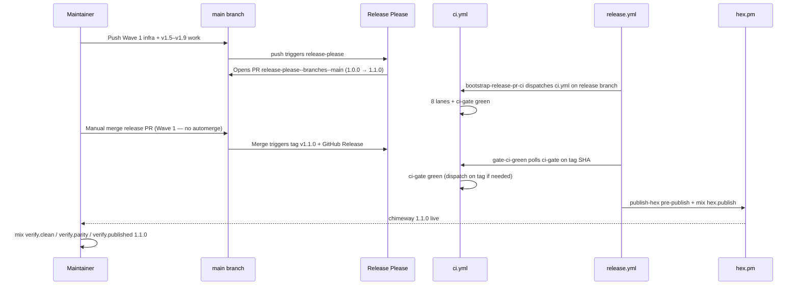

# Phase 60.1: Hex Release Pipeline — Research

**Researched:** 2026-05-30  
**Phase:** 60.1-hex-release-pipeline  
**Requirement:** GATE-06 — Automated Hex publish on release tag, gated on ci-gate green; Release Please owns version/changelog SSOT  
**Canonical template:** `~/projects/lattice_stripe` release workflows + Release Please JSON

---

## Summary

Phase 60.1 closes GATE-06 by porting the szTheory **Release Please → ci-gate → Hex publish** pipeline from `lattice_stripe` into Chimeway. The current `release.yml` is a minimal skeleton (unpinned actions, no CI gate, immediate `mix hex.publish`). CI already runs six integration lanes plus lint/test, but lacks **`ci-gate` aggregation**, dedicated **`verify_gates`** and **`verify_docs`** jobs, and **`workflow_dispatch`** for Release Please branch bootstrap.

**Planner must treat CONTEXT decisions D-60.1-01..12 as authoritative** — they supersede stale fragments in ROADMAP success criteria (6 lanes) and 60.1-01-PLAN task text (6-lane ci-gate, incomplete pre-publish replay). The correct ci-gate is **8 lanes**: `lint`, `test`, `verify_gates`, `verify_docs`, `verify_example`, `verify_journeys`, `verify_mailglass`, `verify_accrue`. `install_golden_contract` stays path-gated and **outside** ci-gate.

Wave 1 delivers merge-blocking ci-gate + hardened `release.yml` + Release Please SSOT; Wave 2 adds automerge, recovery workflow, MAINTAINING runbook, and contract test extensions. First ship target is **v1.1.0** (manifest seeds at 1.0.0 matching `mix.exs`; Release Please opens the bootstrap PR from accumulated conventional commits since Hex 1.0.0).

---

## Current State Analysis

### CI lanes today (`.github/workflows/ci.yml`)

| Job | Command(s) | In ci-gate? | Postgres | Notes |
|-----|------------|-------------|----------|-------|
| `lint` | `mix ci.lint`, `mix ci.audit` | **Missing gate** | No | format + compile WAE + credo + hex.audit |
| `test` | `mix ci.test` | **Missing gate** | Yes | OTP 26/27 matrix; excludes `:mailglass`, `:accrue` tags |
| `verify_example` | `mix verify.example` | **Missing gate** | Yes | Demo host + chimeway_admin |
| `verify_journeys` | `mix verify.journeys` | **Missing gate** | Yes | 10 journey tests |
| `verify_mailglass` | `mix verify.mailglass` | **Missing gate** | Yes | GATE-04 |
| `verify_accrue` | `mix verify.accrue` | **Missing gate** | Yes | Sibling checkout `szTheory/accrue@de7a3fe…` |
| `install_golden_contract` | `mix ci.install_golden` | **Must stay out** | No | Path-gated on PRs; always on `main` push |

**Missing jobs (required by D-60.1-03/06/07):**

| Job | Command | Rationale |
|-----|---------|-----------|
| `verify_gates` | `mix ci.verify_gates` | GATE-01 doc-contract + release gate parity (~225 tests, no Postgres); becomes publish SSOT lane |
| `verify_docs` | `mix ci.docs` | ExDoc WAE; replaces standalone `docs.yml` |
| `ci-gate` | Aggregate 8 lanes | Stable signal for publish, automerge, recovery |

**Triggers:** `push: main`, `pull_request: main` only — **no `workflow_dispatch`**. Release Please bot pushes to `release-please--branches--main` do not reliably trigger PR CI without dispatch bootstrap (D-60.1-09).

**Action pinning:** `ci.yml` SHA-pins `checkout`, `setup-beam`, `cache`. Good baseline for release workflows.

### Docs workflow (`.github/workflows/docs.yml`) — to retire

- Runs `mix ci.docs` on **`push: main` only** — not on PRs or release branches.
- Duplicates future `verify_docs` job; creates drift risk (MAINTAINING SHA refresh mentions `docs.yml`).
- **D-60.1-06:** Delete `docs.yml`; fold into `verify_docs` in `ci.yml` included in ci-gate.

### Release workflow (`.github/workflows/release.yml`) — skeleton

| Capability | Current | Required |
|------------|---------|----------|
| Release Please config/manifest | `release-type: elixir` inline (v4) | `release-please-config.json` + `.release-please-manifest.json` (v5) |
| Action SHA pins | `@v4`, `@v1` unpinned | Match `ci.yml` pins (D-60.1-05) |
| `gate-ci-green` | Absent | Poll `ci-gate` on release SHA; tag-dispatch fallback |
| `bootstrap-release-pr-ci` | Absent | Dispatch `ci.yml` on open release PR when bot skips CI |
| Pre-publish checks | None | compile WAE, grep `@version`, `mix ci.verify_gates`, `mix ci.docs`, `mix hex.build` |
| Idempotency | None | Skip if version already on Hex |
| Post-publish verify | None | Poll `hex.pm/api/packages/chimeway/releases/{version}` |
| Permissions | `contents`, `pull-requests` | Add `issues: write`, `actions: write` (lattice pattern) |
| Concurrency | None | `release-${{ github.ref }}`, `cancel-in-progress: false` |
| Release preflight | None | Skip rerun when tag already exists (lattice `release-preflight`) |

Current publish path: **immediately runs `mix hex.publish --yes`** when Release Please creates a release — violates GATE-06.

### Version / changelog SSOT

| Artifact | Current value | Target |
|----------|---------------|--------|
| `mix.exs` `@version` | `"1.0.0"` | Release Please updates on merge (no manual edits on `main`) |
| `.release-please-manifest.json` | **Missing** | `{ ".": "1.0.0" }` |
| `release-please-config.json` | **Missing** | Mirror lattice Elixir config |
| `CHANGELOG.md` | `## 1.0.0 (2026-05-08)` + `## [Unreleased]` at bottom | Release Please manages from manifest; `[Unreleased]` section present ✓ |

First automated bump: **1.1.0** (additive v1.5–v1.9 surface since Hex 1.0.0). Repo is **124 commits ahead of `origin/main`** — must push Wave 1 infra + accumulated work before bootstrap PR (ROADMAP constraint).

### Mix aliases (`mix.exs`) — ready

| Alias | Purpose | CI job mapping |
|-------|---------|----------------|
| `ci.lint` | format, compile WAE, credo | `lint` (first step; audit is separate step in job) |
| `ci.test` | test excluding mailglass/accrue | `test` |
| `ci.docs` | docs WAE | **`verify_docs`** (new) |
| `ci.verify_gates` | doc_contract + release_gate_contract | **`verify_gates`** (new) |
| `verify.example/journeys/mailglass/accrue` | ecosystem gates | existing jobs |
| `ci.install_golden` | installer contract | `install_golden_contract` (outside ci-gate) |

Local pre-ship (MAINTAINING.md): seven commands — `mix ci`, `mix ci.docs`, `mix ci.verify_gates`, four `verify.*`. Maps to ci-gate lanes + publish replay, not seven identical job names.

### Contract tests (`release_gate_contract_test.exs`)

**Today (GATE-05):** Locks MAINTAINING ↔ `mix.exs` ↔ `ci.yml` for four `verify.*` jobs + Accrue checkout pin.

**Gaps for GATE-06 (Wave 2):**

- No assertion for `verify_gates` / `verify_docs` jobs
- No `ci-gate` job or `needs:` membership check
- No `release.yml` invariants (`gate-ci-green`, pre-publish commands)
- No manifest ↔ `mix.exs` version parity
- No assertion that `docs.yml` is retired

`mix ci.verify_gates` currently passes **225 tests** locally (~2s).

---

## lattice_stripe Pattern Map (what to copy verbatim vs adapt)

### Copy verbatim (structure + logic)

| Pattern | Source | Chimeway notes |
|---------|--------|----------------|
| `ci-gate` job | `lattice_stripe/ci.yml` `ci-gate` | Change `needs:` to 8 chimeway job IDs; same `if: always()` + env var loop |
| `gate-ci-green` poll script | `lattice_stripe/release.yml` | Job name `ci-gate` unchanged; workflow_id `ci.yml`; tag-dispatch at attempt 3 |
| `release-preflight` | `lattice_stripe/release.yml` | Prevents duplicate tag on re-merge |
| `bootstrap-release-pr-ci` | `lattice_stripe/release.yml` | Branch `release-please--branches--main`, label `autorelease: pending` |
| Release Please token fallback | `secrets.RELEASE_PLEASE_TOKEN \|\| secrets.GITHUB_TOKEN` | PAT optional per D-60.1-11 |
| `release-please-config.json` | lattice | Elixir release-type; adjust package name only if needed |
| `.release-please-manifest.json` layout | lattice | Seed `"." : "1.0.0"` not lattice's 1.7.12 |
| `release-pr-automerge.yml` | lattice (Wave 2) | Same ci-gate check via check-runs API |
| Publish idempotency + Hex poll | lattice `publish-hex` steps | Package name `chimeway` |
| `workflow_dispatch` on `ci.yml` | lattice | Required for release branch bootstrap |

### Adapt (do NOT copy blindly)

| Pattern | lattice behavior | Chimeway adaptation |
|---------|------------------|----------------------|
| ci-gate lanes | 6 lanes: format, compile, test, integration, docs_truth, quality | **8 lanes** per D-60.1-03; chimeway uses combined `lint` job (includes audit) |
| Publish pre-publish tests | `mix test` full suite | **`mix ci.verify_gates` + `mix ci.docs`** + `mix hex.build` (D-60.1-12); ci-gate already ran full test matrix |
| Recovery `gate-ci-green` | Per-job prefix checks; **lint failure allowed** | **ci-gate poll only** — copy script from `release.yml`, reject lint bypass (D-60.1-10) |
| Elixir/OTP versions | 1.19/28 via `.tool-versions` | 1.17 / OTP 27 (match `ci.yml`; no `.tool-versions` in chimeway) |
| Accrue sibling checkout | N/A | Only in `verify_accrue` — not in publish job |
| Action pins | `@v5`/`@v6` tags on some actions | **SHA-pin all** per chimeway `ci.yml` + D-60.1-05 |
| `paths-ignore: .planning/**` | lattice CI | Optional for chimeway; not in current `ci.yml` — planner discretion |

### Do not port

- lattice recovery lint-failure allowance (`publish-hex.yml` lines 109–115)
- lattice per-job `requiredPrefixes` gate in recovery
- lattice `integration` / stripe-mock service (no chimeway equivalent in ci-gate)
- `install_golden_contract` into ci-gate (skipped-job footgun)

---

## Implementation Recommendations (Wave 1 vs Wave 2)

### Wave 1 — 60.1-01: ci-gate + Release Please + hardened release.yml

**Files:** `ci.yml`, `release.yml`, `release-please-config.json`, `.release-please-manifest.json`, delete `docs.yml`

1. **Add Release Please JSON**
   - `release-please-config.json`: copy lattice Elixir config (`changelog-sections`, `packages["."].changelog-path`, `include-v-in-tag`)
   - `.release-please-manifest.json`: `{ ".": "1.0.0" }`

2. **Extend `ci.yml`**
   - Add `workflow_dispatch:` trigger (optional: `push: branches: ['release-please--**']` — D-60.1 discretion)
   - Add `verify_gates` job: checkout → setup-beam → cache → deps → `mix ci.verify_gates` (no Postgres)
   - Add `verify_docs` job: same setup → `mix ci.docs` (no Postgres)
   - Add `ci-gate` job:
     ```yaml
     needs: [lint, test, verify_gates, verify_docs, verify_example, verify_journeys, verify_mailglass, verify_accrue]
     if: always()
     ```
     Loop env vars; fail if any `!= success`. Job **name** must be exactly `ci-gate`.
   - Leave `install_golden_contract` unchanged (parallel, not in `needs`)

3. **Replace `release.yml`** (port lattice, chimeway-adapted)
   - SHA-pin: checkout, setup-beam, cache, release-please-action (lookup SHA), github-script
   - Permissions: `contents: write`, `pull-requests: write`, `issues: write`, `actions: write`
   - Concurrency group on release ref
   - Jobs: `release-please` → `bootstrap-release-pr-ci` → `gate-ci-green` → `publish-hex`
   - Publish pre-publish (D-60.1-12): compile WAE, grep `@version`, `mix ci.verify_gates`, `mix ci.docs`, `mix hex.build`, idempotency, publish, Hex API poll
   - Package: `chimeway` in `mix hex.info` and API URL

4. **Delete `.github/workflows/docs.yml`**

5. **Update MAINTAINING.md** minimally in Wave 1 if SHA refresh section references `docs.yml` — full runbook rewrite deferred to Wave 2

**Wave 1 verification:** Push to origin → Release Please opens 1.1.0 PR → dispatch CI on release branch → confirm ci-gate green → **manual merge** (D-60.1-09) → confirm gate-ci-green + Hex publish.

### Wave 2 — 60.1-02: automerge + recovery + runbook + contracts

**Files:** `release-pr-automerge.yml`, `publish-hex.yml`, `MAINTAINING.md`, `release_gate_contract_test.exs`

1. **`release-pr-automerge.yml`:** Port lattice; merge when ci-gate green on release branch SHA; post-merge dispatch `ci.yml` on `main` + `release.yml`

2. **`publish-hex.yml`:** Port lattice shell with **ci-gate-only** gate (inline copy from `release.yml` `gate-ci-green`, shorter timeout OK); chimeway pre-publish replay; `workflow_dispatch` inputs: `tag`, `release_version`, `dry_run`

3. **`MAINTAINING.md`:** Automated Release Please path as default; manual `mix hex.publish` = recovery via `publish-hex.yml` dispatch only; document optional `RELEASE_PLEASE_TOKEN`; keep seven local pre-ship commands; post-publish verify trio unchanged

4. **`release_gate_contract_test.exs`:** Extend GATE-06 describe (see Contract Test Strategy)

---

## Contract Test Strategy

Extend `test/chimeway/release_gate_contract_test.exs` with a new describe **`release pipeline contract (GATE-06)`**:

| Test | Assertion |
|------|-----------|
| `verify_gates` job exists | `ci.yml` block contains `mix ci.verify_gates` |
| `verify_docs` job exists | `ci.yml` block contains `mix ci.docs` |
| `ci-gate` aggregates 8 lanes | `ci-gate` `needs:` includes all 8 job IDs |
| `docs.yml` retired | File absent OR workflow file list excludes standalone docs workflow |
| Manifest matches mix.exs | `.release-please-manifest.json` `"."` == `@version` in mix.exs |
| `release.yml` gate-ci-green | File contains `gate-ci-green` and `ci-gate` poll logic |
| `release.yml` pre-publish replay | Contains `mix ci.verify_gates` and `mix ci.docs` |
| MAINTAINING automated default | Post-Wave-2: documents Release Please / recovery dispatch (string guards) |

**Implementation pattern:** Reuse `extract_ci_job_block/2`; add `@release_yml`, `@manifest` module attributes; add helper to parse `ci-gate` needs list from YAML.

**Run gate:** `mix ci.verify_gates` (included in its own CI job — meta but acceptable).

**Optional follow-up (out of scope):** Exclude `doc_contract_test.exs` and `release_gate_contract_test.exs` from `ci.test` matrix to avoid triple execution (matrix × 2 + verify_gates).

---

## Risks and Mitigations

| Risk | Impact | Mitigation |
|------|--------|------------|
| **install_golden in ci-gate** | Skipped job → false green or false red | Keep path-gated; never add to `ci-gate` needs (D-60.1-08) |
| **lattice recovery lint bypass** | Publish with failing lint/credo | Use ci-gate-only poll in `publish-hex.yml`; no per-job prefix checks (D-60.1-10) |
| **docs.yml retirement drift** | Docs gate only on main push | Delete docs.yml; verify_docs in ci-gate on PR + main |
| **Release PR CI not firing** | Merge without green ci-gate | `workflow_dispatch` + `bootstrap-release-pr-ci`; optional PAT (D-60.1-11) |
| **Unpushed main (124 ahead)** | Bootstrap PR missing v1.5–v1.9 commits | Push all commits before first Release Please run |
| **Plan/ROADMAP drift** | 6-lane ci-gate in 60.1-01-PLAN | Planner follows CONTEXT 8-lane list |
| **CHANGELOG format mix** | Release Please parse errors | `[Unreleased]` exists; monitor first PR; elixir release-type handles `mix.exs` bump |
| **Double test execution** | CI time/cost | Accept for 60.1; optional dedupe later |
| **HEX_API_KEY missing** | Publish fails | Document in MAINTAINING; verify secret before bootstrap |
| **Accrue ref drift** | verify_accrue fails on release branch | Contract test already pins ref; update atomically with integration bump |
| **ci-gate vs check-runs API** | Automerge sees stale conclusion | lattice uses latest check-run by name; same pattern in Wave 2 |
| **Manual 1.1.0 bootstrap** | Operator merges too early | MAINTAINING: confirm ci-gate green on release PR before merge |

---

## Bootstrap Sequence for First 1.1.0 Release

Prerequisites: `HEX_API_KEY` in repo secrets; Wave 1 merged to `origin/main`; all local commits pushed.



**Operator checklist:**

1. Confirm `mix.exs` `@version` is `1.0.0` and manifest matches before Wave 1 merge
2. After Wave 1 on main: wait for Release Please PR titled `chore(main): release 1.1.0`
3. Verify Actions: ci-gate success on release PR head SHA
4. Manually merge release PR (Wave 1 — automerge is Wave 2)
5. Watch `Release` workflow: gate-ci-green → publish-hex
6. Run local post-publish verify trio
7. Wave 2: enable automerge for subsequent releases

---

## Validation Architecture

Nyquist dimension 8 — what must be verified, how, and with which commands.

| Invariant | Requirement | Verification method | Command / check |
|-----------|-------------|---------------------|-----------------|
| ci-gate exists and aggregates 8 lanes | GATE-06 | Contract test + CI inspection | `mix ci.verify_gates` + grep `ci-gate` in `ci.yml` |
| verify_gates CI job | GATE-06 | Contract test | `mix ci.verify_gates` |
| verify_docs CI job | GATE-06 | Contract test + local | `mix ci.docs` |
| docs.yml retired | D-60.1-06 | File absent | `test ! -f .github/workflows/docs.yml` |
| Release Please SSOT | GATE-06 | Manifest + config present | `test -f release-please-config.json .release-please-manifest.json` |
| Manifest ↔ mix.exs parity | GATE-06 | Contract test | `mix ci.verify_gates` |
| gate-ci-green in release.yml | GATE-06 | Contract test + grep | `grep gate-ci-green .github/workflows/release.yml` |
| Publish blocked without ci-gate | GATE-06 | Workflow structure | `publish-hex` `needs: gate-ci-green` |
| Pre-publish replay | D-60.1-12 | grep release.yml | `mix ci.verify_gates`, `mix ci.docs`, `mix hex.build` in publish job |
| SHA-pinned actions | D-60.1-05 | grep workflows | No `@vN` tags in release workflows |
| install_golden outside ci-gate | D-60.1-08 | ci.yml structure | `install_golden_contract` not in ci-gate `needs` |
| Recovery gates on ci-gate only | D-60.1-10 | Code review publish-hex.yml | No lint bypass logic |
| Existing verify lanes unchanged | GATE-05 regression | Full local pre-ship | See commands below |
| Automerge (Wave 2) | GATE-06 | Manual test on 2nd release | ci-gate green → auto merge |
| Hex publish end-to-end | GATE-06 | First 1.1.0 ship | `curl hex.pm/api/packages/chimeway/releases/1.1.0` |

### Test commands (local / CI parity)

```bash
# Fast contract gate (after every task touching workflows/docs)
mix ci.verify_gates

# Individual new lanes
mix ci.docs
mix ci.verify_gates

# Full pre-ship (MAINTAINING seven — maps to ci-gate + publish replay)
mix ci
mix ci.docs
mix ci.verify_gates
mix verify.example
mix verify.journeys
mix verify.mailglass
ACCRUE_PATH="${ACCRUE_PATH:-../accrue/accrue}" mix verify.accrue

# Wave 1 structural smoke (no Hex publish)
grep -q 'name: ci-gate' .github/workflows/ci.yml
grep -q 'gate-ci-green' .github/workflows/release.yml
test ! -f .github/workflows/docs.yml

# Post-publish (maintainer, after 1.1.0 ships)
mix verify.clean
mix verify.parity
mix verify.published 1.1.0
```

### Phase acceptance criteria (GATE-06)

1. Release Please opens version PRs; manifest SSOT at 1.0.0 → first merge produces 1.1.0
2. ci-gate aggregates all 8 required lanes; failure in any lane fails ci-gate
3. Hex publish runs only after ci-gate green on release SHA; version appears on hex.pm without manual `mix hex.publish`
4. `mix ci.verify_gates` green including extended GATE-06 contract tests (Wave 2)
5. MAINTAINING documents automated default + recovery exception (Wave 2)

### Plan drift to fix during planning

- **ROADMAP.md** success criterion #2 lists 6 lanes — update to 8 (verify_gates + verify_docs)
- **60.1-01-PLAN.md** Task 1 lists 6 lanes — align with D-60.1-03
- **60.1-01-PLAN.md** Task 2 pre-publish omits `mix ci.docs` — add per D-60.1-12

---

*Research complete for Phase 60.1 planning. Downstream planner should read CONTEXT.md + this RESEARCH.md + lattice_stripe canonical workflows at execute time.*
