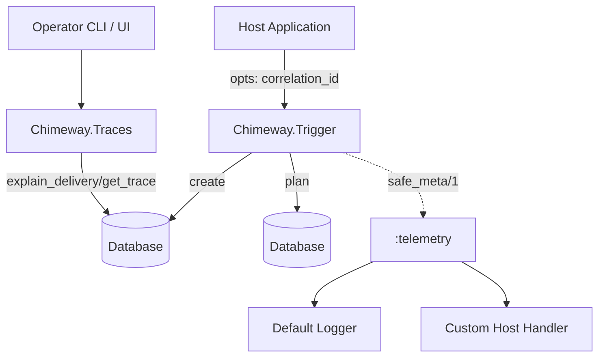

<user_constraints>
## User Constraints (from CONTEXT.md)

### Locked Decisions
None explicitly specified in CONTEXT.md (file not found/empty). Will use project defaults.

### the agent's Discretion
None explicitly specified in CONTEXT.md. Will use project defaults.

### Deferred Ideas (OUT OF SCOPE)
None explicitly specified in CONTEXT.md. Will use project defaults.
</user_constraints>

<phase_requirements>
## Phase Requirements

| ID | Description | Research Support |
|----|-------------|------------------|
| OBS-01 | Operators can trace an event through notification, delivery, and attempt records using one durable identifier. | Verified: `Chimeway.Traces.get_trace/1` loads full trace via Ecto preloads on `event_id`. |
| OBS-02 | Operators can inspect structured telemetry and logs for lifecycle events without leaking sensitive payload fields. | Verified: `Chimeway.Telemetry.safe_meta/1` explicitly filters metadata using `@allowed_meta_keys`. |
| OBS-03 | Host-app correlation and tenancy context is available in operator surfaces and traces. | Verified: `correlation_id` is propagated from trigger opts through `Event` struct and telemetry metadata. |
</phase_requirements>

# Phase 15: Observability & Supportability - Research

**Researched:** 2024-05-15
**Domain:** Elixir Telemetry & Query APIs
**Confidence:** HIGH

## Summary

The observability and supportability capabilities for Phase 15 are largely pre-implemented by the foundational domain model (Phase 1) via `lib/chimeway/telemetry.ex` and `lib/chimeway/traces.ex`. This research confirms that the structural requirements are satisfied natively without adding heavy dependencies, enabling host apps to securely observe notification lifecycles.

**Primary recommendation:** No new architectural dependencies are required; ensure existing tests cover end-to-end traversal of `Chimeway.Traces` and `Chimeway.Telemetry` functionalities.

## Architectural Responsibility Map

| Capability | Primary Tier | Secondary Tier | Rationale |
|------------|-------------|----------------|-----------|
| Traceability (`Chimeway.Traces`) | API / Backend (Ecto) | Database / Storage | Records are durably linked via `event_id` and queried using explicit joins. |
| Telemetry & PII Redaction | API / Backend (`:telemetry`) | — | Leverages native Erlang/Elixir telemetry to broadcast events securely without inspecting payloads. |
| Correlation | API / Backend | Host App | `correlation_id` is supplied by host apps (e.g. `request_id`) and embedded durably and in telemetry. |

## Standard Stack

### Core
| Library | Version | Purpose | Why Standard |
|---------|---------|---------|--------------|
| `:telemetry` | `~> 1.0` | Event broadcasting | Native Elixir/Erlang standard for instrumentation. Implicitly provided via Ecto dependency. |
| `Ecto` | `~> 3.11` | Data persistence and querying | Handles the complex preloads and joins required for traces and explanations. |

### Supporting
| Library | Version | Purpose | When to Use |
|---------|---------|---------|-------------|
| `Logger` | Native | Basic telemetry sink | Used in `Chimeway.Telemetry.attach_default_handlers/0` for dev/debug default reporting. |

### Alternatives Considered
| Instead of | Could Use | Tradeoff |
|------------|-----------|----------|
| Native `:telemetry` | OpenTelemetry (`:opentelemetry`) | OpenTelemetry is heavier and usually configured by the host app. Chimeway emits basic telemetry; host app handles OTel bridging if needed. |

**Installation:**
```bash
# None required. Uses standard library and Ecto.
```

## Architecture Patterns

### System Architecture Diagram



### Pattern 1: Safe Telemetry Metadata Redaction
**What:** Explicit allowlist of telemetry metadata keys to prevent PII leakage.
**When to use:** Always, when emitting telemetry for potentially sensitive data payloads (like notification content or recipient identities).
**Example:**
```elixir
# Source: lib/chimeway/telemetry.ex
@allowed_meta_keys ~w(notification_key event_id recipient_id channel delivery_id attempt_id outcome suppression_reason correlation_id attempt_number error_class)a

def safe_meta(meta) when is_map(meta) do
  meta
  |> normalize_keys()
  |> Map.take(@allowed_meta_keys)
end
```

### Anti-Patterns to Avoid
- **Leaking Payloads into Logs:** Never pass the raw `params` or template data to `:telemetry.span/3`. Always wrap with `Chimeway.Telemetry.safe_meta/1`.
- **Auto-attaching Handlers:** Do not automatically attach Logger handlers in library setup; always require explicit opt-in (e.g. `Chimeway.Telemetry.attach_default_handlers/0`).

## Don't Hand-Roll

| Problem | Don't Build | Use Instead | Why |
|---------|-------------|-------------|-----|
| Lifecycle Event Sinks | Custom PubSub event sinks | `:telemetry` | Standard ecosystem compatibility, allows host applications to plug in Datadog/Prometheus/StatsD seamlessly. |
| Timeline Assembly | Client-side timeline merging | `Chimeway.Traces.explain_delivery/1` | Complex timeline assembly with fallbacks (e.g. handling missing `attempt_number`) is best handled near the durable records in Elixir. |

**Key insight:** Trace explainability is a pure data-fetching capability. Telemetry formatting should be standard `:telemetry`, making integration a zero-friction experience for operators.

## Common Pitfalls

### Pitfall 1: Unsafe Telemetry Metadata
**What goes wrong:** Sensitive recipient details or tokens end up in Datadog/NewRelic.
**Why it happens:** Passing raw context maps into `:telemetry.execute/3`.
**How to avoid:** Pipe all metadata through the central `@allowed_meta_keys` filter in `Chimeway.Telemetry.safe_meta/1`.

### Pitfall 2: N+1 Trace Queries
**What goes wrong:** Tracing an event fetches records individually, crushing DB performance.
**Why it happens:** Failing to leverage Ecto's `preload` and `join` capabilities.
**How to avoid:** Use the prebuilt `Chimeway.Traces` module which explicitly handles preloading `[notifications: [deliveries: :attempts]]`.

## Code Examples

Verified patterns from official sources:

### Using the Tracing API
```elixir
# Source: lib/chimeway/traces.ex
{:ok, explanation} = Chimeway.Traces.explain_delivery("delivery-uuid-here")
explanation.suppression_reason  #=> "channel_disabled"
explanation.timeline            #=> [%{at: ~U[...], event: :event_created, detail: %{}}, ...]
```

## State of the Art

| Old Approach | Current Approach | When Changed | Impact |
|--------------|------------------|--------------|--------|
| Custom GenEvent | Erlang `:telemetry` | 2019+ | Standardized, low-overhead event emission across the ecosystem. |

## Assumptions Log

| # | Claim | Section | Risk if Wrong |
|---|-------|---------|---------------|
| A1 | No additional tenancy tracking logic (like multi-tenant prefixes) is needed for this phase. | Phase Requirements | If the host requires Ecto multi-tenant prefixes, the `Chimeway.Traces` queries might fail without a `prefix` opt. |

## Open Questions (RESOLVED)

1. **Multi-Tenancy Prefixes**
   - What we know: The codebase currently passes `correlation_id` but does not enforce Ecto schema prefixes dynamically in `Chimeway.Traces`.
   - What's unclear: Does the host app require passing a tenant prefix to `get_trace/1` and `explain_delivery/1`?
   - Recommendation: Since the application runs embedded, ensure tracing queries accept `opts \\ []` to optionally pass `[prefix: tenant_id]` to `Repo.all` or `Repo.get`. (RESOLVED: This will be implemented in the plan by adding `opts \\ []` support).

## Environment Availability

Step 2.6: SKIPPED (no external dependencies identified)

## Validation Architecture

### Test Framework
| Property | Value |
|----------|-------|
| Framework | ExUnit (Elixir native) |
| Config file | `test/test_helper.exs` |
| Quick run command | `mix test test/chimeway/traces_test.exs test/chimeway/telemetry_integration_test.exs test/chimeway/telemetry_correlation_test.exs` |
| Full suite command | `mix test` |

### Phase Requirements → Test Map
| Req ID | Behavior | Test Type | Automated Command | File Exists? |
|--------|----------|-----------|-------------------|-------------|
| OBS-01 | Trace via event ID | unit | `mix test test/chimeway/traces_test.exs` | ✅ Wave 0 |
| OBS-02 | Telemetry PII redaction | unit | `mix test test/chimeway/telemetry_integration_test.exs` | ✅ Wave 0 |
| OBS-03 | Correlation ID tracking | unit | `mix test test/chimeway/telemetry_correlation_test.exs` | ✅ Wave 0 |

### Sampling Rate
- **Per task commit:** `mix test test/chimeway/traces_test.exs test/chimeway/telemetry_integration_test.exs test/chimeway/telemetry_correlation_test.exs`
- **Per wave merge:** `mix test`
- **Phase gate:** Full suite green before `/gsd-verify-work`

### Wave 0 Gaps
None — existing test infrastructure covers all phase requirements.

## Security Domain

### Applicable ASVS Categories

| ASVS Category | Applies | Standard Control |
|---------------|---------|-----------------|
| V2 Authentication | no | — |
| V3 Session Management | no | — |
| V4 Access Control | no | — |
| V5 Input Validation | yes | Ecto Changesets and Telemetry `safe_meta/1` |
| V6 Cryptography | no | — |

### Known Threat Patterns for Elixir / Ecto

| Pattern | STRIDE | Standard Mitigation |
|---------|--------|---------------------|
| Telemetry Log Injection | Information Disclosure | Restrict keys via `Map.take/2` and sanitize values (implemented in `Chimeway.Telemetry.safe_meta/1`). |

## Sources

### Primary (HIGH confidence)
- Codebase inspection: `lib/chimeway/telemetry.ex` - Verified structural redaction of metadata.
- Codebase inspection: `lib/chimeway/traces.ex` - Verified tracing queries and preloads.

## Metadata

**Confidence breakdown:**
- Standard stack: HIGH - Relies solely on native Elixir ecosystem and existing Ecto integration.
- Architecture: HIGH - The implementation already exists in the `lib` directory.
- Pitfalls: HIGH - Documented common pitfalls align directly with implemented protective measures.

**Research date:** 2024-05-15
**Valid until:** 30 days